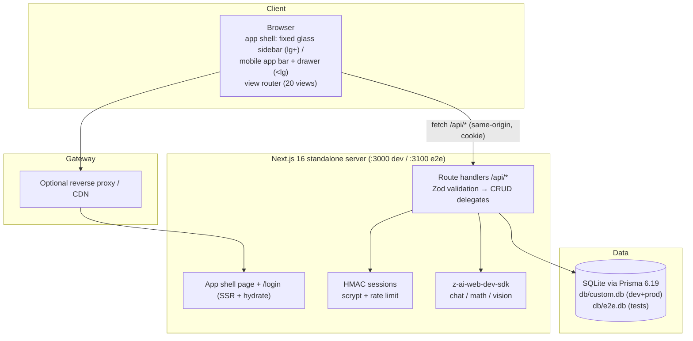
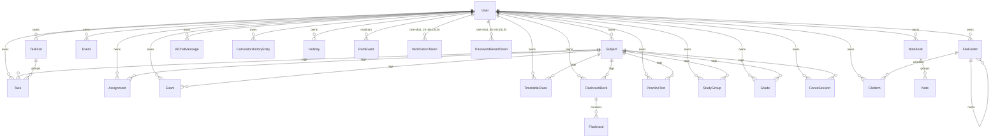

# StudyFlow (Omni-Study) — Master Project Architecture Document (PAD) v1.0.0

**Classification:** Internal Engineering Reference
**Status:** DEFINITIVE, PRODUCTION-LOCKED BLUEPRINT
**Companion Documents:** `README.md` (user-facing), `AGENTS.md` (agent quick-reference), `CLAUDE.md` (agent operating conventions), `docs/Tailwind-V4-Validation-Report.md` (parity trap log)
**Last Updated:** 2026-10-10
**Audience:** Senior Engineers, Tech Leads, DevOps, Onboarding Engineers, and AI Coding Agents
**Rule:** Every architectural decision in this document traces to a specific rationale. Nothing is here "because it's popular."

---

#### Revision Block — v1.0.0

- `[SR]` Initial PAD for the StudyFlow rebuild (replaces the prior document describing the retired ORBITAL iteration of this scaffold repo).
- `[RES]` Reference-app measurements (computed styles, DOM structure, API surface) captured live from `omni-study1.base44.app` with an authenticated headless browser session.
- `[CA]` Prisma 6.19 `file:` URL anchoring behavior verified empirically (schema vs shell-env vs `.env`-loaded values) — encoded as ADR-002 and pinned by `tests/db-path.test.ts`.
- `[SAN]` No secrets, keys, or credentials appear in this document.

---

## Table of Contents

1. [System Overview & Decisions](#1-system-overview--decisions)
2. [High-Level System Topology](#2-high-level-system-topology)
3. [Application Architecture](#3-application-architecture)
4. [Data Architecture](#4-data-architecture)
5. [Design System Reference](#5-design-system-reference)
6. [Security Architecture](#6-security-architecture)
7. [Testing Strategy](#8-testing-strategy)
8. [Build & Deployment](#9-build--deployment)
9. [Developer Handbook](#10-developer-handbook)
10. [Known Issues & Outstanding Tasks](#11-known-issues--outstanding-tasks)
11. [Key Files Reference](#12-key-files-reference)
12. [Glossary](#13-glossary)

---

## 1. System Overview & Decisions

### 1.1 Document Metadata & Purpose

StudyFlow is a self-hosted study-companion application: a deliberate clone — functional superset with measured visual parity — of the hosted app at `omni-study1.base44.app`. This PAD is the single source of truth for how the clone is built and why. Use it when onboarding, when debugging the database-path contract or the Tailwind v4 token pins, when extending a view or an API entity, and when evaluating whether a proposed change violates a locked decision.

### 1.2 Technology Stack Summary

| Layer | Technology | Version | Key Rationale |
|-------|-----------|---------|---------------|
| Web framework | Next.js (App Router) | 16.4.0 | Matches the repo scaffold's pinned major; `output: "standalone"` gives a single-server deploy story |
| UI runtime | React | 19 | Required by Next 16; client view-switching inside one app shell |
| Language | TypeScript (strict) | 5 | End-to-end types; scaffold convention; `unknown` over `any` |
| Styling | Tailwind CSS | 4.1.x (CSS-first) | Scaffold + reference-compiled parity requires v3-pinned tokens (ADR-004) |
| Components | Radix UI primitives, shadcn-style | current (see `package.json`) | Accessible primitives; scaffold convention; themed via CSS vars |
| Icons | lucide-react | 0.525 | Reference uses lucide glyph shapes (verified via DOM) |
| ORM / DB | Prisma + SQLite | 6.19.3 | Zero-config single-file DB; repo-root `db/` contract (ADR-002) |
| Client state | Zustand | 5 | Three small stores; no Context churn; scaffold convention |
| Validation | Zod | 4.6.5 | Every API boundary; codepoint-based string length (noted — see §11) |
| AI SDK | z-ai-web-dev-sdk | 0.0.18 | Chat + vision for the AI Assistant and Math Solver; server-only |
| Unit tests | Vitest | 5 | Matches scaffold `vitest.config.ts` seam |
| E2E tests | Playwright | 1.63 | Boots the production standalone build; computed-style parity pins |
| Runtime/PM | Bun | ≥ 1.3 | Dev server, scripts, seed runner |

### 1.3 Architecture Decision Records

**ADR-001: One-page SPA shell with twenty path rewrites**

- **Context:** The reference app is a rolldown-built React SPA whose views live at PascalCase paths (`/Dashboard` … `/Settings`) and swap client-side without server round-trips. Next.js App Router's default is one folder per route.
- **Decision:** Keep `src/app/page.tsx` as the only app route; add `next.config.ts` rewrites mapping all twenty paths onto `/`; sync view state with `location.pathname` through `src/lib/router.ts` + `useAppStore`; support deep links and back/forward via `pushState`/`popstate`. `/login` remains a real route (the reference redirects unauthenticated users there).
- **Rationale:** Byte-identical routing behavior (instant view swaps, real URLs, SPA 404 semantics for unknown paths); satisfies single-page deployment; keeps every view in one lazy-friendly tree.
- **Consequences:** View components can never be server-rendered per-route; the view map must stay the single source of truth (unit-tested); unknown paths fall through to the dashboard view.
- **Alternatives Rejected:** Twenty real route folders (server round-trips per nav, breaks SPA parity, duplicated shell); query-param routing (URLs diverge from the reference).

**ADR-002: Prisma + SQLite with a three-anchor DATABASE_URL contract**

- **Context:** The requirement pins `.env` to `DATABASE_URL="file:../db/custom.db"` with the `db/` folder at the repo root. Empirical testing of Prisma 6.19 showed three different resolution behaviors for that relative URL: runtime module code can anchor it anywhere (we control it), the CLI anchors shell-provided env at the schema file (correct), but `.env`-loaded env at the CWD (one directory too high). Separately, Next.js dev (Turbopack) pre-resolves relative `file:` DATABASE_URLs against the project directory before app code runs.
- **Decision:** `prisma/schema.prisma` uses `env("DATABASE_URL")`. The runtime resolution lives in `src/lib/db-path.ts`: a RELATIVE url re-anchors against the first candidate root containing `prisma/schema.prisma` (module anchor for dev; standalone detector for the traced build; CWD fallback). An absolute url passes through UNLESS its target is missing while the schema-anchored default exists — that corrects Next-dev's wrong pre-resolution. The `db:*` npm scripts set `DATABASE_URL` inline (shell-provided → schema-anchored CLI). `tests/db-path.test.ts` pins every rule, including the Next-dev correction regression.
- **Rationale:** One database file at `<repo>/db/custom.db` for dev, build, standalone server, and the e2e runner, regardless of CWD; every exception is detected and documented at the point of handling.
- **Consequences:** Raw `prisma db push` relying on repo-root `.env` auto-loading lands the file one directory high (documented in README troubleshooting); schema-url hardcoding was tried and rejected (it embeds the path into the generated client and kills env-based e2e isolation).
- **Alternatives Rejected:** Hardcoded schema url (breaks e2e `db/e2e.db` isolation — the generated client ignores env vars); absolute `.env` paths (violates the pinned requirement; machine-specific); PostgreSQL (heavier ops; the requirement is explicitly SQLite-file based).

**ADR-003: Stateless HMAC cookie sessions + scrypt, no auth framework**

- **Context:** The scaffold documents an "AUTH_SECRET for HMAC cookie auth" contract; single-user deployments don't need OAuth providers, DB session tables, or a framework's worth of indirection. The login page must render a "Continue with Google" button for visual parity.
- **Decision:** `src/lib/auth.ts`: scrypt password hashing (`scrypt$salt$hash`), HMAC-SHA256-signed stateless session cookies (`sf_session`, 30-day TTL, httpOnly/sameSite=lax/secure-in-prod), `requireUser()` for route handlers, and an in-memory per-IP login rate limiter (10 attempts / 15 min). The Google button renders but reports "not configured" honestly — no fake OAuth.
- **Rationale:** Node-crypto stdlib only (no bcrypt native builds); no session-store round trips; revocation-by-logout is acceptable for the threat model; the rate limiter mirrors the reference's limiter shape (which the e2e suite must respect).
- **Consequences:** Sessions can't be server-side revoked before expiry; the limiter is per-process (single-instance only — documented in §11); Google/SSO remains a future integration point.
- **Alternatives Rejected:** Auth.js/NextAuth v5 (OAuth machinery unused; larger surface); Better-Auth (scaffold had no dependency for it; DB sessions unwanted); DB-backed sessions (write amplification for a single-user app).

**ADR-004: Tailwind v4 CSS-first with v3-pinned parity tokens**

- **Context:** The reference app's CSS was compiled by Tailwind v3. Porting its markup byte-identically onto v4 produces five classes of measurable drift, catalogued in `docs/Tailwind-V4-Validation-Report.md` (transparent bare-HSL theme vars, oklch palette drift, oklab gradient interpolation, the `space-*` selector rewrite, the shadow-scale shift).
- **Decision:** `src/app/globals.css` declares the theme under `@theme inline` with full `hsl()` colors, pins the v3 hex palette (slate/violet scales) and `--shadow-sm: 0 1px 2px 0 rgb(0 0 0 / 0.05)`, ships the canvas gradient as an exact `linear-gradient`, and the codebase lays out with `flex gap-*` exclusively. Parity-critical geometry is pinned by e2e computed-style assertions.
- **Rationale:** Five one-line-ish pins versus chasing per-component drift forever; the traps are documented at the point of risk with test coverage.
- **Consequences:** Removing a pin silently regresses parity (hence the e2e pins); `space-y/x` with margin children is banned by convention rather than lint.
- **Alternatives Rejected:** Downgrade to Tailwind v3 (fights the scaffold and Next 16's CSS pipeline); accept v4 defaults (measurably off-palette, heavier shadows).

**ADR-005: Zustand entity cache + mutation wrappers (no react-query)**

- **Context:** The app loads ~20 per-user collections (dozens of rows each). A query-cache library would add bundle + learning overhead; the scaffold already pins Zustand.
- **Decision:** `src/lib/data.ts` holds one `useDataStore` with per-collection status + data, a `load(key, force?)` fetcher, and a `mutations` object whose every operation refreshes the touched collections. Views call `loadAll([...])` in an effect and read slices.
- **Rationale:** Predictable, dependency-free, and correct at this scale; refresh-on-mutate keeps cross-view consistency (a task added on the Dashboard appears in Tasks).
- **Consequences:** No background refetch/dedup/cache invalidation windows; a future multi-megabyte collection would warrant revisiting.
- **Alternatives Rejected:** TanStack Query (unwarranted here); SWR (same); server components + per-route fetching (incompatible with ADR-001's SPA shell).

**ADR-006: CRUD delegate factory with WHERE-clause ownership**

- **Context:** Sixteen entities need identical list/create/update/delete semantics, and the #1 security risk in multi-tenant-by-owner apps is a forgotten scope filter.
- **Decision:** `src/lib/server/http.ts` provides `makeCollectionRoutes`/`makeItemRoutes` over a `CrudDelegate` (`list/create/update/remove`, all taking `userId`); `src/lib/server/entities.ts` implements one delegate per entity; every Prisma query filters `where: { userId, … }`, and updates/deletes verify ownership *before* mutating. Route files are 3-line shells.
- **Rationale:** Ownership by construction — an unscoped query cannot be written through the factory; uniform error envelopes and Zod parsing for free.
- **Consequences:** Cross-user queries are impossible without bypassing the factory (code review guards that); nested ownership (flashcards under decks) needs a manual guard — implemented in `cardsDelegate`.
- **Alternatives Rejected:** Per-route handlers (16× the surface, guaranteed drift); Prisma client extensions (less explicit, harder to lint).

**ADR-007: Two-layer testing with an isolated e2e database**

- **Context:** The value concentrated in this codebase is (a) pure domain seams (calculator engine, date math, auth primitives, path resolution, schemas) and (b) cross-cutting UI contracts (the SPA chrome, parity pins, golden-path CRUD).
- **Decision:** Vitest for unit seams (`tests/*.test.ts`, 179 tests). Playwright for e2e (`tests/e2e/*.spec.ts`, 258 specs incl. the setup project) against the production standalone build on `:3100` with its own `db/e2e.db` (pushed + seeded by `global-setup.ts` using the ADR-002 shell-env mechanism), one shared authenticated storageState (rate-limiter budget), unique row titles per run, accent restoration in the theme spec (awaiting the settings PATCH so the restore cannot be aborted by page teardown), a hydration gate before post-`goto` clicks, and computed-style parity pins (shadow, canvas gradient, sidebar geometry, corner radii, footer avatar default + gradient stops, stat icon size + text metrics, clock chip gradient, mobile app bar glass/brand/clock, drawer geometry/backdrop blur(4px)/icon items, content offset y=80, CTA width + gradient, view-title h1/icon/subtitle model, empty-state design, login card chrome) plus the session-5 interactive-chrome pins (gradient CTAs, Events dark panel + dialog field set, dialog geometry, gray outline palette, FocusTimer layout, Settings appearance cards, Calendar segmented switch, Calculator keypad/display, MyDay quick-add, Timetable week bar/All Weeks, Files chrome, Notes pane, GradeTracker gradient card, AI quick-action cards) in `tests/e2e/parity-session5.spec.ts`, the session-6 populated-state pins (task card rows + priority checkbox + pill meta + filter panel, task dialog field set, MyDay amber progress card + Suggestions, dashboard bare rows, assignment slider rows, exam card grid, calendar cells/legend/day-detail) in `tests/e2e/parity-session6.spec.ts`, the session-7 lightly-probed-views pins (flashcards two-panel view + swatches + card grid + study mode, dialog palettes/field sets, timetable grid-cols-8 + hour cells + My Classes today date, analytics stat cards + chart titles, grade tracker icons, notes title) in `tests/e2e/parity-session7.spec.ts`, and the session-8 deep-chrome/layout pins (nav icon set + active-gradient avatarTo stop + 36px collapse button, dashboard flush divide-y rows, calendar selected/today semantics + simple month card, MyDay header block + bare suggestions toggle, timetable today-header tint + ghost week-nav, tasks two-pane + icon search, notes/study-groups two-pane + gradient dropdown New, analytics per-card icons + Assignment Status donut + Subject Workload + priority chips, calculator rotate-ccw Clear, mathsolver single column + camera/refresh-cw buttons, AI quick-action icons, focustimer check button, settings tab list chrome, assignments/exams search icons + slim exam card) in `tests/e2e/parity-session8.spec.ts`, and the session-9 data-state/chart-axes pins (dashboard overdue banner + slim section empty states, MyDay amber greeting empty state + bare quick-add row, tasks outline filter button + empty My Lists, calendar Sunday-first grid + icon/tab mode switch, files house breadcrumb + grid3x3 toggle, text-only Grid Builder, assignments Active-default slim rows, exams orange Tomorrow badge, analytics area-chart axes/gridlines/fills, focustimer stat icons, settings tab icons, notes combobox icons, flashcards deck-row ellipsis menu, AI wand-sparkles composer, study-groups hint wording) in `tests/e2e/parity-session9.spec.ts`, and the session-10 dark-mode consistency pins (API-toggled dark mode with an afterEach light restore: shadcn token utilities re-theme on outline button/dialog/dropdown, the banner/amber/clock/today/settings dark washes, analytics SVG dark axes/fills/labels, the dark mobile drawer + Escape superset, and a light-mode byte-parity guard) in `tests/e2e/dark-mode.spec.ts`, and the session-11 theme-system pins (pre-paint dark with `/api/auth/me` route-aborted, the fresh-context dark-OS login, the runtime System re-theme via `emulateMedia`, the theme-color meta sync, the cache write, the four accent-surface re-themes — nav/ViewAll/timetable chip/avatar swatch — the print emulation, and a light regression guard) in `tests/e2e/theme-system.spec.ts`, and the session-12 accessibility pins (forced-colors state restoration — the calendar selected/today outlines, the mode-switch + Settings active-tab outlines, the timetable today-header outline, the bold active nav, the slider progress gradient; the skip link — first Tab stop, visible on focus, Enter lands on main, off-screen unfocused; the print pipeline — `beforeprint` un-themes dark and darkens the text, `afterprint` restores, `print-color-adjust: exact` on the gradient CTAs + events panel + timetable canvas + calendar month card, the timetable `min-width: 0` print reset; the reduced-motion collapse; and a light regression guard) in `tests/e2e/accessibility.spec.ts`, and the session-13 resilience pins (the AI-chat failure rollback — optimistic message removed + composer text bounced back + send re-enabled; the held-then-failing send clearing the Thinking indicator; the solver's client-side MIME guard with zero outbound requests; the nameless-upload 400; the RFC 5987 `filename*` download header) in `tests/e2e/resilience.spec.ts`.
- **Rationale:** Fast feedback where logic lives; end-to-end confidence where integration lives; zero collision between dev and e2e data.
- **Consequences:** E2E requires a fresh `bun run build` after component changes (stale-build false failures — documented); suite runtime ~1 min single-worker.
- **Alternatives Rejected:** Running e2e against `next dev` (slower, different engine than production); per-test logins (trips the rate limiter); a shared db (cross-run pollution).

---

**ADR-008: Dark-mode token contract — runtime-indirected shadcn tokens + class-based re-theming gradients (session-10)**

- **Context:** The reference app's own Dark/System options are a Base44 platform no-op (measured session 10: `html.dark` + a dark `body`, but the app markup — canvas gradient, glass sidebar, white cards — never re-themes), so dark mode is a clone-side superset feature whose standard is internal consistency. The original token setup placed LITERAL values inside `@theme inline`; Tailwind v4 inlines those into utilities at build time, so the `.dark { --color-* }` overrides could never reach `bg-card`/`bg-popover`/`bg-muted`/`border-input` surfaces (measured: white dialogs + invisible outline buttons in dark mode while `.sf-card` — a direct var() reference — re-themed correctly).
- **Decision:** (1) The shadcn base tokens stay in `@theme inline` but consume RAW triplet vars (`:root`/`.dark`: `--background`, `--card`, `--popover`, `--muted`, `--input`, …) through `hsl(var(--x))` — shadcn's own v4 shape; utilities then resolve at runtime, and light computed values are byte-identical to the previous literals. Shadows route the same way through `--sf-shadow-sm` (the `.dark` dark-shadow line is finally reachable). (2) Exact-SRGB gradients/tints that must re-theme live as globals.css classes with `.dark` overrides — `.sf-overdue-banner`, `.sf-amber-card`, `.sf-today-tint`/`.sf-today-cell`, `.sf-clock-chip` (+ time/date text), `.sf-selected-tint` (the `.sf-calc-display` precedent) — never inline styles. (3) SVG charts re-theme via `dark:fill-*`/`dark:stroke-slate-800` utilities (CSS presentation properties override SVG attributes).
- **Rationale:** One root fix repairs every token-built surface (buttons, dialogs, dropdowns, selects, tabs, badges, toasts) at once; class-based washes keep the light values byte-identical (the S3–S9 e2e pins) while adding dark counterparts in the codebase's established idiom.
- **Consequences:** New tokens that must re-theme follow the same indirection; a literal value in `@theme inline` is a build-time constant by design. Pinned by `tests/e2e/dark-mode.spec.ts` (10 specs incl. a light-mode byte-parity guard).
- **Alternatives Rejected:** Moving the base palette to non-inline `@theme` (split theme blocks, larger blast radius); per-view `dark:` inline-style conditionals (duplicated mode logic in components).

---

**ADR-009: Theme-application lifecycle — pre-paint boot script + localStorage cache + runtime System tracking (session-11)**
- **Context:** The theme class was applied ONLY by client store code after `/api/auth/me` resolved — measured consequences: dark users saw a light flash (or a fully light page when the auth API stalls), the login route never themed at all (its `dark:*` variants were dead code there — fresh dark-OS visitors got a light login), and System mode resolved the OS preference once with no `matchMedia` change listener (a runtime OS switch left the app stale until reload). The accent layer had four remaining inline-style/utility surfaces carrying light-mode tones in dark (active nav text/icon, ViewAllLink, the timetable mobile today chip, the selected avatar swatch) — the S10 pattern recurring on accent-driven surfaces that pass the 2.2 bar under the default violet but violate the repo's own 300-level dark convention.
- **Decision:** (1) `applyToDocument` (store.ts) persists `{ mode, accent }` to `localStorage["sf-theme"]` on every apply (`themeCachePayload`, format unit-pinned); a self-contained inline boot script (`THEME_BOOT_SCRIPT` in `src/lib/theme.ts`, injected into `<head>` by the root layout) reads it BEFORE first paint, resolves `mode` against `matchMedia` (cache absent → system fallback), and applies the `dark` class — `<html suppressHydrationWarning>` absorbs the pre-hydration toggle. (2) `installSystemThemeTracking()` (module scope, idempotent) re-applies when the stored mode is `system` and the OS preference changes at runtime; explicit light/dark choices are user intent and never follow the OS. (3) Sign-out removes the cache so the login route falls back to the fresh-visitor state. (4) A plain non-media `meta[name=theme-color]` (appended after Next's two media variants — last match wins in Chromium) tracks the EFFECTIVE mode for the mobile browser chrome. (5) The four accent surfaces moved to `.sf-nav-active{,-icon}`/`.sf-swatch-selected` classes and `dark:text/bg-sf-primary-{strong,soft}-dark` utility pairs — light values byte-identical, dark follows the 300-level convention. (6) A minimal `@media print` block (hide `aside`/`header[role=banner]`/`[role=dialog]`, white canvas, reset `main` offsets) — a superset nicety the reference lacks.
- **Rationale:** The cache+boot-script pair is the established next-themes shape: theme application becomes continuous across hard loads and route boundaries without server-side session coupling; the accent scope was consciously cut (pre-auth surfaces keep the violet `:root` defaults — the reference's own login is platform-default-styled).
- **Consequences:** The cache can go stale (another device, or the shared e2e user flipping modes) — the auth round-trip corrects it within the load, a one-frame transition at worst; multi-tab last-write-wins. The boot script is a hand-maintained string that cannot import the resolver — the unit-pinned cache format is the sync contract. Playwright contexts start with empty localStorage, so the boot script's media fallback never fights the specs' API-driven modes.
- **Alternatives Rejected:** Server-side theme cookies read by the root layout (couples the login route to session state and adds Set-Cookie coordination to three endpoints); caching the full accent var map (violet-default pre-auth is reference-consistent — measured decision); a `prefers-color-scheme` CSS-only approach (cannot honor the stored user preference).

**ADR-010: Accessibility — forced-colors state restoration, print light-forcing, skip link, reduced-motion (session-12)**

- **Context:** Chromium's forced-colors (Windows High Contrast) and print rendering both strip the author's color story to system defaults: the forced palette wiped every fill/tint that ENCODES STATE (calendar selected day, today markers, the mode-switch active segment, the active tab, the active nav item, the assignment slider progress — text stayed readable everywhere, 0 invisible-text findings across all 20 views), and the print media never un-themed (dark mode printed 2–8 light-text elements per view on the print-white canvas) while browsers' default background-dropping turned every white-text-on-color surface invisible; the `min-w-[900px]` timetable canvas clipped Saturday on A4. The keyboard audit found 21 sidebar stops before any content with no bypass (WCAG 2.4.1). The reference has NO print styles, NO forced-colors handling, and NO skip link — all superset territory (its own active-nav marker wipes identically under forced-colors, measured).
- **Decision:** (1) ONE `@media (forced-colors: active)` globals.css block restores state with system colors — inset `2px solid Highlight` outlines scoped to the Calendar's two stable `aria-label` containers + `[role=tab][data-state=active]` + `[data-today]` + `.sf-today-tint` (a bare `[aria-pressed]` rule would hit 12 files), `font-weight: 700` on `nav a[aria-current=page]` AND its `span` (inherited weights lose to the inner `font-medium` utility), and `forced-color-adjust: none` on `.sf-slider-fill` (the WCAG 1.4.11 essential-graphic exception). (2) The theme boot script registers `beforeprint`/`afterprint` handlers that remove/restore the `dark` class around the print duration (`__sfPrintDark` flag; unit-pinned presence strings) — one mechanism covering every dark: utility and custom class on BOTH routes. (3) `.sf-gradient` + the `sf-print-exact` utility (`print-color-adjust: exact`, inherited) on every white-text-on-color container: the Button default variant, the events terminal panel, the timetable canvas, the calendar month card, the checked checkboxes, the raw dashboard/MyDay CTAs. (4) `.sf-timetable-canvas` (the `min-w-[900px]` wrapper) resets `min-width: 0` in print — all 8 columns fit A4 (verified in the real PDF). (5) A visually-hidden skip link (`.sf-skip-link`, off-screen not `display:none`) as the first focusable element → `main#main-content` (tabIndex -1). (6) The standard global `@media (prefers-reduced-motion: reduce)` collapse block.
- **Rationale:** System-color outlines keep maximum text contrast (the state rides `Highlight`, not a forced color); the JS print handlers beat duplicating a token-reset per custom class; `print-color-adjust: exact` marks essential backgrounds ONLY (decorative tints still wipe — ink economy); the skip link has zero visual parity impact (off-screen until focused).
- **Consequences:** New interactive surfaces that encode state with fills need a forced-colors story and white-text-on-color surfaces need `sf-print-exact`; the boot script grew (the unit pins are the sync contract); `page.pdf()` in tests must be preceded by `page.emulateMedia({ media: "print" })` to model the real pipeline (measured — without it the layout can keep screen-width geometry), and print-media DOM probes must dispatch `beforeprint` manually (`emulateMedia` alone does not fire it).
- **Alternatives Rejected:** `forced-color-adjust: none` on state surfaces (keeps brand colors but sacrifices the forced palette's guaranteed text contrast — only the non-text slider fill takes it); a CSS-only `.dark` print token reset (duplicates every custom class's dark variant; the JS pair covers inline styles and both routes at once); a display:none skip link (unfocusable).

**ADR-011: Resilience — AI failure-state rollback + request deadlines + upload/download hardening (session-13)**

- **Context:** The happy paths were all pinned (334 tests at session-12) but none exercised FAILURE: the AI surfaces are optimistic (the user's message renders before the server confirms — a failed send orphaned it in local state where it silently vanished on reload, with no retry affordance), the SDK calls had NO deadline anywhere (a hung backend kept the composer disabled and "Thinking…" on screen indefinitely, measured > 25 s with nothing to recover to), the upload route accepted a `File` with an EMPTY name (an unlabeled Files row under `next dev`; a 500 crash under the Bun standalone whose multipart parser surfaces the empty name as `undefined`), and the download route quoted `encodeURIComponent(name)` inside `filename="…"` instead of RFC 5987 `filename*=UTF-8''…` (browsers saved the percent-encoded string as the literal filename). The data-volume stress pass (300 tasks / 200 notes / 250 events) audited GREEN — zero long tasks, ~370 B/row payloads, real click latency < 100 ms — empirically backing the "no query library at this scale" claim.
- **Decision:** (1) `apiSend`/`apiGet` gain an optional `{ timeoutMs }` opt implemented with `AbortSignal.timeout()`; every AI call site (chat, solver, generate-cards, generate-questions) passes `AI_TIMEOUT_MS = 120_000` — generous because LLM completions legitimately run 30–60 s; `isTimeoutError(err)` in `src/lib/api.ts` classifies the deadline so views say "took too long" instead of "unavailable". (2) The AI chat's `send()` captures the optimistic `localId` before the try and on failure calls the new `removeChatMessage(localId)` store action + `setInput(content)` — the bounced-back composer text IS the retry affordance. (3) The upload route rejects empty/whitespace filenames with 400 (before the size check). (4) A pure `buildContentDisposition(name)` seam in `src/lib/server/http.ts` emits BOTH dialects — an ASCII-safe quoted fallback (non-ASCII → `_`, quotes/backslashes neutralized, `download` when empty) AND the RFC 5987 `filename*=UTF-8''<pct-encoded>` extended form. (5) The math solver guards `file.type.startsWith("image/")` client-side (the `accept` attribute filters the picker UI, not the OS dialog's "All files" view).
- **Rationale:** The deadline is a mechanism pin, not a constant pin — unit tests stub a hanging fetch at 25 ms so the suite never waits the production 120 s; the rollback shape (remove + restore) beats a failed-message chip because it adds no store schema and needs no new visual surface; the dual-dialect disposition is the RFC-recommended form every modern browser prefers while old clients keep a usable ASCII name.
- **Consequences:** New AI call sites should pass the timeout opt; optimistic-append patterns elsewhere must capture the rollback id BEFORE the request; upload guards must be tested at BOTH runtimes (Node undici dev vs Bun standalone — the empty-name behavior differs, a 201-stored-empty vs a 500-crash pre-fix); e2e probes that hold routes open must reload between probes (the latched `busy` state silently no-ops later sends — the audit's own first run tripped on it).
- **Alternatives Rejected:** a failed-message chip with a retry button (store schema change + a new visual surface for a rare state — the bounced-back text is the same affordance at zero schema cost); a 30 s timeout (kills legitimate long completions); rejecting non-ASCII filenames entirely (RFC 5987 exists precisely to carry them); pagination/virtualization (the stress audit measured the unbounded lists as a non-gap at 3–10× seed volume — re-verify with `scripts/data-volume-audit.mjs` before ever adding it).


**ADR-012: Hardening — ambient connectivity, per-user AI budgets, download headers, AI live regions (session-14)**

- **Context:** The S13 failure paths were per-request; the S14 audit (five new committed tools: drawer-check-s14, connectivity-audit, settings-roundtrip-audit, security-audit, ai-a11y-audit) found the AMBIENT states invisible: no connectivity awareness anywhere (a dropped network was discoverable only by watching actions fail — the per-request paths themselves were verified green: the S13 bounce-back survives a REAL transport failure, dialogs keep their forms, SPA navigation runs on cached data); the settings schema accepted whitespace-only display names (`bounded(80)` has no trim/min — the record wiped to blank while the sidebar fell back to "Student"); the four AI routes had no rate limit (the app's only per-request COST surface — unlimited authenticated LLM calls) while the download response echoed the stored client-supplied Content-Type with no `nosniff` and no `Cache-Control`; and AI output landed in static containers — the assistant transcript, the Thinking indicator, and the solver's solution were silent for screen readers (WCAG 4.1.3). Plus repo hygiene: 14 stale pre-clone scripts (crash on nonexistent models, foreign absolute paths, the original app's routes) shipped in `scripts/`.
- **Decision:** (1) A `ConnectivityBanner` (`src/components/layout/connectivity-banner.tsx`) bridges `navigator.onLine` via `useSyncExternalStore` — null online (byte-identical DOM, structural parity guarantee), an amber `role="status"` pill offline; and `doFetch` in `src/lib/api.ts` maps fetch `TypeError`s to `ApiError(0, "You appear to be offline…")` with the S13 timeout classification checked FIRST and propagated untouched. No service worker / offline queue (the per-request paths already preserve the user's work — documented). (2) The limiter generalizes to `checkRateLimit(key, max = 10)`; the four AI routes enforce `checkRateLimit(`ai:${user.id}`, 20)` after `requireUser`, before validation — 429 + `Retry-After` + a clear message. (3) File downloads carry `X-Content-Type-Options: nosniff` + `Cache-Control: private, no-store`; NO upload MIME allowlist (the reference stores arbitrary types — parity over restriction; the residual risk re-classified as mitigated). (4) The settings route rejects whitespace-only names (400, mirroring the S13 empty-filename guard) and stores padded names trimmed; the client trims too. (5) The assistant transcript pane and the solver's solution card are `aria-live="polite"` regions with `aria-busy={busy}` — busy suppresses churn, the completed output announces. (6) `git rm` of the 14 stale scripts.
- **Rationale:** The banner is the ONE ambient signal every surface shares (per-request banners would multiply); 20/15-min per user is ~3× the heaviest realistic burst while a runaway script hits it in seconds; `nosniff` + `no-store` harden the echoed Content-Type without regressing what files the reference lets users store; the live-region pattern is the chat-correct level (polite, busy-suppressed) applied at the two seams every AI surface already shares.
- **Consequences:** New AI output surfaces must land in live regions (the AGENTS AI-ACCESSIBILITY contract); new expensive routes should join the `ai:` budget family; audit tooling must reload BEFORE unrouting held routes (unrouting alone releases the pending request to the real server — probe rows landed in the chat history mid-audit); e2e AI-rate pins exhaust the per-user budget by design (no other spec makes real AI calls — verified).
- **Alternatives Rejected:** a service worker + offline queue (large surface, and the measured failure paths already preserve user work — the banner + human messages cover the awareness gap); an upload MIME allowlist (regresses the reference's arbitrary-type Files feature; nosniff+no-store+attachment are the defensible stack); IP-keyed AI limits (the routes are authenticated — the user IS the right key); assertive live regions (would interrupt the SR user mid-task; polite is the chat convention).

**ADR-013: Auth-flow depth — the reference's full account journey with self-hosted token delivery (session-15)**

- **Context:** The S15 audit (reference ground truth re-probed fresh — `scripts/ref-auth-probe-s15.mjs`) found the clone's auth surface a single flat login card while the reference runs a five-state machine: login errors render INLINE (a shadcn-Alert-shaped `role="alert"` block, red wash, between Password and Sign in); "Sign up" opens a real Create-your-account form (Email/Password/Confirm, 44px inputs); registration lands on a "Verify your email" 6-digit OTP screen (64px slate-100 shield circle, Back→h2 gap 96px, six 40×44 boxes, Resend); unverified login is gated with a measured inline copy; "Forgot password?" runs a 3-state flow (Reset your password → Check your email with a GREEN alert → the emailed reset link). The clone had a toast dead-end for both. The calculator was click-only on BOTH apps (parity) — physical keys chosen as the superset. Files search scope verified folder-scoped on both (non-gap); the pre-1.0 sweep (deps/bundle/long-tasks) verified GREEN (non-gap).
- **Decision:** (1) Prisma: `User.emailVerified` (default false) + one-shot `VerificationToken` (6-digit, 15 min) and `PasswordResetToken` (48-hex, 30 min) models; the seeded demo user is `emailVerified: true` (the seed also UPDATEs pre-S15 databases in place — otherwise the gate would lock every existing account out). (2) Routes: `register` no longer auto-logs-in (unverified create + code issue; unverified duplicates re-send like the reference platform; verified duplicates keep the 409); `verify-email` matches the latest unexpired code, marks verified, burns the family, signs in; `resend-verification` uniform-200; `login` gates unverified accounts (403, reference copy) AFTER password verification (never an enumeration oracle); `forgot-password` always-200 with a 30-min token; `reset-password` consumes it. (3) UI: the login page is a six-state client machine (`signin`/`signup`/`verify`/`forgot`/`check-email`/`reset`) with the measured sub-screen chrome (Back link, centered h2, per-state gaps 8/96/16px, 44px inputs, OTP boxes with auto-advance + paste distribution); the ROUTE is a server component that awaits `searchParams` and seeds `initialResetToken` (the `/login?token=` deep-link renders in the SSR HTML — no effect setState, no hydration mismatch). (4) Self-hosted delivery: no SMTP exists — the code and reset URL surface to the ACTOR (response JSON + muted on-screen notes below the parity content, the same additive pattern as the demo-account hint). Without this the flows would be dead ends. (5) The calculator gains `mapPhysicalKey` + a guarded window keydown listener (skips form controls and open dialogs; latest-ref indirection — a []-deps closure evaluates the mount-time display forever).
- **Rationale:** The reference's flow shape IS the parity target (measured, not guessed); the no-SMTP delivery is the only way those flows can complete in a self-hosted deployment — the code/link is shown to the registrant/resetter themselves. The enumeration trade-off (resetUrl presence signals account existence) is bounded by the existing register-409 disclosure and the single-user threat model; the gate sits after password verification so it adds nothing to login's uniform 401.
- **Consequences:** Spec helpers that need a fresh authenticated user must complete the verify step (the register response carries the code — `registerFreshUser` in parity-session9.spec.ts is the pattern); `role="alert"` locators must be scoped to the auth card (Next's route announcer also uses the role); pre-S15 databases need one seed run to flip the demo user verified; physical-keyboard listeners on window must use the latest-ref pattern (stale closures) and guard form controls.
- **Alternatives Rejected:** surfacing nothing (dead-end flows — unusable, not "secure"); an SMTP dependency (out of scope for a zero-config self-hosted app; would add env + a service); auto-verifying on register (loses the reference's flow shape AND the gate pin); reading the reset token via `useSearchParams` (forces a Suspense restructure and a blank-HTML fallback for a statically-prerenderable route; the server-component prop is strictly simpler).

**ADR-014: Load stability — the pre-warmed first paint + the responsive auth sub-screens (session-16)**

- **Context:** The S16 CWV audit (Lighthouse-class synthetics — buffered PerformanceObserver + CDP 4x-CPU/Slow-4G throttle, both apps, both viewports, both themes; `scripts/cwv-audit-s16.mjs`) measured the dashboard cold load at CLS 0.117–0.125 (CWV needs-improvement) on every scenario: the shell flipped from the Splash on `/api/auth/me` with an EMPTY data store, then the five parallel fetches landed, the conditional overdue banner inserted above the stats grid, and the sections grew from slim-empty to populated — one shift moving ~12% of the viewport. The reference's desktop dashboard measures CLS 0.088 (its gated first paint), and its MOBILE dashboard 0.372. The mobile auth probe (both apps at 390×844) found the reference renders the auth sub-screens RESPONSIVELY — h2 `text-xl sm:text-2xl` (20px), Sign in `h-11 sm:h-12` (44px), the verify circle `mb-3 sm:mb-4` rhythm (Back→h2 76px) — where the clone had shipped fixed desktop values; the S15 build had measured desktop only.
- **Decision:** (1) `src/lib/view-collections.ts` — `INITIAL_COLLECTIONS: Record<ViewId, CollectionKey[]>`, the single source of each view's pre-warm set (the same collections the views' own loadAll effects fetch; unit-pinned for completeness). (2) `page.tsx` fires the active view's `loadAll` IN PARALLEL with `/api/auth/me` and flips `status→authed` only when both settle — the Splash→shell replacement renders with final geometry (a replacement is not a layout move). A failed pre-warm never blocks the shell; the three tool views declare `[]`. The active view is read from `useAppStore.getState().view` after `hydrate()` (no stale closure). (3) The login card's mobile-only responsive fixes: the five sub-screen h2s `text-xl sm:text-2xl`, Sign in `h-11 sm:h-12`, the verify circle `mb-5 sm:mb-8` (the whole rhythm on one element — sibling margins collapse), the forgot h2 `mt-2 sm:mt-4`. Every ≥sm value is byte-identical to the S15 desktop pins by construction.
- **Rationale:** The performance-skill discipline (measure → fix → verify → guard): the only CWV-red metric was CLS; LCP was already GOOD everywhere (the clone's mobile login LCP ~640 ms vs the reference's 7.6–8.0 s — a 12× advantage that code-splitting 20 views would risk 241 passing pins to improve marginally). The pre-warm mirrors the reference's own gating while REMOVING its LCP cost by parallelism (the data fetch shares the auth round-trip window; measured mobile LCP moved 2308→2428 ms, still GOOD).
- **Consequences:** New views MUST declare their initial collections in the seam (the unit completeness pin fails otherwise — that is the guard); e2e CLS is pinned at ≤ 0.02 on the cold dashboard load (`tests/e2e/s16-perf-parity.spec.ts`); the audit matrix runs against a standalone build on :3200 (never :3100 — the Playwright webServer's port); adjacent-sibling margin collapse is now a documented trap (spacing rhythms decompose onto ONE element).
- **Alternatives Rejected:** skeleton rows matching final content heights (data-dependent — cannot be exact, still shifts); holding the Splash on a timeout race (compromise shape — either waits too long or ships the shift); per-view code-splitting (an eager 283 KB app already beats the reference's 634–1087 KB on every axis; the flash-on-first-switch + pin risk buys nothing measurable).


**ADR-015: The fresh-user journey — zero-data stat cards + the Settings study-profile depth (session-17)**

- **Context:** The reference's account was re-provisioned empty (2026-09-28), making its ZERO-DATA surfaces measurable for the first time (S6 measured populated states). The S17 dual-app sweep (fresh registrations on the clone, the emptied reference account, leftover probe rows deleted via the reference's own UI) found: the reference renders its Analytics and Grade Tracker stat cards at zero data (0/0 · "0% completion rate" … / 0% · 0 · 0) with NO empty-state blocks; seven views' empty-state hints carry exact copy the clone had drifted from; the reference's Settings tab CONTENT was never previously audited (S5/S8/S9 pinned the Appearance cards, tab-list chrome and tab icons) — its Profile tab persists School Name / Grade Level (12 options) / a 1–12h Daily Study Goal / the Account-created line on its User entity (captured from its own PUT body), and its Notifications tab carries a persisted Enable Notifications master toggle; its registrations create ZERO subjects.
- **Decision:** (1) `User` += `schoolName`/`gradeLevel`/`studyGoalHours`/`notificationsEnabled` (additive, defaulted — the reference's own defaults: 4h goal, notifications on); the preferences schema/route validate + persist them; `/api/auth/me` carries them through the theme store's user slice. (2) The Settings five-tab content follows the reference (per-tab headers, the Profile study fields + Save Profile, the Notifications master toggle + Save Preferences, the Subjects/Holidays zero-empty states) while the clone's display-name editing, Sign out and the four notification detail rows stay as the documented superset. (3) Analytics/GradeTracker render their stat cards unconditionally; the "No data yet"/"No grades yet" EmptyState branches are deleted. (4) The seven-view empty-state hint table lands verbatim; registrations create zero subjects.
- **Rationale:** The measured reference is ground truth; its own mobile two-pane views squeeze rather than stack (the clone's stacked fallbacks remain the S8-H superset — copy parity, not quirk parity). The register budget (10/IP/15min) forces the one-registration-journey e2e convention (3 fresh accounts per run).
- **Consequences:** New User fields flow through `getCurrentUser`'s select + `PublicUserShape` + `loadFromUser` (keep the three in sync); fresh-user e2e specs must not exceed the register budget; the dev server needs a RESTART after `db:generate` (Turbopack does not reload the generated client — a stale client 500s `/api/auth/me` on the new select fields, the live lesson this session).
- **Alternatives Rejected:** matching the reference's squeezed mobile two-pane layout (broken-ish UX — 112px clipped pane; the clone's stacked fallback is the documented superset); a "there" greeting fallback (the reference's pre-load flash is a Base44 async-entity artifact; the clone's pre-warmed first paint renders the final name with zero CLS); pre-seeding starter subjects on register (invented nicety the reference never ships).

**ADR-016: The RUM observability hook + the Docker packaging (session-18)**

- **Context:** With the parity backlog empty (the reference unchanged since S17 — re-verified this session: zero-data account, stable branding split, all Settings tabs matching the S17 measurements; the standing drawer check GREEN; CWV re-measured: CLS 0.00 on every scenario), the session-24 backlog items governed: real-user web-vitals telemetry (the reference has NO field monitoring — its own mobile login LCP measures 7.5-8.0s POOR) and one-command containerized deployment.
- **Decision:** (1) `RumEvent` model (additive: metric/value/rating/navigationType/path/sessionId/userAgent; `@@unique([sessionId, metric])` + `@@index([userId, createdAt])`); `rumEventSchema`/`rumBatchSchema` in validation.ts (the enums mirror the web-vitals v6 Metric unions; 10-event batch cap); `POST /api/rum` (auth-gated, Zod-validated, `checkRateLimit("rum:" + userId, 1000)` — the budget covers the e2e suite's own ~500-750 beacon POSTs; each event UPSERTS on the unique pair so final-value-wins re-reports update in place); `GET /api/rum` (p75 per metric via nearest-rank over the last 200 events + the 10 most recent + counts). (2) `<RumBeacon />` in the authed shell (src/components/layout/rum-beacon.tsx): renders null (zero DOM — byte parity preserved), dynamic-imports web-vitals, batches per microtask into keepalive POSTs, flushes on visibilitychange-hidden/pagehide, swallows ALL failures; ONE crypto-UUID sessionId per pageload carries the upsert identity; the LOGIN route is deliberately un-instrumented (an unauthenticated metrics endpoint is an abuse surface). (3) Docker: multi-stage `Dockerfile` (deps-prod → build → bun runtime with the standalone overlay; `rm -rf /app/db` guards the output tracer's stale db snapshot out of the image), `.dockerignore`, `docker-compose.yml` (SQLite on the /data volume via the §4 form-2 ABSOLUTE `file:/data/custom.db` URL; AUTH_SECRET required at boot; an `init` profile pushes schema + seeds; healthcheck on /api/health).
- **Rationale:** Field telemetry is the production-observability superset a self-hosted owner cannot get any other way; the upsert-dedupe keeps the store at ~5 rows/pageload despite web-vitals' re-report semantics; the 1000/15min budget bounds the auth-gated write surface while admitting the test suite's own beacon traffic (a lower budget would 429 the suite mid-run — measured, not guessed).
- **Consequences:** web-vitals@6 in dependencies (dynamically imported — never in the login bundle); every shell-loading e2e spec now fires real beacon POSTs (harmless — swallowed failures, upsert dedupe); the RumEvent table grows slowly on the scratch e2e db (assert-on-recency, never on absolute counts); the Docker layout was validated end-to-end OUTSIDE Docker (`scripts/docker-layout-sim-s27.sh`: prod-deps overlay → db push → seed → boot → health/login/RUM-401 checks all GREEN) — the sandbox has no Docker daemon, so the first real `docker compose --profile init up` on the owner's host is the remaining verification step (documented in DEPLOYMENT.md §8).
- **Alternatives Rejected:** a visible RUM dashboard panel (chrome on pinned surfaces — the GET endpoint is the v1 inspection surface; a diagnostics panel stays a future option); instrumenting the login route (abuse surface; its CWV is already pinned); sendBeacon-only transport (no response handling, fires-and-forgets even when retryable); per-metric rows without the upsert constraint (web-vitals' final-value-wins semantics would duplicate every LCP/CLS re-report); pruned/retentioned storage (premature at ~5 rows/pageload; db:reset clears the scratch).

**ADR-017: The RUM diagnostics panel (session-19)**

- **Context:** ADR-016 documented "a visible RUM dashboard panel" as the rejected-for-v1 future option — with the parity backlog empty again (the reference re-swept UNCHANGED since S18: zero-data account, all five Settings tabs matching, 20 nav views, stable branding split; the S18 code audited clean), the session-28 narrative's suggested surface governed: the owner-facing visible surface for the p75 field data (v1's inspection surface was curl-only).
- **Decision:** (1) A pure display seam — `src/lib/rum-diagnostics.ts`: `RUM_METRIC_ORDER`/`RUM_METRIC_LABELS`, the public `CWV_THRESHOLDS` (TTFB 800/1800ms, FCP 1800/3000ms, LCP 2500/4000ms, CLS 0.1/0.25, INP 200/500ms), `classifyP75` (re-derives the rating from the p75 VALUE — the field-data convention, distinct from the beacon's per-event in-the-moment ratings), `formatMetricValue` (ms 0dp, CLS unitless 2dp), and `buildPanelRows` (the display model: five card slots whether sampled or not, the hasData empty-state flag, the recent samples passed through untouched). (2) The route — `src/app/rum/page.tsx`, a SERVER component: `getCurrentUser()` + `redirect("/login")` (an anonymous visit never renders panel chrome — no client flash) + the `Performance Diagnostics` metadata; it is NOT in the sitemap (auth-gated tooling, `robots: noindex`). (3) The panel — `src/components/rum/rum-panel.tsx`, a client component: parallel `/api/auth/me` (theme via `useThemeStore.loadFromUser` — the shell's own production path, on top of the pre-paint boot script) + `GET /api/rum`; renders the five p75 cards with rating badges (success/warning/destructive variants), the samples line, the recent-events table, a Refresh action, the empty state, and the good-bounds footer; themed + responsive on `sf-canvas`/`sf-card` + standard utilities (no new CSS — no Tailwind v4 surface risk).
- **Rationale:** The panel completes the observability story (beacon → store → aggregate → VISIBLE surface) without touching any parity-pinned chrome: it is URL-direct (the sidebar/drawer stay exactly 20 links — an e2e guard pins the shell `/rum`-link-free), server-gated pre-render, and themed through the existing token system. The p75→rating re-derivation is honest field-data semantics: a p75 crossing a threshold is a different answer than any single visit's rating.
- **Consequences:** the display logic is unit-pinned at the seam (14 pins: boundary-exact classifications per metric, the formatting split, the full/empty/partial display models); 4 e2e pins (the anon redirect, the posted-data rendering incl. the metadata title, the refresh re-fetch, the zero-nav-linkage guard); `GET /api/rum`'s comment corrected (the last-200-events window is all-metrics, then filtered per metric — the single-user-scale approximation, previously overstated as "per metric"); total 437 tests (179 unit + 258 e2e).
- **Alternatives Rejected:** a 21st nav item or a Settings sixth tab (parity-pinned surfaces — the drawer's 20 links and the five-tab structure are byte-guarded); a client-side-only gate (a flash of panel chrome before the auth check — the server gate renders nothing for anonymous visitors); SQL percentile aggregation (single-user scale — fetch + JS); auto-refresh polling (owner-direct tooling; a manual Refresh keeps the network quiet); linking the panel from the shell (the zero-nav-linkage guard exists precisely to keep the superset invisible to the parity surfaces).

**ADR-018: The RUM panel v3 — per-metric trend sparklines + the CSV export (session-20)**

- **Context:** ADR-017 shipped the owner-facing `/rum` surface; the session-33 narrative documented "optional v3 panel polish (sparklines, CSV export)" as the next surface. With both backlogs empty again on arrival (the reference re-swept UNCHANGED since S19 — zero-data account, all five Settings tabs matching, 20 nav views, stable branding; the S19 code audited line-by-line CLEAN; the standing drawer check GREEN; the 20-view copy sweep showing only the documented data-state non-gaps), the documented v3 option governed.
- **Decision:** (1) Two new PURE seams in `src/lib/rum-diagnostics.ts`: `buildSparklinePoints(values, width, height)` (the card trend geometry — x evenly spaced over `[0, width]`, y inverted-normalized into `[PAD=2, height−PAD]`; the empty series → `[]`, the single value and the flat min===max series → a visible CENTERED line, a one-point polyline being invisible) and `toRumCsv(events)` (the export body — the 7-column header, RAW analysis-grade values, RFC-4180 comma/quote/newline escaping with doubled inner quotes, the caller's ordering). (2) `GET /api/rum` grows the ADDITIVE `trends` field: per metric, the ≤ 20 most recent values in chronological order (oldest → newest) from the same 200-event window — OPTIONAL on the `RumGetAggregate` type so the S19 contract stays backward-compatible. (3) `GET /api/rum/export` (`src/app/api/rum/export/route.ts`): the user's most recent 2000 events, reversed to chronological, serialized through `toRumCsv`, answered as `text/csv; charset=utf-8` with the S13 `buildContentDisposition` attachment (a dated ASCII filename + the RFC 5987 extended form) and the S14 `nosniff` + `private, no-store` headers; 401 JSON for anonymous callers (the API-route convention). (4) The panel: each sampled card renders the sparkline (an `aria-hidden` SVG, `viewBox 0 0 100 28`, `preserveAspectRatio="none"` + `vectorEffect="non-scaling-stroke"`, the accent token `rgb(var(--sf-primary))` — standard utilities only, NO new CSS) and the header gains the Export CSV anchor (a real navigation link FROM `/rum` — the shell's zero-nav-linkage guard is unaffected).
- **Rationale:** Both additions are pure functional supersets on the owner-facing diagnostics surface (the reference has no diagnostics surface at all) — trend context ("is my LCP drifting?") and offline analysis (the spreadsheet dump) complete the observability story without touching a single parity-pinned byte. The trend data reuses the GET's existing 200-event query (no extra read); the CSV reuses the S13/S14 download-header seams (no new header surface).
- **Consequences:** 13 new unit pins (5 sparkline geometry incl. the exact worked example, 5 CSV builder incl. escaping, 3 buildPanelRows trends pass-through incl. backward compat) + 4 new e2e pins in `tests/e2e/s20-rum-export.spec.ts` (the export round-trip incl. the header contract + the probe row, the 401 anon gate via the AP-67 empty-storageState lesson, the GET `trends` field, the panel sparklines + Export CSV action); total 454 tests (192 unit + 262 e2e). The capture probe lesson recorded as AP-68: a trend-rich evidence probe must post each value under a DISTINCT sessionId (the (sessionId, metric) upsert collapses same-session reposts to one row) and in ≤ 10-event batches (the S18 batch cap).
- **Alternatives Rejected:** a chart library for the sparklines (a polyline per card is ~10 lines of inline SVG — a dependency for five lines is not justified; standard utilities keep the zero-Tailwind-v4-surface-risk contract); client-side CSV assembly from the 10-row `recent` slice (the owner wants the FULL history — the export is a server dump over 2000 rows); a JSON export (the CSV is the spreadsheet-ready interchange; the GET aggregate already IS the JSON surface); paginating the export (single-user scale — the data-volume convention: measured bounds over speculative pagination); a rate limit on the export (a read endpoint, auth-gated — the same posture as the GET aggregate).

**ADR-019: The full-data export — data portability (session-21)**

- **Context:** The S18→S20 observability arc closed (beacon → aggregate → panel → trends/export), leaving only the owner's Docker step (no daemon in the sandbox). With both backlogs empty on arrival again (the reference re-swept UNCHANGED since S19/S20 — zero-data account, all five Settings tabs matching, 20 nav views, stable branding; the S20 code audited line-by-line CLEAN; the standing drawer check GREEN), the brief's superset goal + open-questions clause governed. The README's core promise — "your database, your AI keys, your deployment … a codebase you fully own" — had a missing exit: no way to get the user's own data OUT of the app except raw SQLite-file access.
- **Decision:** (1) A new PURE seam `src/lib/data-export.ts`: `EXPORT_COLLECTIONS` (the stable 20-collection manifest — every key ALWAYS present in the envelope), `serializeExportRow` (the row normalizer: `userId` dropped, `Date` → ISO, ids/FKs passed through), `buildDataExport` (the versioned envelope: `format: "studyflow-data-export"`, `version: 1`, `exportedAt`, the hashless `user`, `counts` + `data`), and the SECRET GUARD (a `passwordHash` fed into the seam is stripped — belt-and-braces with the route's explicit select). (2) `GET /api/export/data` (`src/app/api/export/data/route.ts`): the 20 content collections read in PARALLEL (userId-scoped, chronological; Flashcards scoped through their decks; FileItem payloads included — full-fidelity backup), answered `application/json` with the S13/S14 download-header contract (buildContentDisposition attachment + nosniff + private/no-store), 401 JSON for anonymous callers. (3) The server-gated `/export` page (the ADR-017 `/rum` pattern): server-side count snapshot as props, the client panel (themed through the production path) rendering the count grid + the **Download JSON** anchor + the format documentation. (4) EXCLUDED by decision: VerificationToken/PasswordResetToken (secrets), RumEvent (re-collectable telemetry — the `/api/rum/export` CSV is the full RUM dump), and the password hash. Zero nav linkage (an e2e guard pins the shell `/export`-link-free; the sidebar/drawer stay exactly 20 links).
- **Rationale:** Pure functional superset (the reference has no data-portability surface) that completes the self-ownership story with ZERO chrome on any parity-pinned surface — the ADR-017 owner-surface pattern (URL-direct, server-gated, README + DEPLOYMENT documented) applied to the app's own value proposition. The manifest + normalizer + envelope are pure and unit-pinned; the route reuses the S13/S14 download-header seams (no new header surface).
- **Consequences:** 9 new unit pins (the manifest incl. the excluded-families pin, the normalizer incl. FK/null passthrough, the envelope incl. every-key-present + counts, the secret guard) + 5 new e2e pins in `tests/e2e/s21-data-export.spec.ts` (the JSON download round-trip incl. the versioned envelope + seeded content + header contract + the no-secret/no-excluded-family guards, the 401 anon API gate, the page rendering incl. the metadata title, the anon page redirect, the zero-nav-linkage guard); total 468 tests (201 unit + 267 e2e = 266 chromium + the 1 setup). The `/export` page's server-side counts add ~20 cheap COUNT queries on a single-user SQLite file (the S13 data-volume posture).
- **Alternatives Rejected:** a restore/import feature (conflict resolution — what happens to rows created after the export? — idempotency, and partial-failure semantics make it a project of its own; the export fulfils portability, and `db:push` + the SQLite file remain the documented restore story); a CSV or zipped multi-file format for the full export (JSON with ids/FKs cross-references exactly like the database — one file, one parse; the RUM CSV covers the tabular case); per-collection export endpoints (one versioned envelope is the atomic unit of a backup); email delivery of the export (no SMTP exists — the S15 trade-off); a rate limit on the export (a read endpoint, auth-gated, single-user scale — the same posture as the RUM GET/export routes).

**ADR-020: The AUTH_SECRET production boot guard — fail-fast on the forgeable-secret silent default (session-22)**

- **Context:** The S21 data-portability arc closed with both backlogs empty again (the reference re-swept UNCHANGED since S19/S20/S21; the S21 code audited line-by-line CLEAN; the standing drawer check GREEN; the full 468-test regression re-confirmed on arrival). A production-readiness sweep against the scandihaven convention family (whose `instrumentation.ts` + `parseServerEnv()` boot validation omni-study had NOT adopted) found ONE genuine gap: `src/lib/auth.ts`'s `secret()` silently fell back to the public `DEV_FALLBACK_SECRET` constant (committed in the repo) when `AUTH_SECRET` was unset — regardless of `NODE_ENV`. The only enforcement was Docker-side (`docker-compose.yml`'s `${AUTH_SECRET:?}`); the documented non-Docker production path (`bun run start`, DEPLOYMENT.md §4) had NONE — an owner who missed the env step got a silently-booted server whose session cookies were signed with a publicly-known constant (forgeable sessions for any user id), with no warning anywhere.
- **Decision:** (1) A new PURE seam `src/lib/env-check.ts` (zero imports, explicit args, unit-pinned): `authSecretBootStatus(nodeEnv, authSecret)` → `{ level: ok | warn | fatal, message }` — production + missing/empty/whitespace-only secret, or the pasted `DEV_FALLBACK_SECRET`, is FATAL; production + shorter-than-32-chars is a WARN; non-production without a secret is a WARN (the documented dev fallback — dev NEVER blocks); `DEV_FALLBACK_SECRET`'s single source moves here (auth.ts imports it — the pasted-constant check can never drift from the actual fallback). (2) `src/instrumentation.ts` — the Next.js boot hook: `register()` (guarded to `NEXT_RUNTIME === "nodejs"`, never runs during `next build` — validated empirically) consults the seam; FATAL → `console.error` + `process.exit(1)` with the actionable message ("AUTH_SECRET is required in production … `openssl rand -hex 32` … DEPLOYMENT.md §4") — the explicit exit is the VALIDATED mechanism (a plain `throw` is caught by Next as "Failed to prepare server" and the process keeps serving 500s: a silently-degraded server is strictly worse than one that refuses to boot); WARN → one console.warn line; OK → silent. (3) The e2e webServer's secret becomes a 64-hex value (models the production shape, keeps the weak-secret warn out of every suite boot). Zero runtime surface: the guard is boot-time only — no component, route, or parity-pinned byte changes.
- **Rationale:** The README's promise is "production-ready … a codebase you fully own"; a silent insecure default on the single most abuse-relevant env var is the exact opposite. Prose ("REQUIRED in production") does not protect against a missed deployment step — a fail-fast guard with a copy-pasteable remedy does. The dev fallback stays (zero-config local dev is a core promise) with an honest one-line boot warning.
- **Consequences:** 14 new unit pins (`tests/env-check.test.ts` — the full boundary matrix: the fatal family incl. the whitespace-wrapped pasted constant, the 32/31-char warn boundary, the dev/test warn-only family, the single-source pin) + 2 new e2e pins (`tests/e2e/s22-boot-guard.spec.ts` — the negative spawn: the standalone server WITHOUT the secret exits non-zero with the actionable message and the port is refused after exit; the positive control: the suite's own properly-configured boot answers `/api/health`); total 484 tests (215 unit + 269 e2e = 268 chromium + the 1 setup). The instrumentation-throw-is-caught lesson recorded as AP-69.
- **Alternatives Rejected:** warn-only (no exit — the original silent-insecure-boot failure mode remains, just noisier); a per-route/per-request check inside `secret()` (crashes REQUESTS with generic 500s after boot — a confusing degraded state instead of a clear boot refusal); an env-schema validation library (the app reads three env vars — a dependency to validate one required secret is over-engineering); a build-time check (the secret is a RUNTIME concern — requiring it at build time breaks CI/containers that legitimately build without deploy secrets); a pre-push secret-scan gate (the scandihaven CI pattern — the repo already gitignores `.env`/`db/*.db`/SSH keys and the wrapper never commits them; documented as a future candidate, not shipped); Docker-only enforcement (compose's `${AUTH_SECRET:?}` stays belt-and-braces, but the standalone path needed its own guard).


**ADR-021: The data import (restore) — the upsert-by-id, all-or-nothing inverse of the export (session-23)**

- **Context:** The S22 session closed with both backlogs empty (the reference re-swept UNCHANGED since S19–S22; the S22 code audited clean; the 484-test regression re-confirmed on arrival), and the standing superset goal governed. The session-38/39 narratives list the import/restore tool as the first remaining documented candidate: S21 shipped the EXPORT half of the portability promise, but a backup you cannot restore is half a promise — the owner could take their data OUT but had no way to bring it back IN except raw SQLite surgery. The ADR-019 rejection ("conflict resolution + partial-failure semantics are a project of their own") was revisited with those semantics resolved by design and validated empirically (a scratch probe, deleted after): Prisma enforces FKs on SQLite (dangling FK → P2003 mid-transaction — opaque), the userId-scoped `updateMany` matches nothing on foreign rows, a cross-user id collision on create dies P2002, an interactive transaction rolls back cleanly on forced failure, ISO date strings pass to DateTime fields, an explicit `updatedAt` is preserved (not auto-overwritten), and 500 rows upsert in ~300 ms.
- **Decision:** (1) A new PURE seam `src/lib/data-import.ts`: `parseImportEnvelope(raw)` → normalized rows or an actionable error — the envelope identity shared with the export seam (format + version, future versions rejected with the actionable message), the shape rules (known collections only [unknown keys named], rows are objects with unique non-empty string ids), the import-side SECRET GUARD (`passwordHash`/`userId` stripped — the importer's id is re-attached by the route, never by the file), the FK PRE-EMPTION (dangling OPTIONAL FKs nulled — the schema's own onDelete: SetNull semantics; the required `cards.deckId` rejected naming the row), the folders parents-first TOPOLOGICAL SORT (a hand-crafted child-before-parent order would hit P2003; the same pass rejects cycles), `IMPORT_FK_MAP` (the per-collection FK spec, completeness-pinned against the manifest — a new collection without an entry fails the unit test), and `IMPORT_MAX_BYTES` (10 MiB). `counts`/`user`/`exportedAt` are tolerated and ignored (re-derived / informational / the past). (2) `POST /api/import/data` (`src/app/api/import/data/route.ts`): auth-gated (401 JSON), rate-limited 10/15-min per user (the S14 seam), the body read as text and capped BEFORE parsing (413), then ONE interactive `$transaction` (60 s timeout) walking the manifest order (parents before children) — per row a userId-scoped `updateMany` (count 1 → updated; count 0 → `create` with the importer's userId; a cross-user collision dies P2002 → rollback → the clear 400), `cards` scoped through the deck relation; the Prisma error mapping is route-local (P2002/P2003/P2012/P2013 → actionable 400s, never 500s). (3) The `/export` page's **Restore from a backup** card (`export-panel.tsx` — page.tsx UNTOUCHED, the pinned S21 surfaces byte-identical): a file picker with the client-side size pre-check, the POST via `apiSend`, and the per-collection created/updated report as `role="status"` (errors `role="alert"`, verbatim). The footer's "Restoring is a deliberate non-feature" sentence rewritten.
- **Rationale:** The semantics were chosen to be the safest possible restore: upsert-by-id means an import can never LOSE data that exists but is not in the file (a true mirror-restore is the owner's explicit two-step: `bun run db:reset` + import); all-or-nothing means no partial states to reconcile (the database is exactly as before, or exactly the envelope merged in); content-only means the account's identity, password, and sign-in are never touched; and the envelope's userId-free rows make it portable across accounts (the primary use case — data loss → fresh registration → import — needs zero id remapping).
- **Consequences:** 30 new unit pins (`tests/data-import.test.ts`) + 5 new e2e pins (`tests/e2e/s23-import.spec.ts` — the round-trip, the idempotent re-import, the validation 400 family with the rollback guard, the 401 anon gate, the panel journey; the file makes exactly 8 import POSTs against the 10-budget — counted, no other spec POSTs the route); total 519 tests (245 unit + 274 e2e = 273 chromium + the 1 setup). The dev-server-zombie + the contaminated-baseline measurement lessons recorded as AP-70.
- **Alternatives Rejected:** a dry-run preview (upsert-only + all-or-nothing make the operation reversible-by-re-export; the POST's response IS the report — a preview doubles the route surface for marginal value); a replace/wipe mode (destructive; the owner's explicit `db:reset` two-step stays); skip-existing / merge-by-natural-key / field-level-merge modes (conflict-resolution knobs the single-user owner never asked for — envelope-wins is one sentence to document); Zod row schemas (a 20-model maintenance twin that drifts on every schema change — the seam validates shape/FKs, the DATABASE validates row content inside the transaction); a multipart upload (the JSON body is the export's own format — the downloaded file round-trips unmodified); cross-account id remapping (importing a second account's data into a live one — the userId re-attach covers the documented portability story); a rate-limit e2e pin (an exhaustion pin would poison the import budget for the other S23 specs — the C1 pattern, documented).

**ADR-022: The change-password flow — the account-security rotation (session-24)**

- **Context:** The S23 session closed with both backlogs empty (the reference re-swept UNCHANGED since S19–S23; the S23 code audited clean + a live export→import round-trip probe re-confirmed idempotency on arrival; the 519-test regression re-confirmed). This session's production-readiness sweep (the S22 pattern) found ONE genuine user-facing gap: a signed-in user has NO way to rotate their password — the only path is the S15 forgot-password flow, which is designed for the LOCKED-OUT user (its no-SMTP reset URL surfaces in the response JSON — an awkward dance for the hygiene-rotating owner who knows their current password). Verified this session (a scratch reference probe, deleted after): the reference's Settings has ZERO password-related surfaces across all five tabs — the Base44 platform handles accounts outside the app — so this is a pure SUPERSET feature (the standing goal) and the natural continuation of the auth arc (S15 shipped the reference's full account journey; S24 adds the clone's own account-security rotation).
- **Decision:** (1) The schema seam: `changePasswordSchema` in `src/lib/validation.ts` — the register family's min-8/max-200 policy on BOTH fields (ONE policy, no drift) + the must-differ `.refine` whose message IS the actionable copy ("The new password must be different from your current password.") + strip-mode unknown keys (the repo-wide Zod convention). (2) `POST /api/auth/change-password` (`src/app/api/auth/change-password/route.ts`, the reset-password route pattern): `requireUser` (401 JSON) → `checkRateLimit(`changePw:${user.id}`, 10)` (the S14 seam's default budget — a rare, sensitive write) → the schema's safeParse (the refine copy surfaces verbatim; a missing/short field gets the family's standard wording) → the current password VERIFIED against the stored scrypt hash FIRST (timing-safe; a wrong current → 400 "Your current password is incorrect.", PRE-WRITE — the stored hash untouched; the caller is the authenticated account owner, no enumeration surface) → `hashPassword(new)` written. (3) The Settings Profile tab's **Change password** card (`settings-view.tsx` — a purely additive sf-card BELOW the pinned S17 surfaces, the S23 Restore-card pattern): three `type="password"` fields with proper `autoComplete` (`current-password` / `new-password`), client-side pre-checks (all-filled / min-8 / confirm-match / must-differ — the early inline error, no request), errors INLINE as `role="alert"` (the S15 auth convention — auth errors never render as toasts), success as `role="status"` ("Password updated.") + the fields cleared. The session SURVIVES the rotation BY DESIGN — the cookie is an HMAC over AUTH_SECRET, not the password (the user stays signed in across their own rotation).
- **Rationale:** The current-password proof narrows THIS surface to the account owner (a stolen 30-day session cookie cannot rotate the password silently); the pre-write guard means a wrong current password never touches the stored hash; and the one-policy/one-family schema keeps the register/login/reset/change-password rules from drifting apart.
- **Consequences:** 4 new unit pins (`tests/validation.test.ts` — the valid pair, the min/max policy on both fields, the refine copy verbatim, the strip-mode pin) + 5 new e2e pins (`tests/e2e/s24-change-password.spec.ts` — the anon 401 gate, the wrong-current 400 with the pre-write demo-login guard, the same-password 400 with the refine copy, the short-new 400, and the fresh-user rotation round-trip [register → sign in through the UI → the panel renders the pinned surfaces + the card → the mismatched-confirm early error → the successful rotation → the session survives /api/auth/me 200 → the old password login 401 → the new password login 200]; ONE registration — the S17 convention, the demo hash never mutated [the poisoned-record lesson designed out]); total 528 tests (249 unit + 279 e2e = 278 chromium + the 1 setup). No new AP entry (the one e2e iteration was the documented substring-matching locator lesson re-applied to `getByLabel` — the AGENTS quirk extended in the same session).
- **Alternatives Rejected:** other-session revocation (a per-user epoch checked on EVERY request — a stateless-contract break and a DB read per route; documented as the non-gap, the same single-instance posture as the S14 in-memory rate limiter); a password-strength meter (the reference family has none and the policy is the documented min-8 — chrome, not function); an email notification on change (there is no SMTP by design — the S15 trade-off; the in-app success note is the acknowledgment); a rate-limit e2e pin (an exhaustion pin would poison the route budget for the other S24 specs — the C1 pattern, documented); forcing a re-login after the change (the session is AUTH_SECRET-signed, not password-derived — re-signing is cosmetic; the standard UX keeps the owner signed in).

**ADR-023: The account-deletion flow — the ownership exit (session-25)**

- **Context:** The S24 session closed with both backlogs empty (the reference re-swept UNCHANGED since S19–S24; the S24 code audited clean; the 528-test regression re-confirmed on arrival). This session's production-readiness sweep (the S22/S24 pattern) found ONE genuine user-facing gap: a signed-in user cannot delete their own account. The ownership story is otherwise complete — the owner can take every byte OUT (S21 export), bring it back IN (S23 import), and rotate the password (S24) — but the final ownership gesture, LEAVING, requires raw SQLite surgery (`rm db/custom.db` wipes EVERYONE; hand-deleting one user's 22 content collections is unreasonable). Verified this session (a scratch reference probe, deleted after): the reference's Settings has ZERO account-deletion surfaces across all five tabs (no delete/close/remove/erase affordance, no danger zone — the Base44 platform handles accounts outside the app) — a pure SUPERSET feature, the natural completion of the account arc (S15 the reference's journey, S24 the clone's rotation, S25 the clone's right-to-erasure).
- **Decision:** (1) The schema seam: `deleteAccountSchema` in `src/lib/validation.ts` — the register family's min-8/max-200 policy on the password (ONE policy, no drift) + the typed-confirmation `.refine` demanding the CASE-EXACT word `DELETE` whose message IS the actionable copy ("Type DELETE to confirm.") + strip-mode unknown keys (the repo-wide Zod convention). (2) `POST /api/auth/delete-account` (`src/app/api/auth/delete-account/route.ts`, the change-password route pattern — the auth family's verb-noun convention): `requireUser` (401 JSON) → `checkRateLimit(`delAcc:${user.id}`, 10)` (the S14 seam's default budget — a rare, terminal write) → the schema's safeParse (the refine copy surfaces verbatim; a missing/short password gets the family's standard wording) → the password VERIFIED against the stored scrypt hash FIRST (timing-safe; a wrong password → 400 "Your password is incorrect.", PRE-WRITE — the account untouched; the caller is the authenticated account owner, no enumeration surface) → the ONE cascade write `db.user.delete` (every user relation in the schema carries `onDelete: Cascade` — verified by grep [all 22] and pinned empirically in the capture: content rows exist → delete → user gone + every row gone, queried through Prisma directly) → the session cookie CLEARED (maxAge 0 — the logout route's exact flags; a surviving cookie is doubly dead: the HMAC validates but the user id no longer resolves, `/api/auth/me` 401s). (3) The Settings Profile tab's **Danger zone** card (`settings-view.tsx` — a purely additive sf-card BELOW the S24 Change password card): the two-step reveal (the confirmation form is HIDDEN until "Delete account…" is clicked — an accidental Enter on a visible delete form must never fire), the warning copy with the export-first pointer ("To keep a copy, download your data from the Export page first."), a Password field + a Confirmation field (placeholder "Type DELETE", `autoComplete="off"`, `spellCheck={false}`), a `variant="destructive"` "Permanently delete my account" button + Cancel (re-hides + clears), client-side pre-checks (the early inline error, no request), errors INLINE as `role="alert"` (the S15 auth convention), and NO success note — the client clears the theme cache (`THEME_CACHE_KEY`, the logout pattern) and `window.location.replace("/login")`; the redirect IS the feedback.
- **Rationale:** The password proof narrows the terminal surface to the account owner (a stolen session cookie cannot erase the account silently — the same posture as S24's rotation); the typed word forces a deliberate, unambiguous gesture before an irreversible cascade; the ONE cascade write rides the schema's own `onDelete: Cascade` semantics (no hand-enumerated deleteMany chain to drift from the schema — grep-verified complete, empirically pinned); and the two-step reveal + the export-first pointer are the UX guardrails around irreversibility.
- **Consequences:** 4 new unit pins (`tests/validation.test.ts` — the valid pair, the min/max policy, the wrong-word family [lowercase/uppercase/whitespace/padded] with the refine copy verbatim, the strip-mode pin) + 5 new e2e pins (`tests/e2e/s25-delete-account.spec.ts` — the anon 401 gate, the wrong-password 400 with the pre-write demo-login guard, the wrong-confirmation 400 with the refine copy, the short-password 400, and the fresh-user terminal journey [register → sign in through the UI → the panel renders the pinned surfaces + the S24 card + the Danger zone card → the two-step reveal → the wrong-word early inline error → the deletion → the redirect to /login → the OLD-credentials login 401 → the cleared session's me 401]; the fresh user's register/verify POSTs ride a DISTINCT client IP — `x-forwarded-for` with the RFC 5737 TEST-NET range — because the suite's register/verify budgets were already at their 10/IP caps [the corrected count: S9 registers 2, s16 1, S17 3, auth-flows 3, S24 1 = 10; the S24-documented ~8+1=9 was off by two]; the demo account is never deleted — the poisoned-record lesson designed out); total 537 tests (253 unit + 284 e2e = 283 chromium + the 1 setup). New AP entry (AP-71: the register-budget miscount — a documented budget must be re-derived by grep, not trusted; plus the distinct-IP technique for a fresh client under an IP-keyed limiter).
- **Alternatives Rejected:** a soft-delete / grace period (a recycle bin is a product of its own; the owner who wants a safety net exports first — S21 — and the card's copy points there); an export-before-delete integration / auto-download (a surprise 500 KB JSON download mid-confirm is worse than the documented pointer); an email notification on deletion (no SMTP by design — the S15 trade-off; the immediate redirect is the acknowledgment); deleting OTHER users (there is no admin surface in the product — single-owner households; raw-DB territory by design); a rate-limit e2e pin (an exhaustion pin would poison the route budget for the other S25 specs — the C1 pattern, documented); a DELETE-method route (the auth family is POST verb-noun — login, logout, change-password, forgot-password; a body-carrying DELETE would be the odd one out).

**ADR-024: The email-change flow — the account-identity rotation (session-26)**

- **Context:** The S25 session closed with both backlogs empty (the reference re-swept UNCHANGED since S19–S25; the S25 code audited clean; the 537-test regression re-confirmed on arrival). The session-44/47 narrative's production-readiness sweep had found TWO gaps — the account deletion (shipped as S25) and the email-modification surface (left unaddressed); this session re-swept it: a signed-in user cannot change their own email address. The email is the login identifier — the last immutable account field. A student who registered with a typo'd address (with no SMTP the verification code surfaces directly, so a typo'd email CAN be verified — the code never travels to the address), or whose address is decommissioned (a school email → a personal email at graduation), has no in-app path except raw SQLite surgery. Verified this session (a scratch reference probe, deleted after): the reference's Settings has ZERO email-change surfaces across all five tabs (no email input, no change/update-email affordance, no email text in the Profile tab) — a pure SUPERSET feature, the natural continuation of the account arc (S15 the reference's journey, S24 the clone's security rotation, S25 the clone's ownership exit, S26 the clone's identity rotation).
- **Decision:** (1) The schema seam: `changeEmailSchema` in `src/lib/validation.ts` — the register family's min-8/max-200 policy on the password + the email shape everywhere (`z.string().email().max(200)`) + the confirm-match `.refine` (`newEmail === confirmEmail`, whose message IS the actionable copy: "The email addresses do not match.") + strip mode. The must-differ and uniqueness rules live in the ROUTE (the current email is server state, not a body field). (2) `POST /api/auth/change-email` (`src/app/api/auth/change-email/route.ts`, the change-password route pattern): `requireUser` (401 JSON) → `checkRateLimit(`changeEmail:${user.id}`, 10)` (the S14 seam's default budget) → the schema's safeParse (the refine copy surfaces verbatim) → the password VERIFIED against the stored scrypt hash FIRST (timing-safe; a wrong password → 400 "Your password is incorrect.", PRE-WRITE) → the must-differ guard (the account's own lowercased address → 400 "This is already your email address.") → the uniqueness guard (an address owned by ANY existing account, verified or not → 409 "An account with this email already exists. Try a different address." — claiming an unverified owner's address would lock that owner out of their own re-registration path) → the ONE write `db.user.update` (lowercased; `emailVerified` STAYS TRUE — the password proof IS the verification for the change) → the session cookie UNTOUCHED (stateless HMAC over the user id survives — the S24 contract); the response carries `{ ok, email }` so the client updates the theme store's user slice. (3) The Settings Profile tab's **Email address** card (`settings-view.tsx` — a purely additive sf-card BELOW the main Profile card and ABOVE the S24 Change password card: the natural account order identity → security → destructive exit; the S24/S25 specs pin VISIBILITY, not position — verified before insertion): New email + Confirm new email + Password fields (`type="email"`/`type="password"`, `autoComplete` proper), client-side pre-checks (the early inline error, no request), errors INLINE as `role="alert"`, a `role="status"` success note ("Email address updated.") + the fields cleared + the LIVE identity-block/sidebar update through the store's new `setEmail` action (`src/lib/store.ts` — the setAvatar pattern; the email rides the theme store's user slice, rendered by BOTH the Profile identity block and the sidebar footer). (4) The pins: 5 unit pins in `tests/validation.test.ts` + 7 e2e pins in `tests/e2e/s26-change-email.spec.ts` (the anon 401 gate; the wrong-password/mismatched-confirm/short-password/same-email 400 family + the duplicate-email 409, all with the pre-write demo-login guard; the fresh-user rotation journey — register → sign in through the UI → the panel's Email address card → the early inline error → the change → the success note + the identity block showing the NEW email on BOTH surfaces → the session survives me 200 with the new email → the old-email login 401 → the new-email login 200; the fresh user's register/verify POSTs ride DISTINCT client IPs [192.0.2.26/.27 — RFC 5737 TEST-NET] because the loopback register budget is at its 10/IP cap, the AP-71-corrected count).
- **Rationale:** The password proof narrows the identity surface to the account owner (a stolen session cookie cannot hijack the login identifier); the typed-twice confirm guards the typo lockout — a mistyped address is UNRECOVERABLE through the UI (the next login needs the new address), unlike the password, which the forgot-password flow can rescue; the route-side must-differ/uniqueness placement follows server-state ownership (the current email is not a body field — a client-supplied "current email" would be trust-the-client theater); `emailVerified` staying true avoids the re-verification lockout footgun (an OTP would surface to the same actor who just proved the password — proving nothing); and the session survival follows the S24 stateless contract (the cookie is an HMAC over the user id, not the email).
- **Consequences:** 5 new unit pins + 7 new e2e pins; total 549 tests (258 unit + 291 e2e = 290 chromium + the 1 setup; 45 files — re-measured via `playwright test --list` + the vitest per-file listing this session). The theme store gains a `setEmail` action (the setAvatar pattern). ZERO runtime surface beyond the card + the route + the store action; no new CSS (zero Tailwind v4 surface); the shell stays 20 links (zero nav linkage).
- **Alternatives Rejected:** a re-verification OTP on the new address (with no SMTP it surfaces to the same actor who just proved the password — proving nothing, and the login gate would lock the user out at the next sign-in until "re-verification"; the password proof IS the verification for the change); a notification to the OLD address (no SMTP by design — the S15 trade-off; the inline success note is the acknowledgment); an admin/other-user email change (no admin surface in the product — single-owner households); a rate-limit e2e pin (an exhaustion pin would poison the route budget for the other S26 specs — the C1 pattern, documented); putting the confirm-match rule in the route (the schema is the pure, unit-pinnable seam — the refine copy surfaces verbatim through safeParse); placing the card BELOW the Danger zone (identity change above destructive exit is the natural account order; the S24/S25 pins are visibility-only — verified by grep before insertion).

**ADR-025: The self-verifying audit-tool precondition — the dark-sweep repair (session-27)**

- **Context:** The S26 session closed with both backlogs empty (the reference re-swept UNCHANGED since S19–S26; the S26 code audited clean; the 549-test regression re-confirmed on arrival). This session's production-readiness sweep (the S22/S24 pattern) re-ran the full standing-audit suite — security ✓, settings-roundtrip ✓, connectivity ✓, upload-edge ✓, data-volume ✓ (0 findings), forced-colors ✓, print ✓, focus-order ✓, CWV ✓ (CLS 0.00 everywhere), accent-dark-sweep ✓ (its residual LOWCONTRAST hits are the documented S11 verified non-gap family) — and found exactly ONE genuine defect, of the tooling-integrity class (the AP-69/AP-70 family): `scripts/dark-sweep.mjs` — the standing AGENTS.md-documented dark-mode audit tool — had silently stopped auditing dark mode after the S11 theme-lifecycle change. Run against the current codebase it swept in LIGHT mode: the `MODE:` line printed empty, and the detectors reported 97 false "flashbulbs" (every ordinary white card on the light canvas) and 7 false "unreadable" flags (the reference-measured light-mode muted surfaces — the amber `medium` priority pill at 1.85, the Calendar adjacent-month slate-300 days at 1.48 — both documented parity-preserved designs). A future session running the documented command would have chased 97 phantom defects.
- **Root cause (two stacked defects):** (1) The stale localStorage key — the probe forced the mode by `classList.add("dark")` + `localStorage.setItem("sf-theme-mode", "dark")`, but the S11 pre-paint boot script (`src/lib/theme.ts`, `THEME_CACHE_KEY`) reads `sf-theme`; the `sf-theme-mode` key is read by NOTHING in the codebase (verified by grep), so the forced class had no cache backing across the very next full page load the probe itself performed. (2) The auth-correction window — even a correctly-forced class is corrected: on every full load the boot script applies the cached (or matchMedia-light) mode pre-paint, then `/api/auth/me` resolves and `loadFromUser` applies the USER's stored preference (the demo user's `themeMode` is `light`), removing the dark class before the first view is ever probed. The session-10 run worked because at that time there was no pre-paint boot script and no per-load auth correction — the S11 lifecycle (a genuine improvement for the app) silently invalidated the probe's forcing mechanism, and no assertion existed to catch it.
- **Decision:** (1) The mode is set through the REAL application path — `PATCH /api/settings/preferences { themeMode: "dark" }` (the convention `accent-dark-sweep.mjs` and `capture-studyflow.mjs` already use), forcing the same server-persisted → boot-cache → pre-paint → auth-confirmed chain a real dark-mode user rides, so the probe can never diverge from the production theme lifecycle again. (2) The precondition is SELF-VERIFIED and FAILS LOUDLY: after the PATCH the script polls `waitForFunction(html.classList.contains("dark"))` (the observable end state, never a fixed sleep); if the dark class is not applied at sweep time it prints `DARK-SWEEP PRECONDITION FAILED` to stderr, exits non-zero, and emits NO per-view JSON — a probe that cannot verify its own mode must never emit findings that look like findings (the AP-69 fail-fast posture applied to tooling). (3) The applied mode rides the structured output (`{ mode, views }` envelope + the human `MODE:` line) so every saved artifact is self-describing. (4) No state is left mutated — the restore PATCH (light) is awaited before close (an aborted in-flight restore would persist dark and poison later light-mode pins). (5) The detectors are UNTOUCHED — the flashbulb/unreadable CHECKER and its thresholds are the session-10 contract, byte-identical; zero app-code changes, zero new CSS, zero Tailwind v4 surface, zero parity-pinned bytes.
- **Rationale:** An audit tool is a measurement instrument; an instrument that can silently measure the wrong state while still emitting plausible-looking findings is worse than no instrument (the findings actively mislead — 97 phantom flashbulbs invite "fixes" that would break byte-parity on reference-measured surfaces). The only forcing mechanism that survives app evolution is the one that rides the production chain: the API path is the real lifecycle, a parallel side-channel (forced class + a private localStorage key) is a second implementation of theming that drifts — exactly what happened. Self-asserting the precondition converts silent rot into a loud, actionable failure (validated with a negative-control probe: a never-true wait → exit 1 + the stderr line + empty stdout).
- **Consequences:** `scripts/dark-sweep.mjs` now self-verifies; its output shape is `{ mode, views: { … } }` (self-describing artifacts). No test-count change (549 stays: 258 unit + 291 e2e — no app code touched); the full gates re-ran green post-change (lint ✓ tsc ✓ 258 unit ✓ build ✓ 291 e2e ✓ cold-db); the drawer check re-ran GREEN post-change; the demo user left light-preferring (verified via Prisma post-sweep). Evidence: `docs/screenshots/s27-dark-sweep-evidence.json` (the before-state — MODE empty, 97/7 false findings in light mode; the after-state — MODE dark, all 20 views clean in real dark mode — the session-10 post-fix state, consistent with the S11 non-gap family sitting above the <2.2 bar; the guard's negative-control exit; the restore proof). The standing 31 screenshots refreshed via `capture-studyflow.mjs`; the per-session evidence pairs stayed byte-identical.
- **Alternatives Rejected:** keeping the forced-class approach but fixing the key to `sf-theme` (still a parallel side-channel — the auth-correction window would still override the user's stored light preference on every full load; the API path is the only forcing that rides the production chain); a fixed sleep instead of the polled wait (the S16 lesson — gate on the observable end state); emitting findings with a mode disclaimer instead of failing loudly (findings that look like findings get trusted — the exit-1-no-output posture is the only honest failure mode); adding unit pins for probe scripts (browser-context probes need a live server — the repo's convention is execution-validated evidence, the drawer-check/capture pattern; the theme lifecycle they exercise is already pinned by `tests/theme.test.ts` + `tests/e2e/theme-system.spec.ts`).

---

**ADR-026: The designed-channel doctrine — the connectivity-audit A4 repair (session-28)**

- **Context:** The S27 session closed with both backlogs empty (the reference re-swept UNCHANGED since S19–S27; the S27 code audited clean; the 549-test regression re-confirmed on arrival). This session's production-readiness sweep (the S22/S24/S27 pattern) re-ran the full standing-audit suite — security ✓ (0 findings), settings-roundtrip ✓, connectivity (the finding below), upload-edge ✓, data-volume ✓ (0 findings, 750 probe rows), forced-colors ✓ (the Events sr-only non-gap), print ✓, focus-order ✓ (dev-mode NEXTJS-PORTAL artifacts only), CWV ✓ (CLS 0.00 everywhere; the documented S16 state), dark-sweep ✓ (the S27 repair validated live: MODE dark, 0/0 across 20 views), accent-dark-sweep ✓ (the S11 verified non-gap family) — and found exactly ONE genuine defect, again of the tooling-integrity class: the connectivity audit's A4 login-offline probe had silently rotted after the S15 auth-flow change. It reported "Login offline shows no/silent feedback" with `toast: []` while the SAME finding's measured bodyText contained "You appear to be offline. Check your connection and try again." — a finding disproved by its own evidence.
- **Root cause (expectation rot):** A4 was written in S14 against the then-current design — the login card toasted auth errors, and `toast: []` was the silent-failure signal. S15 (ADR-013) then replaced the login card's error rendering with the reference's MEASURED pattern — auth errors render INLINE as a `role=alert` red wash between Password and Sign in (`login-card.tsx`: "the reference's measured pattern, replacing the S14 toast"), pinned by `tests/e2e/auth-flows.spec.ts` (`div.shadow-2xl` `getByRole("alert")` + `toHaveURL(/\/login/)`). The probe was never re-validated against the change: it still enumerated `[role=status]` toasts, so on every run post-S15 it emitted a phantom finding. A future session acting on it would revert the login card to toasts and break the S15 reference-parity pins — the exact failure mode AP-72 warned about, extended from mode-forcing rot (S27) to VERDICT rot: the probe still runs, still measures, but asserts a design that no longer exists.
- **Decision:** A4 now asserts what the DESIGN says — the S15 convention, enumerated from the live DOM: (1) the user stays on the login card (`location.pathname === "/login"`); (2) the failure announces through the DESIGNED channel — the inline `role="alert"` on the auth card, scoped to the `div.shadow-2xl` container (the S15 e2e lesson: Next's route announcer also carries role=alert — never enumerate page-wide); (3) the submit button recovers (not latched busy/"Signing in…"). The measured `{ url, alert, button }` rides the verdict (the self-describing-output convention). The genuine-failure criterion stays LOUD: no announcement or a lost card keeps a REAL finding ("Login offline fails silently or loses the card") — a probe must never normalize a finding away.
- **Rationale:** A probe's verdict is only as current as the design it asserts. The tell for this rot class: a finding whose own measured evidence disproves it — when the probe's measured JSON contains the very feedback the finding claims is absent, the EXPECTATION is stale, not the app. The S27 doctrine (set state through the real application path, self-verify) extends to verdicts: assert the designed channel, and re-run every standing audit after any change that touches what it measures (the AP-72 rule — the S15 change touched exactly what A4 measures, and no re-run happened for thirteen sessions).
- **Consequences:** `scripts/connectivity-audit.mjs` family A4 only; zero app code, zero parity-pinned bytes, the 291 e2e pins untouched by construction. Validated with the TDD probe-script form: RED (the phantom finding, captured) → GREEN zero iterations (findings 0; "Login offline announces the failure through the S15 inline alert (stays on the card, button recovered)" in nonGaps) → the negative control (a scratch never-satisfiable criterion → exit 1 with the loud finding — the guard is not a rubber stamp). Full gates re-ran green (lint ✓ tsc ✓ 258 unit ✓ build ✓ cold-db 291 e2e ✓ = 549; no test-count change). No test-count change (549 stays: 258 unit + 291 e2e — no app code touched).
- **Alternatives Rejected:** accepting BOTH channels (alert OR toast) — a toast on the login route is now the WRONG design; accepting it would let a regression back to toasts pass silently. Fixing the finding in the app (restoring the S14 toast) — parity-breaking: the reference renders auth errors inline; the S15 e2e pins would fail. Retiring the A4 probe — the login-offline behavior is a genuine resilience surface worth auditing; only the expectation was stale. Adding a unit pin for the probe — browser-context probes need a live server (the S27 convention); the app seam is already pinned by the S15 auth-flows e2e family.

---

## 2. High-Level System Topology



Runtime characteristics: single Node (Bun) process; SQLite is embedded (no network hop); AI calls are synchronous request-scoped; the client is a single-page bundle with per-view lazy data loads. Scaling is vertical + instance-level; the in-memory rate limiter and SQLite make horizontal multi-instance deployment out of scope for the current build (see §11).

---

## 3. Application Architecture

### 3.1 The Layer Model

```
Layer 0: Browser shell      — src/app/page.tsx, components/layout/*      Rule: one page; views never route.
Layer 1: Views              — src/components/views/*-view.tsx            Rule: orchestrate only; compute in lib seams.
Layer 2: UI kit             — src/components/ui/*                        Rule: shadcn-style primitives; accent via CSS vars.
Layer 3: Client state       — src/lib/{store,data,api,router,theme}.ts   Rule: Zustand stores; URL is routing truth.
Layer 4: Pure domain        — src/lib/{date,calculator,validation}.ts    Rule: unit-tested; no DOM, no Prisma.
Layer 5: Server handlers    — src/app/api/**, src/lib/server/*           Rule: Zod at boundary; userId in WHERE clause.
Layer 6: Persistence        — src/lib/{db,db-path}.ts, prisma/schema     Rule: one db file; the 3-anchor contract (ADR-002).
```

**Golden Rule:** dependencies point downward only. A view may import lib seams and ui primitives; a lib seam may never import a view. Server-only modules (`auth.ts`, `server/*`, the AI SDK imports) must never appear in a client module's import graph.

### 3.2 Annotated Directory Structure

```
omni-study/
├── src/
│   ├── app/
│   │   ├── page.tsx                     ← the whole app: auth gate → shell → view switcher
│   │   ├── layout.tsx                   ← metadata, fonts, Toaster
│   │   ├── login/page.tsx               ← reference-parity login card
│   │   ├── globals.css                  ← @theme tokens + the five v4 trap pins + .glass/.sf-* utilities
│   │   └── api/
│   │       ├── health/route.ts          ← liveness + DB probe (e2e webServer gate)
│   │       ├── auth/{login,register,logout,me}/route.ts
│   │       ├── tasks|task-lists|assignments|exams|events|timetable|
│   │       │   notebooks|notes|practice-tests|study-groups|grades|
│   │       │   focus-sessions|holidays]/route.ts + [id]/route.ts   ← factory shells
│   │       ├── subjects/route.ts + [id]/route.ts
│   │       ├── flashcards/{decks,cards}/route.ts + [id]/route.ts   ← cards carry a deck-ownership guard
│   │       ├── files/{route,folders,link,[id]}/route.ts            ← multipart upload ≤ 2 MiB, download, links
│   │       ├── settings/preferences/route.ts                       ← theme/accent/avatar/name persistence
│   │       ├── calculator/history/route.ts
│   │       └── ai/{chat,messages}/route.ts, math/solve/route.ts    ← z-ai-web-dev-sdk (server-only)
│   ├── components/
│   │   ├── layout/sidebar.tsx           ← fixed w-[260px] glass, hidden lg:flex, active gradient + dot
│   │   ├── layout/nav-items.tsx         ← NAV_ICONS + NavItemLink — the ONE nav-item markup source
│   │   ├── layout/mobile-chrome.tsx     ← fixed h-16 glass app bar (brand + live clock) + 288px drawer
│   │   ├── ui/                          ← button, card, input, dialog, select, tabs, badge,
│   │   │                                  primitives (checkbox/switch/progress/separator/skeleton),
│   │   │                                  dropdown-menu, toast (zustand toaster)
│   │   └── views/                       ← 20 view files + shared.tsx (ViewHeader, StatCard w/ gradient
│   │                                      chips + blobs, SectionCard, EmptyState, SubjectChip, …)
│   ├── lib/
│   │   ├── db-path.ts                   ← THE DATABASE_URL contract (pure, unit-tested)
│   │   ├── db.ts                        ← Prisma singleton; sets env before construction
│   │   ├── auth.ts                      ← scrypt, HMAC tokens, requireUser, rate limiter
│   │   ├── router.ts                    ← 20-view ↔ path map + greeting buckets (pure)
│   │   ├── date.ts                      ← local-time date math, month grid, HH:MM helpers (pure)
│   │   ├── calculator.ts                ← tokenizer + shunting-yard (u- unary op), GPA, converter (pure)
│   │   ├── theme.ts                     ← 7 accent token sets (RGB triplets), avatar set (pure)
│   │   ├── validation.ts                ← every Zod schema (the API payload contract)
│   │   ├── api.ts                       ← typed fetch helpers + ApiError
│   │   ├── store.ts                     ← useAppStore + useThemeStore (+ html token application)
│   │   ├── data.ts                      ← useDataStore + typed mutations (refresh-on-mutate)
│   │   └── server/{http,entities}.ts    ← CRUD factory + 16 delegates
├── prisma/
│   ├── schema.prisma                    ← 24 models + the DATABASE PATH CONTRACT header
│   └── seed.ts                          ← idempotent demo data (uses db.ts for env-aware resolution)
├── tests/
│   ├── *.test.ts                        ← Vitest: router, theme, date, calculator, auth, validation, db-path
│   └── e2e/                             ← Playwright: global-setup (e2e.db), auth.setup (storageState),
│                                          auth, mobile-navigation, navigation, tasks, calculator specs
├── docs/
│   ├── screenshots/                     ← dev-server captures (login, 14 desktop views, 3 mobile)
│   ├── Tailwind-V4-Validation-Report.md ← the five documented traps + methodology notes
│   ├── DEPLOYMENT.md                    ← production notes (absolute DATABASE_URL, §4)
│   └── ssh_git_wrapper_v3.py + how-to-git-push-using-ssh-wrapper_SKILL.md
├── next.config.ts                       ← standalone output, 20 rewrites, allowedDevOrigins
├── vitest.config.ts / playwright.config.ts / eslint.config.mjs / tsconfig.json / components.json
└── package.json                         ← bun scripts incl. inline-anchored db:* commands
```

### 3.3 Critical Code Patterns

**Pattern A — the view router seam (pure, deep-link tolerant):**

```typescript
// src/lib/router.ts — the single source of truth for view ↔ path mapping.
// Pure on purpose: every consumer (page shell, sidebar, drawer, e2e specs)
// trusts THIS map, and tests pin the round-trip.
export function viewFromPath(pathname: string): ViewId {
  const clean = (pathname || "/").split("?")[0]!.replace(/\/+$/, "");
  if (!clean || clean === "/") return "dashboard";
  const segments = clean.split("/").filter(Boolean);
  for (const segment of segments) {           // FIRST matching segment wins:
    const hit = VIEWS.find((v) => v === segment.toLowerCase());
    if (hit) return hit;                       // /Tasks/abc still lands on tasks
  }
  return "dashboard";
}
```

*Why this pattern:* deep links and the rewrite table both funnel into one resolver; case-insensitivity tolerates hand-typed URLs; unknown paths degrade to the dashboard exactly like the reference SPA.

**Pattern B — ownership-scoped CRUD through the factory:**

```typescript
// src/lib/server/entities.ts (excerpt) — every delegate takes userId and
// scopes the WHERE clause; updates verify ownership BEFORE mutating.
update: async (userId, id, input) => {
  const patch = parseWith(taskPatchSchema, input);        // Zod at the boundary
  await owned(userId, id, () => db.task.findFirst({ where: { id, userId } }));
  return db.task.update({ where: { id }, data: { /* …patch fields… */ } });
},
```

*Why this pattern:* an unscoped query cannot be written through the factory (ADR-006); the ownership pre-check prevents both cross-user reads and `P2025` leaks about record existence.

**Pattern C — the db-path correction (the Next-dev trap):**

```typescript
// src/lib/db-path.ts (excerpt) — absolute file: URLs pass through UNLESS
// the target is missing while the schema-anchored default exists. That is
// exactly the shape of Next.js dev's pre-resolved value (anchored at the
// project dir, one level off the prisma/ anchor).
if (path.isAbsolute(raw) || /^[A-Za-z]:[\\/]/.test(raw)) {
  if (!existsSync(raw)) {
    const fallback = path.resolve(schemaRoot, "prisma", DEFAULT_RELATIVE_DB);
    if (existsSync(fallback)) return `file:${fallback}`;
  }
  return `file:${raw}`;
}
```

*Why this pattern:* production absolute URLs (valid targets) are untouched; the dev-server's wrong-but-absolute value self-heals to the documented default; the regression is pinned by a dedicated unit test.

**Pattern D — parity-pinned design tokens:**

```css
/* src/app/globals.css — TRAP 5 pin (v4 moved the shadow scale one notch):
   the reference's cards compute 0 1px 2px 0 rgba(0,0,0,0.05); without this
   pin every `shadow-sm` renders visibly heavier. Pinned by e2e spec
   "cards render the v3-pinned shadow-sm geometry". */
@theme inline {
  --shadow-sm: 0 1px 2px 0 rgb(0 0 0 / 0.05);
}
```

*Why this pattern:* one line fixes every usage site forever; the e2e computed-style assertion makes silent regression impossible.

---

## 4. Data Architecture

### 4.1 Database Schema

SQLite, provider `sqlite`, url `env("DATABASE_URL")` (see ADR-002). Twenty-four models — 21 original + the S15 one-shot token pair (`VerificationToken`, `PasswordResetToken` — ADR-013) + `RumEvent` (S18 — ADR-016); 22 of the 23 non-User models carry direct `userId` `onDelete: Cascade` relations (`Flashcard` is scoped through its deck, the documented S7 nesting); all children cascade on `User` deletion; nullable subject/list references use `SetNull`.



Notable column semantics: `Task.dueDate` nullable datetime (local-time semantics); `TimetableClass.dayOfWeek` 0=Monday…6=Sunday (ISO minus one); `StudyGroup.members` JSON string `[{name,email}]` (normalized client-side); `FileItem.data` base64 ≤ 2 MiB or null-with-url for links; `Grade.weight` credit weight (default 1); `User.themeMode/accentColor/avatarEmoji` drive the theme system.

### 4.2 Persistence Strategy

Single Prisma client singleton per process (`globalThis` caching in dev); query logging in dev, error-only in production; `db push` (not migrate) is the documented schema workflow for this SQLite app — the seed is idempotent (upsert-by-email + subject top-up). E2E gets a fully separate file (`db/e2e.db`) created per run by `global-setup.ts` and never committed (gitignored `db/*.db`).

---

## 5. Design System Reference

### 5.1 Typographic System

System sans stack (`ui-sans-serif, system-ui, sans-serif, "Apple Color Emoji", …`) — matches the reference's measured `font-family`. Scale: page titles `text-2xl font-bold slate-800` (dashboard greeting / MyDay / FocusTimer `text-3xl`); section titles `text-lg font-semibold slate-800` with `h-5 w-5` accent icon; stat values `text-[30px] font-bold` (dashboard) / `text-4xl font-bold` (GradeTracker + calculator display, S5-M/H); nav labels 16px (text-base) with `w-5` icons; body text `text-sm`; the FocusTimer clock is `text-5xl font-mono` (48px, S5-E).

### 5.2 Color Tokens

| Token | Value | Usage / Notes |
|-------|-------|---------------|
| `--sf-primary` | `139 92 246` (#8b5cf6) | Accent RGB triplet on `<html>`; active states, chips |
| `--sf-primary-strong` | `124 58 237` (#7c3aed) | Links ("View All"), active nav text, clock date (measured live); gradient hover start (S5-A) |
| `--sf-primary-deep` | `109 40 217` (#6d28d9) | Clock time text (reference violet-700, measured) |
| `--sf-primary-softest` | `245 243 255` (#f5f3ff) | Clock chip gradient start (reference violet-50); calculator display start (S5-H) |
| `--sf-primary-soft` | `243 232 255` | Active nav gradient tint, icon chips, selected avatar tile (S5-F) |
| `--sf-primary-softest-adjacent` | `238 242 255` (indigo-50) | Clock chip gradient SECOND stop (measured, S3-C); calculator display end (S5-H) |
| `--sf-primary-gradient-to` | `79 70 229` (indigo-600) | Brand chips (sidebar/drawer/app-bar) + CTA gradient end (measured, S4-G) |
| `--sf-primary-gradient-to-strong` | `67 56 202` (indigo-700) | CTA gradient HOVER end (`hover:to-indigo-700` measured — S5-A) |
| `--sf-primary-avatar-from` / `-to` | `167 139 250` / `99 102 241` | Footer avatar gradient (violet-400 → indigo-500, the LIGHTER pair — measured, S4-G) |
| `--sf-primary-empty-from` / `-to` | `237 233 254` / `224 231 255` | Empty-state 80px block gradient (violet-100 → indigo-100 — measured, S4-C) |
| Card surface | white / `#f1f5f9` border / 16px radius | `sf-card` + SectionCard |
| Shadow | `0 1px 2px 0 rgb(0 0 0 / 0.05)` | v3 `shadow-sm` — **pinned** (trap 5) |
| Primary CTAs | `.sf-gradient` = `linear-gradient(to right, rgb(var(--sf-primary)), rgb(var(--sf-primary-gradient-to)))` + v3 `shadow` (`.sf-gradient-shadow`); empty-state CTAs + tinted `shadow-lg` (`.sf-gradient-shadow-lg`) | Button `gradient` variant — sRGB-exact, accent-aware (S5-A) |
| Radius scale | md 6px / lg 8px / xl 12px / 2xl 16px / 3xl 24px | v4 defaults = v3 semantics; only `--radius-sm: 0.125rem` pinned (trap 6) |
| Canvas | `linear-gradient(to right bottom, #f8fafc, #fff, #f5f3ff4d)` | `.sf-canvas` — measured from the reference; exact third stop pinned |
| Neutral ramps | slate (view text) + GRAY (form controls: `--foreground` gray-950, `--input`/`--border` gray-200, `--muted-foreground` gray-400) + cyan-300/400 + red-600 pins | v3 hexes pinned in `@theme` (traps 2/7/10 — S5-D) |
| Dark mode | slate-950 family + `--sf-primary-soft-dark` tokens | `.dark` class + token swap |
| Footer avatar | 36px gradient circle (`avatar-from → avatar-to` = violet-400 → indigo-500), white initial when no emoji | `UserAvatar` (reference default state, R3 + S4-G) |
| View titles | `h1 text-2xl font-bold text-slate-800` + 24px accent icon (MyDay/FocusTimer 30px) + 16px subtitle (reference wording) | `ViewHeader` — one source for all 20 views (S4-D) |
| Empty states | 80px rounded-2xl gradient block + 40px accent icon + h3 20px/600 + 16px hint | `EmptyState`/`SimpleEmptyState` (S4-C) |
| Login card | 448px `shadow-2xl bg-white/95 backdrop-blur-xs border-0` + gradient strip + 96px circular logo | `src/app/login/page.tsx` (S4-F) |
| Events panel | slate-900 rounded-2xl shadow-2xl terminal panel, cyan-400 New Event link, `CW <n>` week label, slate-800/50 section headers | `events-view.tsx` — intentionally dark in BOTH themes (S5-B) |

Seven accent sets (violet/blue/**emerald**/**amber**/pink/red/teal — the green/orange migrations match the reference's swatch faces, S5-F) × Light/Dark/System × 24 emoji avatars, persisted on `User` and applied by `useThemeStore.loadFromUser`.

### 5.3 Component Primitives

Radix: dialog, select, tabs, dropdown-menu, checkbox, switch, progress, separator, tooltip, scroll-area, alert-dialog, label, popover, radio-group, slot. shadcn-style wrappers in `src/components/ui/*` themed with the `--sf-*` vars; `cva` variants on button/badge/tabs.

### 5.4 Motion

CSS-keyframe only (`sf-shimmer` skeletons, `sf-toast-in` slide, dialog zoom/fade via Radix data-state classes, `transition-all duration-200/300` on chrome). No animation library; reduced-motion is handled by the global `@media (prefers-reduced-motion: reduce)` collapse block (session-12/ADR-010 — see §11, RESOLVED).

---

## 6. Security Architecture

### 6.1 Security Rules

| # | Rule | Enforcement |
|---|------|-------------|
| 1 | Every API payload validates through its Zod schema | `parseWith()` in every delegate/handler; 400 with field context on failure |
| 2 | Every query is ownership-scoped | CRUD factory (ADR-006); `requireUser()` gate in `withUser()` |
| 3 | Passwords are scrypt-hashed, never logged | `hashPassword/verifyPassword`; no secret fields in any select |
| 4 | Sessions are HMAC-signed, httpOnly, sameSite=lax | `createSessionToken`/cookie flags; tamper + expiry checked on read |
| 5 | Login is rate-limited and user-enumeration-safe | 10/IP/15 min; uniform "Invalid email or password." |
| 6 | Uploads are size-capped and type-recorded | 2 MiB check before persist; MIME stored, served with `Content-Disposition: attachment` |
| 7 | No secrets in the repo | `.env`/`*.key`/`db/*.db` gitignored; pushes via the key-shredding SSH wrapper |
| 8 | z-ai SDK stays server-side | imports only inside `src/app/api/{ai,math}/**` |

### 6.2 Security Utilities

`src/lib/auth.ts` (scrypt/HMAC/rate-limit/`requireUser`), `src/lib/validation.ts` (all boundary schemas), `src/lib/server/http.ts` (`errorResponse` mapping — Zod→400, Prisma P2002→409, P2025→404, unauthed→401, unknown→500 with server-side log only).

### 6.3 Authentication & Authorization

Single-role per-user ownership model; no admin surface. Session: `{ uid, iat, exp }` HMAC-SHA256 with `AUTH_SECRET` (dev fallback constant when unset — production MUST set it, enforced at boot by the S22 guard). Registration creates the account with ZERO starter subjects (S17/ADR-015 — the reference's own measured behavior; the seeded demo account carries the showcase). Logout clears the cookie client- and server-side.

### 6.4 Threat Model

| Vector | Mitigation | Residual risk |
|--------|-----------|---------------|
| Credential stuffing | Rate limiter + scrypt cost | Limiter is per-process (single instance) |
| Session forgery | HMAC + expiry | Secret leakage = valid sessions until expiry; rotate AUTH_SECRET |
| IDOR on entities | Factory WHERE-scoping | Bypassing the factory is a code-review concern |
| XSS | React escaping only; no `dangerouslySetInnerHTML` anywhere | AI/markdown rendered as plain text |
| Upload abuse | 2 MiB cap, attachment disposition, `nosniff` + `private, no-store` on downloads (session-14) | No MIME allowlist — DOCUMENTED DECISION (the reference stores arbitrary types; parity over restriction — see ADR-012) |
| SQLi | Prisma parameterized queries | — |
| LLM cost abuse (authenticated) | Per-user AI budget 20/15 min on all four AI routes (session-14) | Budget is per-process in-memory (same as the login limiter) |
| CSRF | sameSite=lax cookies + JSON-only APIs | Cross-site POSTs with JSON bodies are blocked by CORS/preflight defaults |

---

## 8. Testing Strategy

### 8.1 Test Distribution

| Category | Files | Tests | Location | Framework |
|----------|-------|-------|----------|-----------|
| Unit — pure seams | 15 | 214 | `tests/*.test.ts` (the pre-S22 seams incl. validation.test.ts — extended with the S24 changePasswordSchema pins, the S25 deleteAccountSchema pins, and the S26 changeEmailSchema pins) | Vitest 5 (node env, `@` alias) |
| E2E — auth | 1 | 6 | `tests/e2e/auth.spec.ts` | Playwright 1.63 |
| E2E — mobile navigation | 1 | 10 | `tests/e2e/mobile-navigation.spec.ts` | Playwright |
| E2E — desktop nav + views + parity pins | 1 | 42 | `tests/e2e/navigation.spec.ts` | Playwright |
| E2E — task CRUD golden path | 1 | 6 | `tests/e2e/tasks.spec.ts` | Playwright |
| E2E — calculator + theme + physical keyboard | 1 | 11 | `tests/e2e/calculator.spec.ts` | Playwright |
| E2E — session-5 interactive-chrome parity pins | 1 | 19 | `tests/e2e/parity-session5.spec.ts` | Playwright |
| E2E — session-6 populated-state parity pins | 1 | 15 | `tests/e2e/parity-session6.spec.ts` | Playwright |
| E2E — session-7 lightly-probed-views parity pins | 1 | 17 | `tests/e2e/parity-session7.spec.ts` | Playwright |
| E2E — session-8 deep-chrome/layout parity pins | 1 | 36 | `tests/e2e/parity-session8.spec.ts` | Playwright |
| E2E — session-9 data-state/chart-axes parity pins | 1 | 25 | `tests/e2e/parity-session9.spec.ts` | Playwright |
| E2E — session-10 dark-mode consistency pins | 1 | 10 | `tests/e2e/dark-mode.spec.ts` | Playwright |
| E2E — session-11 theme-system pins (boot script, System tracking, meta, accent re-themes, print) | 1 | 11 | `tests/e2e/theme-system.spec.ts` | Playwright |
| E2E — session-12 accessibility pins (forced-colors state, skip link, print pipeline, reduced-motion) | 1 | 15 | `tests/e2e/accessibility.spec.ts` | Playwright |
| E2E — session-13 resilience pins (AI failure rollback + recovery, solver MIME guard, upload edges, RFC 5987) | 1 | 5 | `tests/e2e/resilience.spec.ts` | Playwright |
| E2E — session-14 hardening pins (offline banner + byte-parity guard, offline toast, display-name guard, AI rate limit, download headers, live regions) | 1 | 7 | `tests/e2e/s14-hardening.spec.ts` | Playwright |
| E2E — session-15 auth-flow pins (inline login error chrome, signup form shape, register→verify→in, unverified gate, forgot→check-email→reset journey, sign-in parity guard) | 1 | 5 | `tests/e2e/auth-flows.spec.ts` | Playwright |
| E2E — session-16 perf/mobile-geometry pins (auth sub-screens at 390×844: 44px Sign in, 20px h2s, 76px verify / 28px forgot rhythms; the dashboard CLS ≤ 0.02 guard) | 1 | 3 | `tests/e2e/s16-perf-parity.spec.ts` | Playwright |
| E2E — session-17 fresh-user pins (zero-data stat cards, the seven reference-measured empty hints, Settings headers/zero states, the Profile save round-trip, the Notifications master, the mobile StudyGroups copy) | 1 | 5 | `tests/e2e/s17-fresh-user.spec.ts` | Playwright |
| E2E — session-18 RUM pins (the beacon journey, the POST upsert contract, the 400, the 401 gate, the zero-DOM chrome guard) | 1 | 5 | `tests/e2e/s18-rum.spec.ts` | Playwright |
| E2E — session-19 diagnostics-panel pins (the anon redirect, the posted-data rendering + metadata title, the refresh re-fetch, the zero-nav-linkage guard) | 1 | 4 | `tests/e2e/s19-rum-panel.spec.ts` | Playwright |
| E2E — session-20 export + trends pins (the CSV export round-trip + download-header contract, the 401 anon gate, the GET trends field, the panel sparklines + Export CSV action) | 1 | 4 | `tests/e2e/s20-rum-export.spec.ts` | Playwright |
| E2E — session-21 data-export pins (the JSON download round-trip + versioned envelope + download-header contract + the no-secret/no-excluded-family guards, the 401 anon API gate, the /export page rendering, the anon page redirect, the zero-nav-linkage guard) | 1 | 5 | `tests/e2e/s21-data-export.spec.ts` | Playwright |
| Unit — the S22 AUTH_SECRET boot-guard seam (the fatal family [production + missing/empty/whitespace/the pasted dev constant], the 32/31-char warn boundary, the dev/test warn-only family, the single-source pin) | 1 | 14 | `tests/env-check.test.ts` | Vitest |
| E2E — session-22 boot-guard pins (the negative spawn: the standalone server without the secret exits non-zero with the actionable message + the port refused; the positive control: the suite's own boot answers /api/health) | 1 | 2 | `tests/e2e/s22-boot-guard.spec.ts` | Playwright |
| Unit — the S23 import seam (the envelope identity, the shape rules, the secret guard, the dangling-FK family [optional nulled, required rejected], the folders topo sort + cycle, the FK-map completeness, the cap pin) | 1 | 30 | `tests/data-import.test.ts` | Vitest |
| E2E — session-23 import pins (the round-trip + dangling-FK nulling, the idempotent re-import, the validation 400 family + rollback guard, the 401 anon gate, the panel journey) | 1 | 5 | `tests/e2e/s23-import.spec.ts` | Playwright |
| E2E — session-24 change-password pins (the anon 401 gate, the wrong-current/same-password/short-new 400 family with the pre-write demo-login guard, the fresh-user rotation round-trip — register → sign in → the panel rotates → old login 401 → new login 200 → the session survives) | 1 | 5 | `tests/e2e/s24-change-password.spec.ts` | Playwright |
| E2E — session-25 account-deletion pins (the anon 401 gate, the wrong-password/wrong-confirmation/short-password 400 family with the pre-write demo-login guard, the fresh-user terminal journey — register → sign in → the panel reveals the Danger zone form → the wrong-word early inline error → the deletion → the redirect to /login → the old-credentials login 401 → the cleared session's me 401) | 1 | 5 | `tests/e2e/s25-delete-account.spec.ts` | Playwright |
| E2E — session-26 email-change pins (the anon 401 gate, the wrong-password/mismatched-confirm/short-password/same-email 400 family + the duplicate-email 409 with the pre-write demo-login guard, the fresh-user identity rotation — register → sign in → the Email address card → the early inline error → the change → the success note + the live identity-block update on BOTH surfaces → the session survives me 200 with the new email → the old-email login 401 → the new-email login 200; the register POSTs ride DISTINCT client IPs) | 1 | 7 | `tests/e2e/s26-change-email.spec.ts` | Playwright |
| E2E — the shared-sign-in setup project (one login, the storageState the whole suite rides) | 1 | 1 | `tests/e2e/auth.setup.ts` | Playwright |
| **Total** | **45** | **549** | `tests/` (258 unit + 291 e2e = 290 chromium specs + the 1 setup; 17 unit files + 28 e2e files; per-file counts re-measured via `playwright test --list` and `vitest run` this session — the S26 re-measure kept the file reconciliation exact) | Vitest + Playwright |

### 8.2 Test Patterns

- **Contract pinning:** db-path anchors, router round-trips, theme token values, calculator edge cases (unary chains, right-assoc powers, division by zero), Zod accept/reject matrices.
- **Computed-style parity:** the e2e layer asserts the v3 `shadow-sm` geometry, the canvas gradient's first stop, sidebar width/margin at `lg`, active-nav color `rgb(124, 58, 237)`, the stat-card text metrics, the view-title model, the empty-state design, the brand-gradient stops, and the login chrome — plus the session-5 interactive-chrome family (gradient CTAs, Events dark panel, dialog geometry, gray outline palette, FocusTimer layout, Settings appearance cards, Calculator keypad/display, Timetable week bar, Files/Notes/MyDay/AI/GradeTracker chrome) the session-6 populated-state family (task card rows + priority checkbox + pill meta + filter panel, task dialog field set, MyDay amber progress card + Suggestions, dashboard bare rows, assignment slider rows, exam card grid, calendar cells/legend/day-detail), and the session-7 lightly-probed-views family (flashcards two-panel layout + deck swatches + card grid + 3D study mode, study-group swatch palette, practice-test dialog field set, timetable grid-cols-8 heads + 60px hour cells + My Classes today date, analytics tinted stat cards + 7-day chart titles, grade tracker icons, notes title input), and the session-8 deep-chrome/layout family (nav icon set + active-gradient indigo stop, dashboard flush divide-y rows, calendar selected/today semantics, MyDay header block + suggestions, timetable today-header tint, tasks/notes/study-groups two-pane layouts, analytics per-card icons + donut + workload, calculator/mathsolver/AI/focustimer/settings chrome, assignments/exams search icons + slim exam card), and the session-9 data-state/chart-axes family (dashboard overdue banner + slim section empty states, MyDay amber greeting empty state, tasks outline filter button, calendar Sunday-first grid + mode-switch chrome, files breadcrumb/toggle glyphs, assignments Active-default slim rows, exams orange Tomorrow badge, analytics area-chart axes/gridlines, focustimer/settings/notes icon fixes, flashcards deck-row ellipsis menu, AI wand-sparkles composer), and the session-10 dark-mode consistency family (API-toggled dark mode asserting the shadcn token utilities re-theme — outline button/dialog/dropdown — plus the banner/amber/clock/today/settings dark washes, dark SVG chart axes/fills, the dark mobile drawer, and a light-mode byte-parity guard), and the session-11 theme-system family (pre-paint dark application with the auth route aborted, the dark-OS fresh-visitor login, runtime System re-theming, the theme-color meta sync, the cache format, the active-nav/ViewAll/timetable-chip/avatar-swatch accent re-themes, and print emulation) — the trap-log guarantees.
- **Golden-path CRUD:** create → complete → filter → delete through the real UI against the seeded e2e db.
- **Shared-session design:** one login via the setup project's storageState; the auth spec opts out with an empty state and stays under the rate-limiter budget.

### 8.3 Coverage Thresholds

No numeric coverage gate is configured; the standard is "every pure seam has a test file, every parity pin has a spec." New logic lands with tests in the same commit (regression tests required for bug fixes).

### 8.4 Pre-Push Checklist

- [ ] `bun run lint` clean
- [ ] `bun run typecheck` clean
- [ ] `bun run test` green (258+)
- [ ] `bun run build` succeeds
- [ ] `bun run test:e2e` green (290+; rebuild first if components changed)
- [ ] No secrets / db files staged (`git status`)
- [ ] Docs touched if behavior/setup changed

---

## 9. Build & Deployment

### 9.1 Production Build

`bun run build` → `next build` (static login page + dynamic API/app shell) → copies `static/` + `public/` into `.next/standalone`. Serve with `bun run start` (`NODE_ENV=production`, port 3000). The e2e suite boots this exact artifact on `:3100` with `DATABASE_URL=file:../db/e2e.db` — the standalone detector in `db-path.ts` resolves it to `<repo>/db/e2e.db`.

### 9.2 Environment Variables

| Variable | Required | Description | Default |
|----------|----------|-------------|---------|
| `DATABASE_URL` | yes | SQLite url; runtime-resolved by `db-path.ts` | `file:../db/custom.db` (.env) |
| `AUTH_SECRET` | prod | Session HMAC key | insecure dev fallback |
| `NEXT_PUBLIC_SITE_URL` | no | Canonical origin (metadata/sitemap) | `http://localhost:3000` |
| `E2E_PORT` | no | Playwright server port override | `3100` |

Production should use an **absolute** `DATABASE_URL` (see `docs/DEPLOYMENT.md` §4).

### 9.3 Docker Configuration

Shipped in session-18 (ADR-016): a production multi-stage `Dockerfile` (prod-deps → build → bun runtime, with the `rm -rf /app/db` guard so the output tracer's stale db snapshot never ships) + `.dockerignore` + `docker-compose.yml` — SQLite on the /data volume via the ABSOLUTE `file:/data/custom.db` URL (§4 form-2), `AUTH_SECRET` required at boot, an `init` profile (schema push + seed), and a healthcheck on `/api/health`. The runtime layout was validated end-to-end OUTSIDE Docker (`scripts/docker-layout-sim-s27.sh` — the sandbox has no daemon); the first real `docker compose --profile init up` on a Docker host is the remaining verification step (documented in DEPLOYMENT.md §8). The standalone output remains the non-Docker deployment unit.

### 9.4 CI/CD Pipeline

No hosted CI. The local gate (§8.4) is authoritative; pushes to `main` go through `docs/ssh_git_wrapper_v3.py` (dry-run → push → remote-ref verification → key shredding; instructions in `docs/how-to-git-push-using-ssh-wrapper_SKILL.md`).

---

## 10. Developer Handbook

### 10.1 Local Setup

```bash
bun install
bun run db:push && bun run db:seed
bun run dev                # → /login → demo@studyflow.app / Demo1234!
```

### 10.2 Common Commands

See the table in `AGENTS.md` (canonical) — dev/lint/typecheck/test/build/test:e2e/db:* plus single-file runners.

### 10.3 Code Style Rules

Enforced: ESLint flat config + `tsc --noEmit` (both gate). Convention (review-enforced): `flex gap-*` layouts only; accent colors via `--sf-*` tokens; pure logic in `src/lib` seams with tests; view files export one `<Name>View`; `"use client"` atop every component file.

### 10.4 Git Workflow

`main` only; Conventional Commits; atomic units; wrapper-based SSH pushes with post-push remote verification. Never commit `.env`, `db/*.db`, `dev.log`, or key material.

---

## 11. Known Issues & Outstanding Tasks

| Priority | Issue | Impact | Status |
|----------|-------|--------|--------|
| MEDIUM | In-memory rate limiters (login + AI budgets) are per-process | A multi-instance deploy would multiply the attempt budgets | Open (single-instance by design; document before scaling) |
| MEDIUM | `next dev` OOM-killed in ~4 GB containers under parallel load (observed: 1.6 GB RSS + headless browsers) | Dev server dies silently mid-session | Mitigated (close extra browsers; restart) — no memory cap configured |
| LOW | "Continue with Google" renders but is not wired to OAuth | Visual parity only; email/password is the real flow | Open (honest toast; future integration point) |
| LOW | Notifications preferences persist to localStorage only | No delivery channel exists | Open (documented in Settings UI) |
| LOW | Zod v4 `.max()` counts code points, not UTF-16 units | `avatarEmoji` limit allows up to 8 code points (≈8 emoji) | Accepted (pinned by test with the semantics documented) |
| LOW | ~~No `prefers-reduced-motion` handling~~ | ~~Motion-sensitive users still see shimmer/slide~~ | **Resolved** — the global reduced-motion collapse block landed in session-12 (ADR-010) |
| LOW | Prisma `db push` workflow (no migrations history) | Schema changes are not versioned | Accepted for SQLite/single-user; revisit if multi-user |
| INFO | `space-*` ban is convention, not lint rule | A new contributor could reintroduce trap 4 | Accepted (e2e parity pins would not catch spacing regressions) |
| RESOLVED | Session-2 remediation: radius scale inflated one notch by a mistaken pin block (cards 20px vs reference 16px, buttons 8px vs 6px) | Every corner ~33% larger than the reference | **Fixed** — `--radius-sm: 0.125rem` is the only radius pin; pinned by the e2e "corner radii" spec (see `docs/remediation-plan.md` R1) |
| RESOLVED | Session-2 remediation: dashboard stat icons (Pending→ListChecks, Focus→Sparkles), footer avatar default (emoji vs initial), collapse glyph, canvas third-stop drift, clock chip one-notch-too-saturated | Minor visual parity drifts vs the live reference | **Fixed** — all measured against the reference DOM and re-verified (VLM verdict EXCELLENT); see `docs/remediation-plan.md` |
| RESOLVED | Session-3 remediation: mobile app bar was sticky + main pt-20 → 64px dead gap (content at 144px vs reference 80px); header showed the view title instead of brand + live clock | Every mobile view sat 64px too low; header content mismatch | **Fixed** — fixed glass app bar + main pt-20 (see `docs/remediation-plan-session3.md` S3-E) |
| RESOLVED | Session-3 remediation: drawer divergences (290px panel, 45% backdrop, text-only nav links, extra footer), stat icons 20px, clock "3:43 AM" + indigo-50 stop drift, "Good night" greeting bucket, CTA full-width at mobile, glass blur 16px | Mobile visual parity + token drifts | **Fixed** — drawer mirrors the reference (shared `NavItemLink`), tokens pinned exactly; see `docs/remediation-plan-session3.md` |
| RESOLVED | Session-3 remediation: accent switching wrote only 6 of 9 theme tokens — `deep`/`softest` stayed violet under every non-violet accent | Clock text/chip stayed violet after switching accents | **Fixed** — `applyToDocument` writes the complete `accentCssVars` set (S3-J; unit-pinned) |
| RESOLVED | Session-4 remediation: v4 blur trap (drawer backdrop 8px vs reference 4px); stat-card text metrics (tracking-tight/leading-none/12px hint); empty-state design divergence; view titles tracking-tight slate-900 h2-in-8-views with NO icons; subtitle text drift on ~12 views; login card chrome; brand gradients ending violet-600 instead of indigo-600; "My Lists" label; dashboard date 14px | Second-order parity across every view | **Fixed** — all measured against the reference DOM; 11 new e2e pins + 2 unit pins; see `docs/remediation-plan-session4.md` |
| RESOLVED | Session-5 remediation: primary CTAs rendered solid violet (reference: violet→indigo gradient + v3 shadow); Events view was a light 7-day-strip design (reference: dark slate-900 terminal panel); dialog chrome (rounded-2xl/max-w-lg/h-10 inputs); zinc form-control palette (reference: gray); FocusTimer/Settings-Appearance/Calculator/Timetable/Notes/GradeTracker/Files/MyDay/AI body divergences; green/orange accents off the reference swatch faces | Third-order (interactive-chrome + view-body) parity across every surface | **Fixed** — 19 new e2e pins + 6 unit pins; see `docs/remediation-plan-session5.md` |
| RESOLVED | Session-6 remediation: populated rows were unmeasurable in prior sessions (reference account empty) — task rows rendered bare `li`s in one card with 16px square checkboxes and amber stars (reference: standalone r12 card rows, 24px round priority-colored checkboxes, pill meta, hover-revealed violet-star actions); task model lacked priority/repeat/myDay/subtasks; MyDay lacked the amber progress card + Suggestions; dashboard rows/assignment rows/exam cards/calendar grid+legend+day-detail all diverged from the (newly measured) reference designs | Fourth-order (populated-state) parity across every list surface | **Fixed** — 15 new e2e pins + 3 unit pins; see `docs/remediation-plan-session6.md` |
| MITIGATED | The sandbox reaps background processes at tool-call boundaries — a plain `&` dev server dies silently between agent commands | Dev server instability during long agent sessions | **Mitigated** — `setsid nohup` keeps the dev server alive across tool calls in this environment (the session-4-era `scripts/dev-daemon.py` from the original repo was never carried into this codebase; the 14 stale pre-clone scripts were removed in session-14) |
| MITIGATED | SQLite serves a deleted `db/custom.db` through the open file handle — reseeding under a running dev server changes nothing until restart | Stale demo data after reseed | **Mitigated** — restart the dev daemon after `rm db/custom.db && db:push && db:seed` (documented in the session-5 plan) |

---

## 12. Key Files Reference

| File | Lines | Purpose |
|------|-------|---------|
| `src/app/page.tsx` | ~120 | The whole app: auth gate, shell, view switcher, popstate sync |
| `src/lib/db-path.ts` | ~130 | The DATABASE_URL contract — pure, unit-tested, trap-corrected |
| `src/lib/server/entities.ts` | ~620 | All 16 CRUD delegates (ownership-scoped) |
| `src/lib/server/http.ts` | ~135 | Route factory, error envelope, Zod parse helper |
| `src/lib/validation.ts` | ~230 | Every API boundary schema |
| `src/lib/data.ts` | ~560 | Client entity cache + typed mutations |
| `src/lib/calculator.ts` | ~250 | Shunting-yard engine, GPA, unit converter |
| `src/lib/auth.ts` | ~150 | scrypt, HMAC sessions, rate limiter |
| `src/components/layout/user-avatar.tsx` | ~60 | Footer avatar: gradient circle, initial fallback (R3) |
| `src/components/layout/sidebar.tsx` | ~130 | Fixed glass sidebar (measured parity, clock chip tokens) |
| `src/components/layout/nav-items.tsx` | ~115 | `NAV_ICONS` + `NavItemLink` — the single nav-item source (sidebar + drawer) |
| `src/components/layout/mobile-chrome.tsx` | ~145 | Fixed glass app bar (brand + live clock) + the reference-exact drawer |
| `src/components/views/dashboard-view.tsx` | ~250 | The parity-pinned dashboard layout |
| `src/components/views/events-view.tsx` | ~530 | The dark terminal panel (slate-900, both themes) + recurring-event expansion + reminders (S5-B) |
| `prisma/schema.prisma` | ~460 | 24 models + the DB contract header |
| `prisma/seed.ts` | ~230 | Idempotent demo data |
| `tests/e2e/mobile-navigation.spec.ts` | ~100 | The highest-regression-risk chrome (drawer + lg breakpoint) |
| `tests/e2e/navigation.spec.ts` | ~145 | 20-view render matrix + computed parity pins |
| `src/app/globals.css` | ~230 | Token pins (traps 1–3, 5–6), `.glass`, `.sf-*` utilities |

---

## 13. Glossary

- **Anchor (db-path):** a candidate repo root searched for `prisma/schema.prisma`; the first hit anchors relative `file:` URLs.
- **CRUD delegate:** an entity adapter (`list/create/update/remove`) consumed by the route factory; always `userId`-scoped.
- **Glass sidebar:** the reference's fixed sidebar treatment — `rgba(255,255,255,0.8)` + `backdrop-blur` (`.glass` utility).
- **Parity pin:** an e2e computed-style assertion that locks a measured reference value (e.g. the v3 `shadow-sm` geometry).
- **Trap (1–5):** a documented Tailwind v3→v4 engine difference (see `docs/Tailwind-V4-Validation-Report.md`).
- **RGB triplet:** the reference's theme-variable convention (`--primary: 139 92 246`) consumed as `rgb(var(--sf-primary))`.
- **StorageState:** Playwright's saved cookie jar — one login shared suite-wide to respect the rate limiter.
- **View id:** the lowercase router key (`myday`) for a PascalCase path (`/MyDay`).
