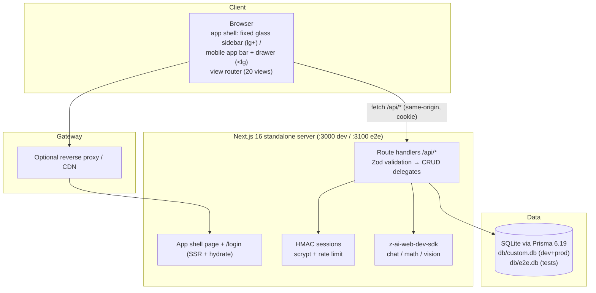
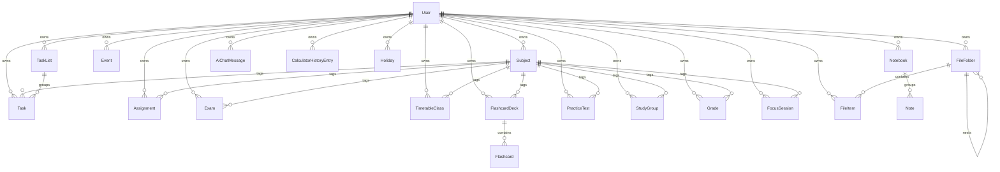

# StudyFlow (Omni-Study) — Master Project Architecture Document (PAD) v1.0.0

**Classification:** Internal Engineering Reference
**Status:** DEFINITIVE, PRODUCTION-LOCKED BLUEPRINT
**Companion Documents:** `README.md` (user-facing), `AGENTS.md` (agent quick-reference), `CLAUDE.md` (agent operating conventions), `docs/Tailwind-V4-Validation-Report.md` (parity trap log)
**Last Updated:** 2026-10-07
**Audience:** Senior Engineers, Tech Leads, DevOps, Onboarding Engineers, and AI Coding Agents
**Rule:** Every architectural decision in this document traces to a specific rationale. Nothing is here "because it's popular."

---

#### Revision Block — v1.0.0

- `[SR]` Initial PAD for the StudyFlow rebuild (replaces the prior document describing the retired ORBITAL iteration of this scaffold repo).
- `[RES]` Reference-app measurements (computed styles, DOM structure, API surface) captured live from `omni-study1.base44.app` with an authenticated headless browser session.
- `[CA]` Prisma 6.19 `file:` URL anchoring behavior verified empirically (schema vs shell-env vs `.env`-loaded values) — encoded as ADR-002 and pinned by `tests/db-path.test.ts`.
- `[SAN]` No secrets, keys, or credentials appear in this document.

---

## Table of Contents

1. [System Overview & Decisions](#1-system-overview--decisions)
2. [High-Level System Topology](#2-high-level-system-topology)
3. [Application Architecture](#3-application-architecture)
4. [Data Architecture](#4-data-architecture)
5. [Design System Reference](#5-design-system-reference)
6. [Security Architecture](#6-security-architecture)
7. [Testing Strategy](#8-testing-strategy)
8. [Build & Deployment](#9-build--deployment)
9. [Developer Handbook](#10-developer-handbook)
10. [Known Issues & Outstanding Tasks](#11-known-issues--outstanding-tasks)
11. [Key Files Reference](#12-key-files-reference)
12. [Glossary](#13-glossary)

---

## 1. System Overview & Decisions

### 1.1 Document Metadata & Purpose

StudyFlow is a self-hosted study-companion application: a deliberate clone — functional superset with measured visual parity — of the hosted app at `omni-study1.base44.app`. This PAD is the single source of truth for how the clone is built and why. Use it when onboarding, when debugging the database-path contract or the Tailwind v4 token pins, when extending a view or an API entity, and when evaluating whether a proposed change violates a locked decision.

### 1.2 Technology Stack Summary

| Layer | Technology | Version | Key Rationale |
|-------|-----------|---------|---------------|
| Web framework | Next.js (App Router) | 16.4.0 | Matches the repo scaffold's pinned major; `output: "standalone"` gives a single-server deploy story |
| UI runtime | React | 19 | Required by Next 16; client view-switching inside one app shell |
| Language | TypeScript (strict) | 5 | End-to-end types; scaffold convention; `unknown` over `any` |
| Styling | Tailwind CSS | 4.1.x (CSS-first) | Scaffold + reference-compiled parity requires v3-pinned tokens (ADR-004) |
| Components | Radix UI primitives, shadcn-style | current (see `package.json`) | Accessible primitives; scaffold convention; themed via CSS vars |
| Icons | lucide-react | 0.525 | Reference uses lucide glyph shapes (verified via DOM) |
| ORM / DB | Prisma + SQLite | 6.19.3 | Zero-config single-file DB; repo-root `db/` contract (ADR-002) |
| Client state | Zustand | 5 | Three small stores; no Context churn; scaffold convention |
| Validation | Zod | 4.6.5 | Every API boundary; codepoint-based string length (noted — see §11) |
| AI SDK | z-ai-web-dev-sdk | 0.0.18 | Chat + vision for the AI Assistant and Math Solver; server-only |
| Unit tests | Vitest | 5 | Matches scaffold `vitest.config.ts` seam |
| E2E tests | Playwright | 1.63 | Boots the production standalone build; computed-style parity pins |
| Runtime/PM | Bun | ≥ 1.3 | Dev server, scripts, seed runner |

### 1.3 Architecture Decision Records

**ADR-001: One-page SPA shell with twenty path rewrites**

- **Context:** The reference app is a rolldown-built React SPA whose views live at PascalCase paths (`/Dashboard` … `/Settings`) and swap client-side without server round-trips. Next.js App Router's default is one folder per route.
- **Decision:** Keep `src/app/page.tsx` as the only app route; add `next.config.ts` rewrites mapping all twenty paths onto `/`; sync view state with `location.pathname` through `src/lib/router.ts` + `useAppStore`; support deep links and back/forward via `pushState`/`popstate`. `/login` remains a real route (the reference redirects unauthenticated users there).
- **Rationale:** Byte-identical routing behavior (instant view swaps, real URLs, SPA 404 semantics for unknown paths); satisfies single-page deployment; keeps every view in one lazy-friendly tree.
- **Consequences:** View components can never be server-rendered per-route; the view map must stay the single source of truth (unit-tested); unknown paths fall through to the dashboard view.
- **Alternatives Rejected:** Twenty real route folders (server round-trips per nav, breaks SPA parity, duplicated shell); query-param routing (URLs diverge from the reference).

**ADR-002: Prisma + SQLite with a three-anchor DATABASE_URL contract**

- **Context:** The requirement pins `.env` to `DATABASE_URL="file:../db/custom.db"` with the `db/` folder at the repo root. Empirical testing of Prisma 6.19 showed three different resolution behaviors for that relative URL: runtime module code can anchor it anywhere (we control it), the CLI anchors shell-provided env at the schema file (correct), but `.env`-loaded env at the CWD (one directory too high). Separately, Next.js dev (Turbopack) pre-resolves relative `file:` DATABASE_URLs against the project directory before app code runs.
- **Decision:** `prisma/schema.prisma` uses `env("DATABASE_URL")`. The runtime resolution lives in `src/lib/db-path.ts`: a RELATIVE url re-anchors against the first candidate root containing `prisma/schema.prisma` (module anchor for dev; standalone detector for the traced build; CWD fallback). An absolute url passes through UNLESS its target is missing while the schema-anchored default exists — that corrects Next-dev's wrong pre-resolution. The `db:*` npm scripts set `DATABASE_URL` inline (shell-provided → schema-anchored CLI). `tests/db-path.test.ts` pins every rule, including the Next-dev correction regression.
- **Rationale:** One database file at `<repo>/db/custom.db` for dev, build, standalone server, and the e2e runner, regardless of CWD; every exception is detected and documented at the point of handling.
- **Consequences:** Raw `prisma db push` relying on repo-root `.env` auto-loading lands the file one directory high (documented in README troubleshooting); schema-url hardcoding was tried and rejected (it embeds the path into the generated client and kills env-based e2e isolation).
- **Alternatives Rejected:** Hardcoded schema url (breaks e2e `db/e2e.db` isolation — the generated client ignores env vars); absolute `.env` paths (violates the pinned requirement; machine-specific); PostgreSQL (heavier ops; the requirement is explicitly SQLite-file based).

**ADR-003: Stateless HMAC cookie sessions + scrypt, no auth framework**

- **Context:** The scaffold documents an "AUTH_SECRET for HMAC cookie auth" contract; single-user deployments don't need OAuth providers, DB session tables, or a framework's worth of indirection. The login page must render a "Continue with Google" button for visual parity.
- **Decision:** `src/lib/auth.ts`: scrypt password hashing (`scrypt$salt$hash`), HMAC-SHA256-signed stateless session cookies (`sf_session`, 30-day TTL, httpOnly/sameSite=lax/secure-in-prod), `requireUser()` for route handlers, and an in-memory per-IP login rate limiter (10 attempts / 15 min). The Google button renders but reports "not configured" honestly — no fake OAuth.
- **Rationale:** Node-crypto stdlib only (no bcrypt native builds); no session-store round trips; revocation-by-logout is acceptable for the threat model; the rate limiter mirrors the reference's limiter shape (which the e2e suite must respect).
- **Consequences:** Sessions can't be server-side revoked before expiry; the limiter is per-process (single-instance only — documented in §11); Google/SSO remains a future integration point.
- **Alternatives Rejected:** Auth.js/NextAuth v5 (OAuth machinery unused; larger surface); Better-Auth (scaffold had no dependency for it; DB sessions unwanted); DB-backed sessions (write amplification for a single-user app).

**ADR-004: Tailwind v4 CSS-first with v3-pinned parity tokens**

- **Context:** The reference app's CSS was compiled by Tailwind v3. Porting its markup byte-identically onto v4 produces five classes of measurable drift, catalogued in `docs/Tailwind-V4-Validation-Report.md` (transparent bare-HSL theme vars, oklch palette drift, oklab gradient interpolation, the `space-*` selector rewrite, the shadow-scale shift).
- **Decision:** `src/app/globals.css` declares the theme under `@theme inline` with full `hsl()` colors, pins the v3 hex palette (slate/violet scales) and `--shadow-sm: 0 1px 2px 0 rgb(0 0 0 / 0.05)`, ships the canvas gradient as an exact `linear-gradient`, and the codebase lays out with `flex gap-*` exclusively. Parity-critical geometry is pinned by e2e computed-style assertions.
- **Rationale:** Five one-line-ish pins versus chasing per-component drift forever; the traps are documented at the point of risk with test coverage.
- **Consequences:** Removing a pin silently regresses parity (hence the e2e pins); `space-y/x` with margin children is banned by convention rather than lint.
- **Alternatives Rejected:** Downgrade to Tailwind v3 (fights the scaffold and Next 16's CSS pipeline); accept v4 defaults (measurably off-palette, heavier shadows).

**ADR-005: Zustand entity cache + mutation wrappers (no react-query)**

- **Context:** The app loads ~20 per-user collections (dozens of rows each). A query-cache library would add bundle + learning overhead; the scaffold already pins Zustand.
- **Decision:** `src/lib/data.ts` holds one `useDataStore` with per-collection status + data, a `load(key, force?)` fetcher, and a `mutations` object whose every operation refreshes the touched collections. Views call `loadAll([...])` in an effect and read slices.
- **Rationale:** Predictable, dependency-free, and correct at this scale; refresh-on-mutate keeps cross-view consistency (a task added on the Dashboard appears in Tasks).
- **Consequences:** No background refetch/dedup/cache invalidation windows; a future multi-megabyte collection would warrant revisiting.
- **Alternatives Rejected:** TanStack Query (unwarranted here); SWR (same); server components + per-route fetching (incompatible with ADR-001's SPA shell).

**ADR-006: CRUD delegate factory with WHERE-clause ownership**

- **Context:** Sixteen entities need identical list/create/update/delete semantics, and the #1 security risk in multi-tenant-by-owner apps is a forgotten scope filter.
- **Decision:** `src/lib/server/http.ts` provides `makeCollectionRoutes`/`makeItemRoutes` over a `CrudDelegate` (`list/create/update/remove`, all taking `userId`); `src/lib/server/entities.ts` implements one delegate per entity; every Prisma query filters `where: { userId, … }`, and updates/deletes verify ownership *before* mutating. Route files are 3-line shells.
- **Rationale:** Ownership by construction — an unscoped query cannot be written through the factory; uniform error envelopes and Zod parsing for free.
- **Consequences:** Cross-user queries are impossible without bypassing the factory (code review guards that); nested ownership (flashcards under decks) needs a manual guard — implemented in `cardsDelegate`.
- **Alternatives Rejected:** Per-route handlers (16× the surface, guaranteed drift); Prisma client extensions (less explicit, harder to lint).

**ADR-007: Two-layer testing with an isolated e2e database**

- **Context:** The value concentrated in this codebase is (a) pure domain seams (calculator engine, date math, auth primitives, path resolution, schemas) and (b) cross-cutting UI contracts (the SPA chrome, parity pins, golden-path CRUD).
- **Decision:** Vitest for unit seams (`tests/*.test.ts`, 114 tests). Playwright for e2e (`tests/e2e/*.spec.ts`, 220 specs incl. 1 setup) against the production standalone build on `:3100` with its own `db/e2e.db` (pushed + seeded by `global-setup.ts` using the ADR-002 shell-env mechanism), one shared authenticated storageState (rate-limiter budget), unique row titles per run, accent restoration in the theme spec (awaiting the settings PATCH so the restore cannot be aborted by page teardown), a hydration gate before post-`goto` clicks, and computed-style parity pins (shadow, canvas gradient, sidebar geometry, corner radii, footer avatar default + gradient stops, stat icon size + text metrics, clock chip gradient, mobile app bar glass/brand/clock, drawer geometry/backdrop blur(4px)/icon items, content offset y=80, CTA width + gradient, view-title h1/icon/subtitle model, empty-state design, login card chrome) plus the session-5 interactive-chrome pins (gradient CTAs, Events dark panel + dialog field set, dialog geometry, gray outline palette, FocusTimer layout, Settings appearance cards, Calendar segmented switch, Calculator keypad/display, MyDay quick-add, Timetable week bar/All Weeks, Files chrome, Notes pane, GradeTracker gradient card, AI quick-action cards) in `tests/e2e/parity-session5.spec.ts`, the session-6 populated-state pins (task card rows + priority checkbox + pill meta + filter panel, task dialog field set, MyDay amber progress card + Suggestions, dashboard bare rows, assignment slider rows, exam card grid, calendar cells/legend/day-detail) in `tests/e2e/parity-session6.spec.ts`, the session-7 lightly-probed-views pins (flashcards two-panel view + swatches + card grid + study mode, dialog palettes/field sets, timetable grid-cols-8 + hour cells + My Classes today date, analytics stat cards + chart titles, grade tracker icons, notes title) in `tests/e2e/parity-session7.spec.ts`, and the session-8 deep-chrome/layout pins (nav icon set + active-gradient avatarTo stop + 36px collapse button, dashboard flush divide-y rows, calendar selected/today semantics + simple month card, MyDay header block + bare suggestions toggle, timetable today-header tint + ghost week-nav, tasks two-pane + icon search, notes/study-groups two-pane + gradient dropdown New, analytics per-card icons + Assignment Status donut + Subject Workload + priority chips, calculator rotate-ccw Clear, mathsolver single column + camera/refresh-cw buttons, AI quick-action icons, focustimer check button, settings tab list chrome, assignments/exams search icons + slim exam card) in `tests/e2e/parity-session8.spec.ts`, and the session-9 data-state/chart-axes pins (dashboard overdue banner + slim section empty states, MyDay amber greeting empty state + bare quick-add row, tasks outline filter button + empty My Lists, calendar Sunday-first grid + icon/tab mode switch, files house breadcrumb + grid3x3 toggle, text-only Grid Builder, assignments Active-default slim rows, exams orange Tomorrow badge, analytics area-chart axes/gridlines/fills, focustimer stat icons, settings tab icons, notes combobox icons, flashcards deck-row ellipsis menu, AI wand-sparkles composer, study-groups hint wording) in `tests/e2e/parity-session9.spec.ts`, and the session-10 dark-mode consistency pins (API-toggled dark mode with an afterEach light restore: shadcn token utilities re-theme on outline button/dialog/dropdown, the banner/amber/clock/today/settings dark washes, analytics SVG dark axes/fills/labels, the dark mobile drawer + Escape superset, and a light-mode byte-parity guard) in `tests/e2e/dark-mode.spec.ts`, and the session-11 theme-system pins (pre-paint dark with `/api/auth/me` route-aborted, the fresh-context dark-OS login, the runtime System re-theme via `emulateMedia`, the theme-color meta sync, the cache write, the four accent-surface re-themes — nav/ViewAll/timetable chip/avatar swatch — the print emulation, and a light regression guard) in `tests/e2e/theme-system.spec.ts`, and the session-12 accessibility pins (forced-colors state restoration — the calendar selected/today outlines, the mode-switch + Settings active-tab outlines, the timetable today-header outline, the bold active nav, the slider progress gradient; the skip link — first Tab stop, visible on focus, Enter lands on main, off-screen unfocused; the print pipeline — `beforeprint` un-themes dark and darkens the text, `afterprint` restores, `print-color-adjust: exact` on the gradient CTAs + events panel + timetable canvas + calendar month card, the timetable `min-width: 0` print reset; the reduced-motion collapse; and a light regression guard) in `tests/e2e/accessibility.spec.ts`.
- **Rationale:** Fast feedback where logic lives; end-to-end confidence where integration lives; zero collision between dev and e2e data.
- **Consequences:** E2E requires a fresh `bun run build` after component changes (stale-build false failures — documented); suite runtime ~1 min single-worker.
- **Alternatives Rejected:** Running e2e against `next dev` (slower, different engine than production); per-test logins (trips the rate limiter); a shared db (cross-run pollution).

---

**ADR-008: Dark-mode token contract — runtime-indirected shadcn tokens + class-based re-theming gradients (session-10)**

- **Context:** The reference app's own Dark/System options are a Base44 platform no-op (measured session 10: `html.dark` + a dark `body`, but the app markup — canvas gradient, glass sidebar, white cards — never re-themes), so dark mode is a clone-side superset feature whose standard is internal consistency. The original token setup placed LITERAL values inside `@theme inline`; Tailwind v4 inlines those into utilities at build time, so the `.dark { --color-* }` overrides could never reach `bg-card`/`bg-popover`/`bg-muted`/`border-input` surfaces (measured: white dialogs + invisible outline buttons in dark mode while `.sf-card` — a direct var() reference — re-themed correctly).
- **Decision:** (1) The shadcn base tokens stay in `@theme inline` but consume RAW triplet vars (`:root`/`.dark`: `--background`, `--card`, `--popover`, `--muted`, `--input`, …) through `hsl(var(--x))` — shadcn's own v4 shape; utilities then resolve at runtime, and light computed values are byte-identical to the previous literals. Shadows route the same way through `--sf-shadow-sm` (the `.dark` dark-shadow line is finally reachable). (2) Exact-SRGB gradients/tints that must re-theme live as globals.css classes with `.dark` overrides — `.sf-overdue-banner`, `.sf-amber-card`, `.sf-today-tint`/`.sf-today-cell`, `.sf-clock-chip` (+ time/date text), `.sf-selected-tint` (the `.sf-calc-display` precedent) — never inline styles. (3) SVG charts re-theme via `dark:fill-*`/`dark:stroke-slate-800` utilities (CSS presentation properties override SVG attributes).
- **Rationale:** One root fix repairs every token-built surface (buttons, dialogs, dropdowns, selects, tabs, badges, toasts) at once; class-based washes keep the light values byte-identical (the S3–S9 e2e pins) while adding dark counterparts in the codebase's established idiom.
- **Consequences:** New tokens that must re-theme follow the same indirection; a literal value in `@theme inline` is a build-time constant by design. Pinned by `tests/e2e/dark-mode.spec.ts` (10 specs incl. a light-mode byte-parity guard).
- **Alternatives Rejected:** Moving the base palette to non-inline `@theme` (split theme blocks, larger blast radius); per-view `dark:` inline-style conditionals (duplicated mode logic in components).

---

**ADR-009: Theme-application lifecycle — pre-paint boot script + localStorage cache + runtime System tracking (session-11)**
- **Context:** The theme class was applied ONLY by client store code after `/api/auth/me` resolved — measured consequences: dark users saw a light flash (or a fully light page when the auth API stalls), the login route never themed at all (its `dark:*` variants were dead code there — fresh dark-OS visitors got a light login), and System mode resolved the OS preference once with no `matchMedia` change listener (a runtime OS switch left the app stale until reload). The accent layer had four remaining inline-style/utility surfaces carrying light-mode tones in dark (active nav text/icon, ViewAllLink, the timetable mobile today chip, the selected avatar swatch) — the S10 pattern recurring on accent-driven surfaces that pass the 2.2 bar under the default violet but violate the repo's own 300-level dark convention.
- **Decision:** (1) `applyToDocument` (store.ts) persists `{ mode, accent }` to `localStorage["sf-theme"]` on every apply (`themeCachePayload`, format unit-pinned); a self-contained inline boot script (`THEME_BOOT_SCRIPT` in `src/lib/theme.ts`, injected into `<head>` by the root layout) reads it BEFORE first paint, resolves `mode` against `matchMedia` (cache absent → system fallback), and applies the `dark` class — `<html suppressHydrationWarning>` absorbs the pre-hydration toggle. (2) `installSystemThemeTracking()` (module scope, idempotent) re-applies when the stored mode is `system` and the OS preference changes at runtime; explicit light/dark choices are user intent and never follow the OS. (3) Sign-out removes the cache so the login route falls back to the fresh-visitor state. (4) A plain non-media `meta[name=theme-color]` (appended after Next's two media variants — last match wins in Chromium) tracks the EFFECTIVE mode for the mobile browser chrome. (5) The four accent surfaces moved to `.sf-nav-active{,-icon}`/`.sf-swatch-selected` classes and `dark:text/bg-sf-primary-{strong,soft}-dark` utility pairs — light values byte-identical, dark follows the 300-level convention. (6) A minimal `@media print` block (hide `aside`/`header[role=banner]`/`[role=dialog]`, white canvas, reset `main` offsets) — a superset nicety the reference lacks.
- **Rationale:** The cache+boot-script pair is the established next-themes shape: theme application becomes continuous across hard loads and route boundaries without server-side session coupling; the accent scope was consciously cut (pre-auth surfaces keep the violet `:root` defaults — the reference's own login is platform-default-styled).
- **Consequences:** The cache can go stale (another device, or the shared e2e user flipping modes) — the auth round-trip corrects it within the load, a one-frame transition at worst; multi-tab last-write-wins. The boot script is a hand-maintained string that cannot import the resolver — the unit-pinned cache format is the sync contract. Playwright contexts start with empty localStorage, so the boot script's media fallback never fights the specs' API-driven modes.
- **Alternatives Rejected:** Server-side theme cookies read by the root layout (couples the login route to session state and adds Set-Cookie coordination to three endpoints); caching the full accent var map (violet-default pre-auth is reference-consistent — measured decision); a `prefers-color-scheme` CSS-only approach (cannot honor the stored user preference).

**ADR-010: Accessibility — forced-colors state restoration, print light-forcing, skip link, reduced-motion (session-12)**

- **Context:** Chromium's forced-colors (Windows High Contrast) and print rendering both strip the author's color story to system defaults: the forced palette wiped every fill/tint that ENCODES STATE (calendar selected day, today markers, the mode-switch active segment, the active tab, the active nav item, the assignment slider progress — text stayed readable everywhere, 0 invisible-text findings across all 20 views), and the print media never un-themed (dark mode printed 2–8 light-text elements per view on the print-white canvas) while browsers' default background-dropping turned every white-text-on-color surface invisible; the `min-w-[900px]` timetable canvas clipped Saturday on A4. The keyboard audit found 21 sidebar stops before any content with no bypass (WCAG 2.4.1). The reference has NO print styles, NO forced-colors handling, and NO skip link — all superset territory (its own active-nav marker wipes identically under forced-colors, measured).
- **Decision:** (1) ONE `@media (forced-colors: active)` globals.css block restores state with system colors — inset `2px solid Highlight` outlines scoped to the Calendar's two stable `aria-label` containers + `[role=tab][data-state=active]` + `[data-today]` + `.sf-today-tint` (a bare `[aria-pressed]` rule would hit 12 files), `font-weight: 700` on `nav a[aria-current=page]` AND its `span` (inherited weights lose to the inner `font-medium` utility), and `forced-color-adjust: none` on `.sf-slider-fill` (the WCAG 1.4.11 essential-graphic exception). (2) The theme boot script registers `beforeprint`/`afterprint` handlers that remove/restore the `dark` class around the print duration (`__sfPrintDark` flag; unit-pinned presence strings) — one mechanism covering every dark: utility and custom class on BOTH routes. (3) `.sf-gradient` + the `sf-print-exact` utility (`print-color-adjust: exact`, inherited) on every white-text-on-color container: the Button default variant, the events terminal panel, the timetable canvas, the calendar month card, the checked checkboxes, the raw dashboard/MyDay CTAs. (4) `.sf-timetable-canvas` (the `min-w-[900px]` wrapper) resets `min-width: 0` in print — all 8 columns fit A4 (verified in the real PDF). (5) A visually-hidden skip link (`.sf-skip-link`, off-screen not `display:none`) as the first focusable element → `main#main-content` (tabIndex -1). (6) The standard global `@media (prefers-reduced-motion: reduce)` collapse block.
- **Rationale:** System-color outlines keep maximum text contrast (the state rides `Highlight`, not a forced color); the JS print handlers beat duplicating a token-reset per custom class; `print-color-adjust: exact` marks essential backgrounds ONLY (decorative tints still wipe — ink economy); the skip link has zero visual parity impact (off-screen until focused).
- **Consequences:** New interactive surfaces that encode state with fills need a forced-colors story and white-text-on-color surfaces need `sf-print-exact`; the boot script grew (the unit pins are the sync contract); `page.pdf()` in tests must be preceded by `page.emulateMedia({ media: "print" })` to model the real pipeline (measured — without it the layout can keep screen-width geometry), and print-media DOM probes must dispatch `beforeprint` manually (`emulateMedia` alone does not fire it).
- **Alternatives Rejected:** `forced-color-adjust: none` on state surfaces (keeps brand colors but sacrifices the forced palette's guaranteed text contrast — only the non-text slider fill takes it); a CSS-only `.dark` print token reset (duplicates every custom class's dark variant; the JS pair covers inline styles and both routes at once); a display:none skip link (unfocusable).

---

## 2. High-Level System Topology



Runtime characteristics: single Node (Bun) process; SQLite is embedded (no network hop); AI calls are synchronous request-scoped; the client is a single-page bundle with per-view lazy data loads. Scaling is vertical + instance-level; the in-memory rate limiter and SQLite make horizontal multi-instance deployment out of scope for the current build (see §11).

---

## 3. Application Architecture

### 3.1 The Layer Model

```
Layer 0: Browser shell      — src/app/page.tsx, components/layout/*      Rule: one page; views never route.
Layer 1: Views              — src/components/views/*-view.tsx            Rule: orchestrate only; compute in lib seams.
Layer 2: UI kit             — src/components/ui/*                        Rule: shadcn-style primitives; accent via CSS vars.
Layer 3: Client state       — src/lib/{store,data,api,router,theme}.ts   Rule: Zustand stores; URL is routing truth.
Layer 4: Pure domain        — src/lib/{date,calculator,validation}.ts    Rule: unit-tested; no DOM, no Prisma.
Layer 5: Server handlers    — src/app/api/**, src/lib/server/*           Rule: Zod at boundary; userId in WHERE clause.
Layer 6: Persistence        — src/lib/{db,db-path}.ts, prisma/schema     Rule: one db file; the 3-anchor contract (ADR-002).
```

**Golden Rule:** dependencies point downward only. A view may import lib seams and ui primitives; a lib seam may never import a view. Server-only modules (`auth.ts`, `server/*`, the AI SDK imports) must never appear in a client module's import graph.

### 3.2 Annotated Directory Structure

```
omni-study/
├── src/
│   ├── app/
│   │   ├── page.tsx                     ← the whole app: auth gate → shell → view switcher
│   │   ├── layout.tsx                   ← metadata, fonts, Toaster
│   │   ├── login/page.tsx               ← reference-parity login card
│   │   ├── globals.css                  ← @theme tokens + the five v4 trap pins + .glass/.sf-* utilities
│   │   └── api/
│   │       ├── health/route.ts          ← liveness + DB probe (e2e webServer gate)
│   │       ├── auth/{login,register,logout,me}/route.ts
│   │       ├── tasks|task-lists|assignments|exams|events|timetable|
│   │       │   notebooks|notes|practice-tests|study-groups|grades|
│   │       │   focus-sessions|holidays]/route.ts + [id]/route.ts   ← factory shells
│   │       ├── subjects/route.ts + [id]/route.ts
│   │       ├── flashcards/{decks,cards}/route.ts + [id]/route.ts   ← cards carry a deck-ownership guard
│   │       ├── files/{route,folders,link,[id]}/route.ts            ← multipart upload ≤ 2 MiB, download, links
│   │       ├── settings/preferences/route.ts                       ← theme/accent/avatar/name persistence
│   │       ├── calculator/history/route.ts
│   │       └── ai/{chat,messages}/route.ts, math/solve/route.ts    ← z-ai-web-dev-sdk (server-only)
│   ├── components/
│   │   ├── layout/sidebar.tsx           ← fixed w-[260px] glass, hidden lg:flex, active gradient + dot
│   │   ├── layout/nav-items.tsx         ← NAV_ICONS + NavItemLink — the ONE nav-item markup source
│   │   ├── layout/mobile-chrome.tsx     ← fixed h-16 glass app bar (brand + live clock) + 288px drawer
│   │   ├── ui/                          ← button, card, input, dialog, select, tabs, badge,
│   │   │                                  primitives (checkbox/switch/progress/separator/skeleton),
│   │   │                                  dropdown-menu, toast (zustand toaster)
│   │   └── views/                       ← 20 view files + shared.tsx (ViewHeader, StatCard w/ gradient
│   │                                      chips + blobs, SectionCard, EmptyState, SubjectChip, …)
│   ├── lib/
│   │   ├── db-path.ts                   ← THE DATABASE_URL contract (pure, unit-tested)
│   │   ├── db.ts                        ← Prisma singleton; sets env before construction
│   │   ├── auth.ts                      ← scrypt, HMAC tokens, requireUser, rate limiter
│   │   ├── router.ts                    ← 20-view ↔ path map + greeting buckets (pure)
│   │   ├── date.ts                      ← local-time date math, month grid, HH:MM helpers (pure)
│   │   ├── calculator.ts                ← tokenizer + shunting-yard (u- unary op), GPA, converter (pure)
│   │   ├── theme.ts                     ← 7 accent token sets (RGB triplets), avatar set (pure)
│   │   ├── validation.ts                ← every Zod schema (the API payload contract)
│   │   ├── api.ts                       ← typed fetch helpers + ApiError
│   │   ├── store.ts                     ← useAppStore + useThemeStore (+ html token application)
│   │   ├── data.ts                      ← useDataStore + typed mutations (refresh-on-mutate)
│   │   └── server/{http,entities}.ts    ← CRUD factory + 16 delegates
│   └── hooks/                           ← (reserved)
├── prisma/
│   ├── schema.prisma                    ← 21 models + the DATABASE PATH CONTRACT header
│   └── seed.ts                          ← idempotent demo data (uses db.ts for env-aware resolution)
├── tests/
│   ├── *.test.ts                        ← Vitest: router, theme, date, calculator, auth, validation, db-path
│   └── e2e/                             ← Playwright: global-setup (e2e.db), auth.setup (storageState),
│                                          auth, mobile-navigation, navigation, tasks, calculator specs
├── docs/
│   ├── screenshots/                     ← dev-server captures (login, 14 desktop views, 3 mobile)
│   ├── Tailwind-V4-Validation-Report.md ← the five documented traps + methodology notes
│   ├── DEPLOYMENT.md                    ← production notes (absolute DATABASE_URL, §4)
│   └── ssh_git_wrapper_v3.py + how-to-git-push-using-ssh-wrapper_SKILL.md
├── next.config.ts                       ← standalone output, 20 rewrites, allowedDevOrigins
├── vitest.config.ts / playwright.config.ts / eslint.config.mjs / tsconfig.json / components.json
└── package.json                         ← bun scripts incl. inline-anchored db:* commands
```

### 3.3 Critical Code Patterns

**Pattern A — the view router seam (pure, deep-link tolerant):**

```typescript
// src/lib/router.ts — the single source of truth for view ↔ path mapping.
// Pure on purpose: every consumer (page shell, sidebar, drawer, e2e specs)
// trusts THIS map, and tests pin the round-trip.
export function viewFromPath(pathname: string): ViewId {
  const clean = (pathname || "/").split("?")[0]!.replace(/\/+$/, "");
  if (!clean || clean === "/") return "dashboard";
  const segments = clean.split("/").filter(Boolean);
  for (const segment of segments) {           // FIRST matching segment wins:
    const hit = VIEWS.find((v) => v === segment.toLowerCase());
    if (hit) return hit;                       // /Tasks/abc still lands on tasks
  }
  return "dashboard";
}
```

*Why this pattern:* deep links and the rewrite table both funnel into one resolver; case-insensitivity tolerates hand-typed URLs; unknown paths degrade to the dashboard exactly like the reference SPA.

**Pattern B — ownership-scoped CRUD through the factory:**

```typescript
// src/lib/server/entities.ts (excerpt) — every delegate takes userId and
// scopes the WHERE clause; updates verify ownership BEFORE mutating.
update: async (userId, id, input) => {
  const patch = parseWith(taskPatchSchema, input);        // Zod at the boundary
  await owned(userId, id, () => db.task.findFirst({ where: { id, userId } }));
  return db.task.update({ where: { id }, data: { /* …patch fields… */ } });
},
```

*Why this pattern:* an unscoped query cannot be written through the factory (ADR-006); the ownership pre-check prevents both cross-user reads and `P2025` leaks about record existence.

**Pattern C — the db-path correction (the Next-dev trap):**

```typescript
// src/lib/db-path.ts (excerpt) — absolute file: URLs pass through UNLESS
// the target is missing while the schema-anchored default exists. That is
// exactly the shape of Next.js dev's pre-resolved value (anchored at the
// project dir, one level off the prisma/ anchor).
if (path.isAbsolute(raw) || /^[A-Za-z]:[\\/]/.test(raw)) {
  if (!existsSync(raw)) {
    const fallback = path.resolve(schemaRoot, "prisma", DEFAULT_RELATIVE_DB);
    if (existsSync(fallback)) return `file:${fallback}`;
  }
  return `file:${raw}`;
}
```

*Why this pattern:* production absolute URLs (valid targets) are untouched; the dev-server's wrong-but-absolute value self-heals to the documented default; the regression is pinned by a dedicated unit test.

**Pattern D — parity-pinned design tokens:**

```css
/* src/app/globals.css — TRAP 5 pin (v4 moved the shadow scale one notch):
   the reference's cards compute 0 1px 2px 0 rgba(0,0,0,0.05); without this
   pin every `shadow-sm` renders visibly heavier. Pinned by e2e spec
   "cards render the v3-pinned shadow-sm geometry". */
@theme inline {
  --shadow-sm: 0 1px 2px 0 rgb(0 0 0 / 0.05);
}
```

*Why this pattern:* one line fixes every usage site forever; the e2e computed-style assertion makes silent regression impossible.

---

## 4. Data Architecture

### 4.1 Database Schema

SQLite, provider `sqlite`, url `env("DATABASE_URL")` (see ADR-002). Twenty models; all children cascade on `User` deletion; nullable subject/list references use `SetNull`.



Notable column semantics: `Task.dueDate` nullable datetime (local-time semantics); `TimetableClass.dayOfWeek` 0=Monday…6=Sunday (ISO minus one); `StudyGroup.members` JSON string `[{name,email}]` (normalized client-side); `FileItem.data` base64 ≤ 2 MiB or null-with-url for links; `Grade.weight` credit weight (default 1); `User.themeMode/accentColor/avatarEmoji` drive the theme system.

### 4.2 Persistence Strategy

Single Prisma client singleton per process (`globalThis` caching in dev); query logging in dev, error-only in production; `db push` (not migrate) is the documented schema workflow for this SQLite app — the seed is idempotent (upsert-by-email + subject top-up). E2E gets a fully separate file (`db/e2e.db`) created per run by `global-setup.ts` and never committed (gitignored `db/*.db`).

---

## 5. Design System Reference

### 5.1 Typographic System

System sans stack (`ui-sans-serif, system-ui, sans-serif, "Apple Color Emoji", …`) — matches the reference's measured `font-family`. Scale: page titles `text-2xl font-bold slate-800` (dashboard greeting / MyDay / FocusTimer `text-3xl`); section titles `text-lg font-semibold slate-800` with `h-5 w-5` accent icon; stat values `text-[30px] font-bold` (dashboard) / `text-4xl font-bold` (GradeTracker + calculator display, S5-M/H); nav labels 16px (text-base) with `w-5` icons; body text `text-sm`; the FocusTimer clock is `text-5xl font-mono` (48px, S5-E).

### 5.2 Color Tokens

| Token | Value | Usage / Notes |
|-------|-------|---------------|
| `--sf-primary` | `139 92 246` (#8b5cf6) | Accent RGB triplet on `<html>`; active states, chips |
| `--sf-primary-strong` | `124 58 237` (#7c3aed) | Links ("View All"), active nav text, clock date (measured live); gradient hover start (S5-A) |
| `--sf-primary-deep` | `109 40 217` (#6d28d9) | Clock time text (reference violet-700, measured) |
| `--sf-primary-softest` | `245 243 255` (#f5f3ff) | Clock chip gradient start (reference violet-50); calculator display start (S5-H) |
| `--sf-primary-soft` | `243 232 255` | Active nav gradient tint, icon chips, selected avatar tile (S5-F) |
| `--sf-primary-softest-adjacent` | `238 242 255` (indigo-50) | Clock chip gradient SECOND stop (measured, S3-C); calculator display end (S5-H) |
| `--sf-primary-gradient-to` | `79 70 229` (indigo-600) | Brand chips (sidebar/drawer/app-bar) + CTA gradient end (measured, S4-G) |
| `--sf-primary-gradient-to-strong` | `67 56 202` (indigo-700) | CTA gradient HOVER end (`hover:to-indigo-700` measured — S5-A) |
| `--sf-primary-avatar-from` / `-to` | `167 139 250` / `99 102 241` | Footer avatar gradient (violet-400 → indigo-500, the LIGHTER pair — measured, S4-G) |
| `--sf-primary-empty-from` / `-to` | `237 233 254` / `224 231 255` | Empty-state 80px block gradient (violet-100 → indigo-100 — measured, S4-C) |
| Card surface | white / `#f1f5f9` border / 16px radius | `sf-card` + SectionCard |
| Shadow | `0 1px 2px 0 rgb(0 0 0 / 0.05)` | v3 `shadow-sm` — **pinned** (trap 5) |
| Primary CTAs | `.sf-gradient` = `linear-gradient(to right, rgb(var(--sf-primary)), rgb(var(--sf-primary-gradient-to)))` + v3 `shadow` (`.sf-gradient-shadow`); empty-state CTAs + tinted `shadow-lg` (`.sf-gradient-shadow-lg`) | Button `gradient` variant — sRGB-exact, accent-aware (S5-A) |
| Radius scale | md 6px / lg 8px / xl 12px / 2xl 16px / 3xl 24px | v4 defaults = v3 semantics; only `--radius-sm: 0.125rem` pinned (trap 6) |
| Canvas | `linear-gradient(to right bottom, #f8fafc, #fff, #f5f3ff4d)` | `.sf-canvas` — measured from the reference; exact third stop pinned |
| Neutral ramps | slate (view text) + GRAY (form controls: `--foreground` gray-950, `--input`/`--border` gray-200, `--muted-foreground` gray-400) + cyan-300/400 + red-600 pins | v3 hexes pinned in `@theme` (traps 2/7/10 — S5-D) |
| Dark mode | slate-950 family + `--sf-primary-soft-dark` tokens | `.dark` class + token swap |
| Footer avatar | 36px gradient circle (`avatar-from → avatar-to` = violet-400 → indigo-500), white initial when no emoji | `UserAvatar` (reference default state, R3 + S4-G) |
| View titles | `h1 text-2xl font-bold text-slate-800` + 24px accent icon (MyDay/FocusTimer 30px) + 16px subtitle (reference wording) | `ViewHeader` — one source for all 20 views (S4-D) |
| Empty states | 80px rounded-2xl gradient block + 40px accent icon + h3 20px/600 + 16px hint | `EmptyState`/`SimpleEmptyState` (S4-C) |
| Login card | 448px `shadow-2xl bg-white/95 backdrop-blur-xs border-0` + gradient strip + 96px circular logo | `src/app/login/page.tsx` (S4-F) |
| Events panel | slate-900 rounded-2xl shadow-2xl terminal panel, cyan-400 New Event link, `CW <n>` week label, slate-800/50 section headers | `events-view.tsx` — intentionally dark in BOTH themes (S5-B) |

Seven accent sets (violet/blue/**emerald**/**amber**/pink/red/teal — the green/orange migrations match the reference's swatch faces, S5-F) × Light/Dark/System × 24 emoji avatars, persisted on `User` and applied by `useThemeStore.loadFromUser`.

### 5.3 Component Primitives

Radix: dialog, select, tabs, dropdown-menu, checkbox, switch, progress, separator, tooltip, scroll-area, alert-dialog, label, popover, radio-group, slot. shadcn-style wrappers in `src/components/ui/*` themed with the `--sf-*` vars; `cva` variants on button/badge/tabs.

### 5.4 Motion

CSS-keyframe only (`sf-shimmer` skeletons, `sf-toast-in` slide, dialog zoom/fade via Radix data-state classes, `transition-all duration-200/300` on chrome). No animation library; no reduced-motion special-casing yet (see §11).

---

## 6. Security Architecture

### 6.1 Security Rules

| # | Rule | Enforcement |
|---|------|-------------|
| 1 | Every API payload validates through its Zod schema | `parseWith()` in every delegate/handler; 400 with field context on failure |
| 2 | Every query is ownership-scoped | CRUD factory (ADR-006); `requireUser()` gate in `withUser()` |
| 3 | Passwords are scrypt-hashed, never logged | `hashPassword/verifyPassword`; no secret fields in any select |
| 4 | Sessions are HMAC-signed, httpOnly, sameSite=lax | `createSessionToken`/cookie flags; tamper + expiry checked on read |
| 5 | Login is rate-limited and user-enumeration-safe | 10/IP/15 min; uniform "Invalid email or password." |
| 6 | Uploads are size-capped and type-recorded | 2 MiB check before persist; MIME stored, served with `Content-Disposition: attachment` |
| 7 | No secrets in the repo | `.env`/`*.key`/`db/*.db` gitignored; pushes via the key-shredding SSH wrapper |
| 8 | z-ai SDK stays server-side | imports only inside `src/app/api/{ai,math}/**` |

### 6.2 Security Utilities

`src/lib/auth.ts` (scrypt/HMAC/rate-limit/`requireUser`), `src/lib/validation.ts` (all boundary schemas), `src/lib/server/http.ts` (`errorResponse` mapping — Zod→400, Prisma P2002→409, P2025→404, unauthed→401, unknown→500 with server-side log only).

### 6.3 Authentication & Authorization

Single-role per-user ownership model; no admin surface. Session: `{ uid, iat, exp }` HMAC-SHA256 with `AUTH_SECRET` (dev fallback constant when unset — production MUST set it). Registration seeds three starter subjects. Logout clears the cookie client- and server-side.

### 6.4 Threat Model

| Vector | Mitigation | Residual risk |
|--------|-----------|---------------|
| Credential stuffing | Rate limiter + scrypt cost | Limiter is per-process (single instance) |
| Session forgery | HMAC + expiry | Secret leakage = valid sessions until expiry; rotate AUTH_SECRET |
| IDOR on entities | Factory WHERE-scoping | Bypassing the factory is a code-review concern |
| XSS | React escaping only; no `dangerouslySetInnerHTML` anywhere | AI/markdown rendered as plain text |
| Upload abuse | 2 MiB cap, attachment disposition | No MIME allowlist (content sniffing relies on disposition) |
| SQLi | Prisma parameterized queries | — |
| CSRF | sameSite=lax cookies + JSON-only APIs | Cross-site POSTs with JSON bodies are blocked by CORS/preflight defaults |

---

## 8. Testing Strategy

### 8.1 Test Distribution

| Category | Files | Tests | Location | Framework |
|----------|-------|-------|----------|-----------|
| Unit — pure seams | 8 | 106 | `tests/*.test.ts` | Vitest 5 (node env, `@` alias) |
| E2E — auth | 1 | 6 | `tests/e2e/auth.spec.ts` | Playwright 1.63 |
| E2E — mobile navigation | 1 | 11 | `tests/e2e/mobile-navigation.spec.ts` | Playwright |
| E2E — desktop nav + views + parity pins | 1 | 41 | `tests/e2e/navigation.spec.ts` | Playwright |
| E2E — task CRUD golden path | 1 | 6 | `tests/e2e/tasks.spec.ts` | Playwright |
| E2E — calculator + theme | 1 | 8 | `tests/e2e/calculator.spec.ts` | Playwright |
| E2E — session-5 interactive-chrome parity pins | 1 | 19 | `tests/e2e/parity-session5.spec.ts` | Playwright |
| E2E — session-6 populated-state parity pins | 1 | 15 | `tests/e2e/parity-session6.spec.ts` | Playwright |
| E2E — session-7 lightly-probed-views parity pins | 1 | 17 | `tests/e2e/parity-session7.spec.ts` | Playwright |
| E2E — session-8 deep-chrome/layout parity pins | 1 | 36 | `tests/e2e/parity-session8.spec.ts` | Playwright |
| E2E — session-9 data-state/chart-axes parity pins | 1 | 25 | `tests/e2e/parity-session9.spec.ts` | Playwright |
| E2E — session-10 dark-mode consistency pins | 1 | 10 | `tests/e2e/dark-mode.spec.ts` | Playwright |
| E2E — session-11 theme-system pins (boot script, System tracking, meta, accent re-themes, print) | 1 | 12 | `tests/e2e/theme-system.spec.ts` | Playwright |
| E2E — session-12 accessibility pins (forced-colors state, skip link, print pipeline, reduced-motion) | 1 | 15 | `tests/e2e/accessibility.spec.ts` | Playwright |
| **Total** | **22** | **334** | `tests/` (114 unit + 220 e2e incl. 1 setup) | Vitest + Playwright |

### 8.2 Test Patterns

- **Contract pinning:** db-path anchors, router round-trips, theme token values, calculator edge cases (unary chains, right-assoc powers, division by zero), Zod accept/reject matrices.
- **Computed-style parity:** the e2e layer asserts the v3 `shadow-sm` geometry, the canvas gradient's first stop, sidebar width/margin at `lg`, active-nav color `rgb(124, 58, 237)`, the stat-card text metrics, the view-title model, the empty-state design, the brand-gradient stops, and the login chrome — plus the session-5 interactive-chrome family (gradient CTAs, Events dark panel, dialog geometry, gray outline palette, FocusTimer layout, Settings appearance cards, Calculator keypad/display, Timetable week bar, Files/Notes/MyDay/AI/GradeTracker chrome) the session-6 populated-state family (task card rows + priority checkbox + pill meta + filter panel, task dialog field set, MyDay amber progress card + Suggestions, dashboard bare rows, assignment slider rows, exam card grid, calendar cells/legend/day-detail), and the session-7 lightly-probed-views family (flashcards two-panel layout + deck swatches + card grid + 3D study mode, study-group swatch palette, practice-test dialog field set, timetable grid-cols-8 heads + 60px hour cells + My Classes today date, analytics tinted stat cards + 7-day chart titles, grade tracker icons, notes title input), and the session-8 deep-chrome/layout family (nav icon set + active-gradient indigo stop, dashboard flush divide-y rows, calendar selected/today semantics, MyDay header block + suggestions, timetable today-header tint, tasks/notes/study-groups two-pane layouts, analytics per-card icons + donut + workload, calculator/mathsolver/AI/focustimer/settings chrome, assignments/exams search icons + slim exam card), and the session-9 data-state/chart-axes family (dashboard overdue banner + slim section empty states, MyDay amber greeting empty state, tasks outline filter button, calendar Sunday-first grid + mode-switch chrome, files breadcrumb/toggle glyphs, assignments Active-default slim rows, exams orange Tomorrow badge, analytics area-chart axes/gridlines, focustimer/settings/notes icon fixes, flashcards deck-row ellipsis menu, AI wand-sparkles composer), and the session-10 dark-mode consistency family (API-toggled dark mode asserting the shadcn token utilities re-theme — outline button/dialog/dropdown — plus the banner/amber/clock/today/settings dark washes, dark SVG chart axes/fills, the dark mobile drawer, and a light-mode byte-parity guard), and the session-11 theme-system family (pre-paint dark application with the auth route aborted, the dark-OS fresh-visitor login, runtime System re-theming, the theme-color meta sync, the cache format, the active-nav/ViewAll/timetable-chip/avatar-swatch accent re-themes, and print emulation) — the trap-log guarantees.
- **Golden-path CRUD:** create → complete → filter → delete through the real UI against the seeded e2e db.
- **Shared-session design:** one login via the setup project's storageState; the auth spec opts out with an empty state and stays under the rate-limiter budget.

### 8.3 Coverage Thresholds

No numeric coverage gate is configured; the standard is "every pure seam has a test file, every parity pin has a spec." New logic lands with tests in the same commit (regression tests required for bug fixes).

### 8.4 Pre-Push Checklist

- [ ] `bun run lint` clean
- [ ] `bun run typecheck` clean
- [ ] `bun run test` green (87+)
- [ ] `bun run build` succeeds
- [ ] `bun run test:e2e` green (60+; rebuild first if components changed)
- [ ] No secrets / db files staged (`git status`)
- [ ] Docs touched if behavior/setup changed

---

## 9. Build & Deployment

### 9.1 Production Build

`bun run build` → `next build` (static login page + dynamic API/app shell) → copies `static/` + `public/` into `.next/standalone`. Serve with `bun run start` (`NODE_ENV=production`, port 3000). The e2e suite boots this exact artifact on `:3100` with `DATABASE_URL=file:../db/e2e.db` — the standalone detector in `db-path.ts` resolves it to `<repo>/db/e2e.db`.

### 9.2 Environment Variables

| Variable | Required | Description | Default |
|----------|----------|-------------|---------|
| `DATABASE_URL` | yes | SQLite url; runtime-resolved by `db-path.ts` | `file:../db/custom.db` (.env) |
| `AUTH_SECRET` | prod | Session HMAC key | insecure dev fallback |
| `NEXT_PUBLIC_SITE_URL` | no | Canonical origin (metadata/sitemap) | `http://localhost:3000` |
| `E2E_PORT` | no | Playwright server port override | `3100` |

Production should use an **absolute** `DATABASE_URL` (see `docs/DEPLOYMENT.md` §4).

### 9.3 Docker Configuration

None — the repo ships no Dockerfile; the standalone output is the deployment unit. (Documented honestly rather than backfilled with an untested image.)

### 9.4 CI/CD Pipeline

No hosted CI. The local gate (§8.4) is authoritative; pushes to `main` go through `docs/ssh_git_wrapper_v3.py` (dry-run → push → remote-ref verification → key shredding; instructions in `docs/how-to-git-push-using-ssh-wrapper_SKILL.md`).

---

## 10. Developer Handbook

### 10.1 Local Setup

```bash
bun install
bun run db:push && bun run db:seed
bun run dev                # → /login → demo@studyflow.app / Demo1234!
```

### 10.2 Common Commands

See the table in `AGENTS.md` (canonical) — dev/lint/typecheck/test/build/test:e2e/db:* plus single-file runners.

### 10.3 Code Style Rules

Enforced: ESLint flat config + `tsc --noEmit` (both gate). Convention (review-enforced): `flex gap-*` layouts only; accent colors via `--sf-*` tokens; pure logic in `src/lib` seams with tests; view files export one `<Name>View`; `"use client"` atop every component file.

### 10.4 Git Workflow

`main` only; Conventional Commits; atomic units; wrapper-based SSH pushes with post-push remote verification. Never commit `.env`, `db/*.db`, `dev.log`, or key material.

---

## 11. Known Issues & Outstanding Tasks

| Priority | Issue | Impact | Status |
|----------|-------|--------|--------|
| MEDIUM | In-memory login rate limiter is per-process | A multi-instance deploy would multiply the attempt budget | Open (single-instance by design; document before scaling) |
| MEDIUM | `next dev` OOM-killed in ~4 GB containers under parallel load (observed: 1.6 GB RSS + headless browsers) | Dev server dies silently mid-session | Mitigated (close extra browsers; restart) — no memory cap configured |
| LOW | "Continue with Google" renders but is not wired to OAuth | Visual parity only; email/password is the real flow | Open (honest toast; future integration point) |
| LOW | Notifications preferences persist to localStorage only | No delivery channel exists | Open (documented in Settings UI) |
| LOW | Zod v4 `.max()` counts code points, not UTF-16 units | `avatarEmoji` limit allows up to 8 code points (≈8 emoji) | Accepted (pinned by test with the semantics documented) |
| LOW | No `prefers-reduced-motion` handling for CSS animations | Motion-sensitive users still see shimmer/slide | Open |
| LOW | Prisma `db push` workflow (no migrations history) | Schema changes are not versioned | Accepted for SQLite/single-user; revisit if multi-user |
| INFO | `space-*` ban is convention, not lint rule | A new contributor could reintroduce trap 4 | Accepted (e2e parity pins would not catch spacing regressions) |
| RESOLVED | Session-2 remediation: radius scale inflated one notch by a mistaken pin block (cards 20px vs reference 16px, buttons 8px vs 6px) | Every corner ~33% larger than the reference | **Fixed** — `--radius-sm: 0.125rem` is the only radius pin; pinned by the e2e "corner radii" spec (see `docs/remediation-plan.md` R1) |
| RESOLVED | Session-2 remediation: dashboard stat icons (Pending→ListChecks, Focus→Sparkles), footer avatar default (emoji vs initial), collapse glyph, canvas third-stop drift, clock chip one-notch-too-saturated | Minor visual parity drifts vs the live reference | **Fixed** — all measured against the reference DOM and re-verified (VLM verdict EXCELLENT); see `docs/remediation-plan.md` |
| RESOLVED | Session-3 remediation: mobile app bar was sticky + main pt-20 → 64px dead gap (content at 144px vs reference 80px); header showed the view title instead of brand + live clock | Every mobile view sat 64px too low; header content mismatch | **Fixed** — fixed glass app bar + main pt-20 (see `docs/remediation-plan-session3.md` S3-E) |
| RESOLVED | Session-3 remediation: drawer divergences (290px panel, 45% backdrop, text-only nav links, extra footer), stat icons 20px, clock "3:43 AM" + indigo-50 stop drift, "Good night" greeting bucket, CTA full-width at mobile, glass blur 16px | Mobile visual parity + token drifts | **Fixed** — drawer mirrors the reference (shared `NavItemLink`), tokens pinned exactly; see `docs/remediation-plan-session3.md` |
| RESOLVED | Session-3 remediation: accent switching wrote only 6 of 9 theme tokens — `deep`/`softest` stayed violet under every non-violet accent | Clock text/chip stayed violet after switching accents | **Fixed** — `applyToDocument` writes the complete `accentCssVars` set (S3-J; unit-pinned) |
| RESOLVED | Session-4 remediation: v4 blur trap (drawer backdrop 8px vs reference 4px); stat-card text metrics (tracking-tight/leading-none/12px hint); empty-state design divergence; view titles tracking-tight slate-900 h2-in-8-views with NO icons; subtitle text drift on ~12 views; login card chrome; brand gradients ending violet-600 instead of indigo-600; "My Lists" label; dashboard date 14px | Second-order parity across every view | **Fixed** — all measured against the reference DOM; 11 new e2e pins + 2 unit pins; see `docs/remediation-plan-session4.md` |
| RESOLVED | Session-5 remediation: primary CTAs rendered solid violet (reference: violet→indigo gradient + v3 shadow); Events view was a light 7-day-strip design (reference: dark slate-900 terminal panel); dialog chrome (rounded-2xl/max-w-lg/h-10 inputs); zinc form-control palette (reference: gray); FocusTimer/Settings-Appearance/Calculator/Timetable/Notes/GradeTracker/Files/MyDay/AI body divergences; green/orange accents off the reference swatch faces | Third-order (interactive-chrome + view-body) parity across every surface | **Fixed** — 19 new e2e pins + 6 unit pins; see `docs/remediation-plan-session5.md` |
| RESOLVED | Session-6 remediation: populated rows were unmeasurable in prior sessions (reference account empty) — task rows rendered bare `li`s in one card with 16px square checkboxes and amber stars (reference: standalone r12 card rows, 24px round priority-colored checkboxes, pill meta, hover-revealed violet-star actions); task model lacked priority/repeat/myDay/subtasks; MyDay lacked the amber progress card + Suggestions; dashboard rows/assignment rows/exam cards/calendar grid+legend+day-detail all diverged from the (newly measured) reference designs | Fourth-order (populated-state) parity across every list surface | **Fixed** — 15 new e2e pins + 3 unit pins; see `docs/remediation-plan-session6.md` |
| MITIGATED | The sandbox reaps background processes at tool-call boundaries — a plain `&` dev server dies silently between agent commands | Dev server instability during long agent sessions | **Mitigated** — `scripts/dev-daemon.py` (double-fork + setsid) keeps the dev server alive; documented in the session-4 plan |
| MITIGATED | SQLite serves a deleted `db/custom.db` through the open file handle — reseeding under a running dev server changes nothing until restart | Stale demo data after reseed | **Mitigated** — restart the dev daemon after `rm db/custom.db && db:push && db:seed` (documented in the session-5 plan) |

---

## 12. Key Files Reference

| File | Lines | Purpose |
|------|-------|---------|
| `src/app/page.tsx` | ~120 | The whole app: auth gate, shell, view switcher, popstate sync |
| `src/lib/db-path.ts` | ~130 | The DATABASE_URL contract — pure, unit-tested, trap-corrected |
| `src/lib/server/entities.ts` | ~620 | All 16 CRUD delegates (ownership-scoped) |
| `src/lib/server/http.ts` | ~135 | Route factory, error envelope, Zod parse helper |
| `src/lib/validation.ts` | ~230 | Every API boundary schema |
| `src/lib/data.ts` | ~560 | Client entity cache + typed mutations |
| `src/lib/calculator.ts` | ~250 | Shunting-yard engine, GPA, unit converter |
| `src/lib/auth.ts` | ~150 | scrypt, HMAC sessions, rate limiter |
| `src/components/layout/user-avatar.tsx` | ~60 | Footer avatar: gradient circle, initial fallback (R3) |
| `src/components/layout/sidebar.tsx` | ~130 | Fixed glass sidebar (measured parity, clock chip tokens) |
| `src/components/layout/nav-items.tsx` | ~115 | `NAV_ICONS` + `NavItemLink` — the single nav-item source (sidebar + drawer) |
| `src/components/layout/mobile-chrome.tsx` | ~145 | Fixed glass app bar (brand + live clock) + the reference-exact drawer |
| `src/components/views/dashboard-view.tsx` | ~250 | The parity-pinned dashboard layout |
| `src/components/views/events-view.tsx` | ~530 | The dark terminal panel (slate-900, both themes) + recurring-event expansion + reminders (S5-B) |
| `prisma/schema.prisma` | ~330 | 21 models + the DB contract header |
| `prisma/seed.ts` | ~230 | Idempotent demo data |
| `tests/e2e/mobile-navigation.spec.ts` | ~100 | The highest-regression-risk chrome (drawer + lg breakpoint) |
| `tests/e2e/navigation.spec.ts` | ~145 | 20-view render matrix + computed parity pins |
| `src/app/globals.css` | ~230 | Token pins (traps 1–3, 5–6), `.glass`, `.sf-*` utilities |

---

## 13. Glossary

- **Anchor (db-path):** a candidate repo root searched for `prisma/schema.prisma`; the first hit anchors relative `file:` URLs.
- **CRUD delegate:** an entity adapter (`list/create/update/remove`) consumed by the route factory; always `userId`-scoped.
- **Glass sidebar:** the reference's fixed sidebar treatment — `rgba(255,255,255,0.8)` + `backdrop-blur` (`.glass` utility).
- **Parity pin:** an e2e computed-style assertion that locks a measured reference value (e.g. the v3 `shadow-sm` geometry).
- **Trap (1–5):** a documented Tailwind v3→v4 engine difference (see `docs/Tailwind-V4-Validation-Report.md`).
- **RGB triplet:** the reference's theme-variable convention (`--primary: 139 92 246`) consumed as `rgb(var(--sf-primary))`.
- **StorageState:** Playwright's saved cookie jar — one login shared suite-wide to respect the rate limiter.
- **View id:** the lowercase router key (`myday`) for a PascalCase path (`/MyDay`).
