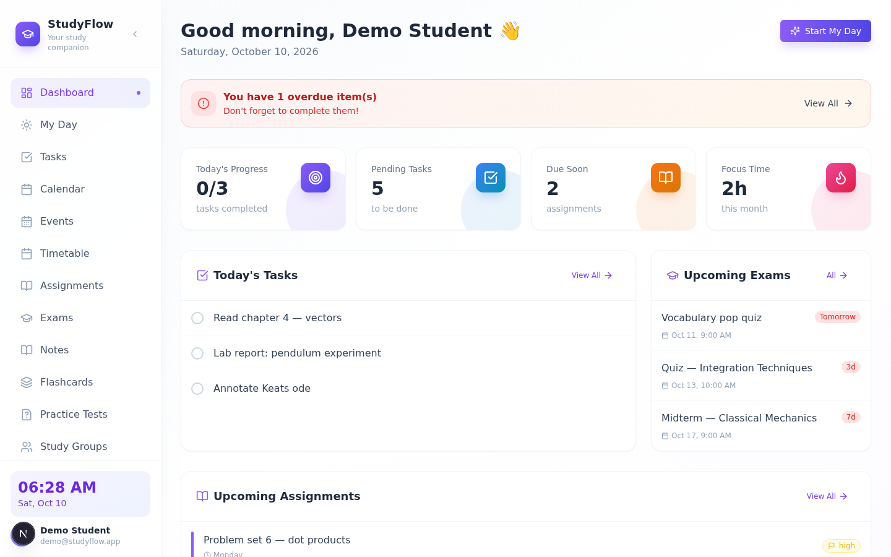
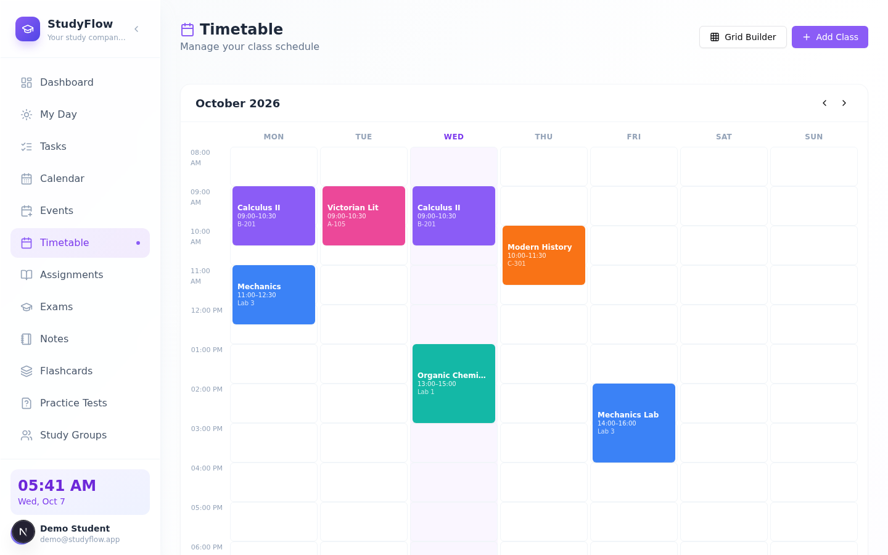
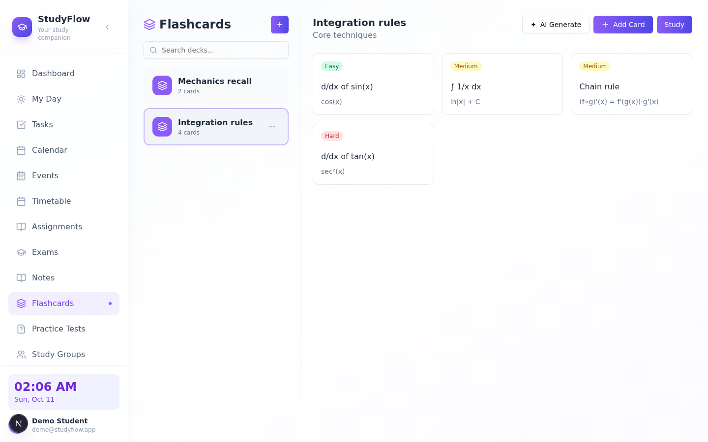
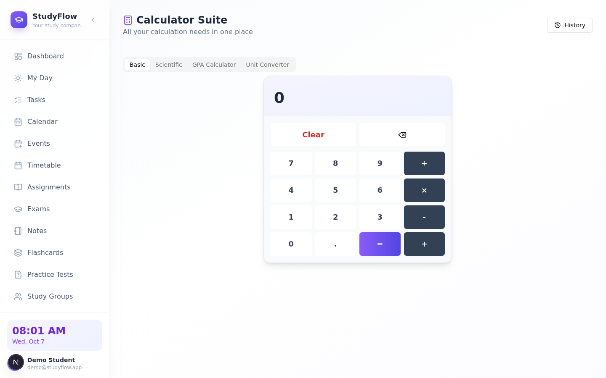
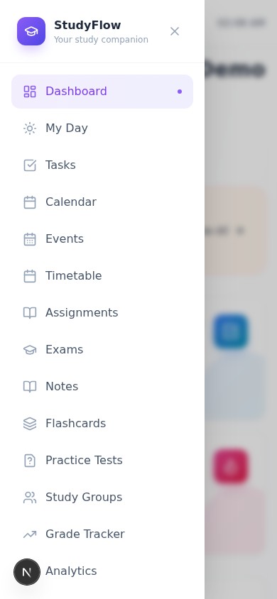
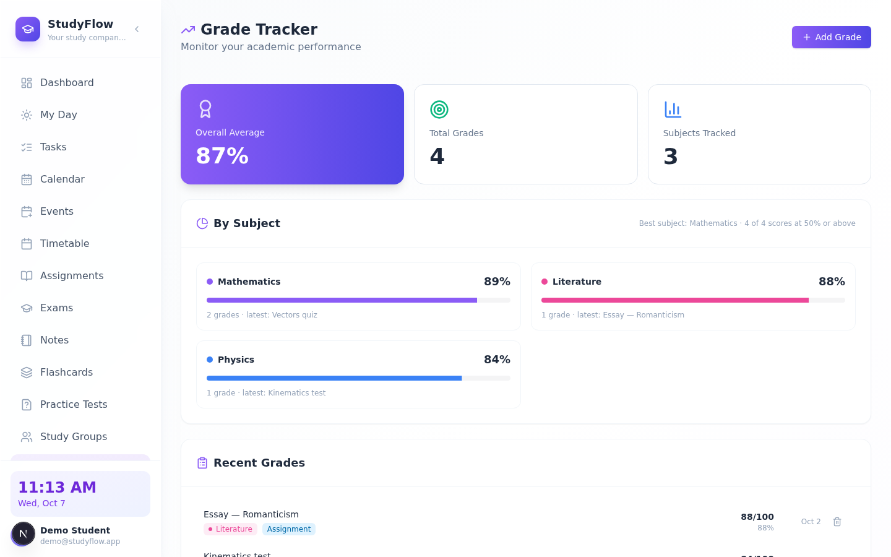
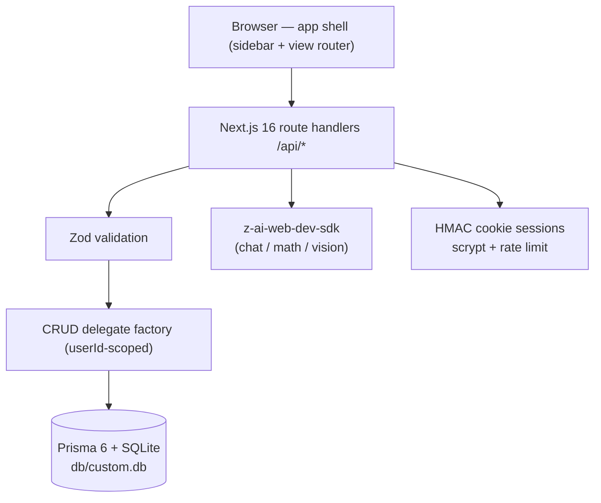

# StudyFlow (Omni-Study)

      

**StudyFlow — your study companion.** A production-ready, self-hosted clone (functional superset) of the [`omni-study1.base44.app`](https://omni-study1.base44.app/) study-planning app, rebuilt as a single Next.js application you fully own: your database, your AI keys, your deployment.

## Overview

The reference app is a study companion that keeps a student's whole life in one place — but it lives behind a hosted platform login with no source access. StudyFlow rebuilds every surface (and fills in the ones the reference left empty) as an open codebase: twenty views from the daily dashboard to a focus timer, all wired to real CRUD persistence through Prisma/SQLite. Visual parity was measured from the live reference (computed styles, not eyeballing), and the places where the framework changed underneath — Tailwind v4's engine differences chief among them — are documented and pinned by tests. Where the reference shows empty states, StudyFlow ships working features: an AI study assistant, a math solver that reads photographed problems, flashcard decks with a study mode, and a grade tracker with trend charts.

| | | |
|---|---|---|
|  |  |  |
|  |  |  |

All 20 views (plus the login card, three mobile captures, and six dark-mode captures) are in [`docs/screenshots/`](docs/screenshots/) — refreshed after the session-10 dark-mode consistency remediation (`node scripts/capture-studyflow.mjs` regenerates them).

## Key Features

| | Feature | What it does |
|---|---------|--------------|
| 📊 | Dashboard | Time-aware greeting, conditional overdue alert banner, four stat cards, today's tasks, upcoming exams & assignments |
| ☀️ | My Day | Quick-add tasks, amber "Today's Progress" card, Suggestions for overdue/upcoming tasks |
| ✅ | Tasks | Lists (custom lists + Important), search, filters, full CRUD — priority (colored round checkbox), repeat, My Day toggle, subtasks |
| 📅 | Calendar | Sunday-first month grid (dynamic week count) + day detail (border-l-4 colored rows), timeline agenda mode, icon+tab mode switch, legend |
| 🔔 | Events & Reminders | Dark terminal-style panel: 7-day sections, recurring events, multi-reminders, color-coded |
| 🏫 | Timetable | grid-cols-8 week table with full day heads + 60px hour rows, mobile day accordion, Grid Builder, alternating Week A/B, My Classes with today's date |
| 📚 | Assignments / Exams | Subject-tagged, urgency badges, status tracking — type + priority pills, interactive progress sliders; exam cards with subject color strips, durations, topics |
| 🗒️ | Notes | Notebooks, tags, pinned notes, autosaving editor |
| 🃏 | Flashcards | Two-panel view with colored deck swatches, card grid with difficulty badges, 3D-flip study mode, AI card generation |
| 📝 | Practice Tests | Question builder (manual + AI generation), score recording with completion % |
| 👥 | Study Groups | Members, next meeting, subject linking |
| 📈 | Grade Tracker | Gradient summary card + target/chart icons, weighted averages per subject, GPA, SVG trend chart |
| 🧠 | Analytics | Icon-block stat cards (Tasks Completed, Assignments, Focus Time, Upcoming Exams), axis-labeled area charts (7-day activity, focus gradient), grade trend, subject distribution |
| 📁 | Files | Folders, uploads (≤ 2 MiB), links, grid/list views |
| 🧮 | Calculator Suite | Basic, scientific (shunting-yard engine, no `eval`), GPA, unit converter + history |
| ƒ | Math Solver | AI step-by-step solutions — typed or photographed (vision) |
| ✨ | AI Assistant | Chat with six study-tuned quick modes, persisted history |
| ⏲️ | Focus Timer | Pomodoro/Deep Work presets, subject logging, session stats |
| 🎨 | Theme System | Light/Dark/System + seven accent colors + emoji avatars, persisted per user — dark mode fully re-themes every surface (a superset: the reference's own Dark option is a no-op) |
| 🔐 | Auth | Email & password (scrypt + HMAC cookie sessions), rate-limited |

## Architecture

| Layer | Technology | Version | Purpose |
|-------|-----------|---------|---------|
| Framework | Next.js (App Router) | 16.4.0 | One page + 20 path rewrites (SPA parity with the reference) |
| UI runtime | React | 19 | Client view switching inside a single app shell |
| Language | TypeScript | 5 (strict) | End-to-end types, no `any` |
| Styling | Tailwind CSS | 4 (CSS-first `@theme`) | v3-pinned palette/shadow tokens for reference parity |
| Components | Radix UI (shadcn-style) | current | Accessible primitives themed via CSS vars |
| Database | SQLite via Prisma ORM | 6.19.3 | Zero-config, single file at repo-root `db/` |
| State | Zustand | 5 | App/theme/data stores; URL is the routing truth |
| Validation | Zod | 4.6.5 | Every API boundary |
| AI | z-ai-web-dev-sdk | 0.0.18 | Server-only: chat, math solve, vision |
| Unit tests | Vitest | 5 | Pure seams (router, date, calculator, auth, schemas) |
| E2E tests | Playwright | 1.63 | Production standalone build + isolated `db/e2e.db` |
| Runtime | Bun | ≥ 1.3 | `bun run dev`, scripts, seed |



## File Hierarchy

```
📂 src/
├── 📂 app/
│   ├── 📄 page.tsx              ← the whole app: auth gate + shell + view switcher
│   ├── 📄 login/page.tsx        ← reference-parity login card
│   ├── 📄 globals.css           ← Tailwind v4 @theme tokens + trap pins
│   └── 📂 api/                  ← auth, health, 16 entity CRUDs, AI, files, settings
├── 📂 components/
│   ├── 📂 ui/                   ← button, card, dialog, select, tabs, toast, …
│   ├── 📂 layout/               ← sidebar (fixed glass) + mobile drawer chrome
│   └── 📂 views/                ← the 20 view components + shared primitives
├── 📂 lib/
│   ├── 📄 db-path.ts            ← the DATABASE_URL contract (unit-tested)
│   ├── 📄 db.ts                 ← Prisma singleton with env resolution
│   ├── 📄 auth.ts               ← scrypt, HMAC sessions, rate limiter
│   ├── 📄 router.ts             ← 20-view ↔ PascalCase-path map
│   ├── 📄 data.ts               ← client cache + typed mutations
│   ├── 📄 calculator.ts         ← shunting-yard engine, GPA, converter
│   ├── 📄 theme.ts              ← 7 accents, RGB-triplet tokens
│   └── 📂 server/               ← http helpers + entity CRUD delegates
├── 📂 prisma/
│   ├── 📄 schema.prisma         ← 21 models; DATABASE PATH CONTRACT header
│   └── 📄 seed.ts               ← idempotent demo data
├── 📂 tests/
│   ├── 📄 *.test.ts             ← Vitest unit layer (106 tests)
│   └── 📂 e2e/                  ← Playwright specs (194 specs)
└── 📂 docs/
    ├── 📄 Tailwind-V4-Validation-Report.md  ← the five documented v3→v4 traps
    ├── 📄 remediation-plan.md   ← session-2 parity audit: evidence, fixes, non-gaps
    ├── 📄 remediation-plan-session3.md ← session-3 mobile-chrome & token audit
    ├── 📄 remediation-plan-session4.md ← session-4 text-metrics & login audit
    ├── 📄 remediation-plan-session5.md ← session-5 interactive-chrome & view-body audit
    ├── 📄 remediation-plan-session6.md ← session-6 populated-state & row-design audit
    ├── 📄 remediation-plan-session7.md ← session-7 lightly-probed-views & flashcards audit
    ├── 📄 remediation-plan-session8.md ← session-8 deep-chrome/layout audit (16 gap families)
    ├── 📄 remediation-plan-session9.md ← session-9 data-state/chart-axes/icon audit (19 gap families)
    ├── 📄 remediation-plan-session10.md ← session-10 dark-mode consistency audit (the @theme inline token trap + 6 tint families)
    ├── 📂 screenshots/          ← dev-server captures of every view (light + dark)
    └── 📄 DEPLOYMENT.md         ← production notes
```

## Quick Start

Requires **Bun ≥ 1.3** (or npm with Node ≥ 22 — swap `bun` for `npx`/`npm run`).

```bash
git clone https://github.com/nordeim/omni-study.git
cd omni-study
bun install

# Database — .env ships with DATABASE_URL="file:../db/custom.db";
# db/ lives at the repo root (git-ignored, recreated by these two commands):
bun run db:push
bun run db:seed

bun run dev
```

**Verify setup:**

1. `curl http://localhost:3000/api/health` → `{"status":"ok","db":"up","app":"studyflow"}`
2. Open <http://localhost:3000> → redirects to `/login`
3. Sign in with the demo account — **`demo@studyflow.app` / `Demo1234!`** — you land on the dashboard with seeded subjects, tasks, exams, notes, decks and grades.

## Environment Variables

Copy `.env.example` to `.env` (the defaults above already work locally):

| Variable | Required | Purpose |
|----------|----------|---------|
| `DATABASE_URL` | yes | `"file:../db/custom.db"` — resolved by `src/lib/db-path.ts` to `<repo>/db/custom.db` at runtime; the `db:*` scripts set it inline for the Prisma CLI (schema-anchored). Keep the value in sync with `prisma/schema.prisma`'s header note. |
| `AUTH_SECRET` | prod | HMAC key for session cookies. Generate with `openssl rand -hex 32`; a dev-only fallback is used when unset. |
| `NEXT_PUBLIC_SITE_URL` | no | Canonical origin for metadata/sitemap. Defaults to `http://localhost:3000`. |

## Testing

```bash
bun run test        # Vitest — 106 unit tests (router, theme, date, calculator, auth, validation, db-path, site-url)
bun run build       # REQUIRED before e2e — the suite boots the standalone server
bun run test:e2e    # Playwright — 194 specs against the production build on :3100
```

E2E notes: the suite pushes and seeds an isolated `db/e2e.db` (never touches `custom.db`), signs the demo user in **once** via a setup project (the login endpoints are rate-limited — 10 attempts/IP/15 min), and asserts the reference-measured design pins (sidebar geometry, v3 `shadow-sm`, canvas gradient, view-title model, stat-card text metrics, empty-state design, brand-gradient stops, login chrome, the session-5 interactive-chrome pins, the session-6 populated-row pins, the session-7 flashcards/timetable/analytics/dialog pins, the session-8 deep-chrome/layout pins, the session-9 data-state/chart-axes pins, and the session-10 dark-mode consistency pins — the shadcn token utilities, banner/amber/clock/today/chart dark re-themes, the dark mobile drawer, and a light-mode byte-parity regression guard). Full gate order: `lint → typecheck → test → build → test:e2e`.

## API Reference

All endpoints are same-origin JSON; sessions ride the `sf_session` cookie. 🔒 = requires authentication.

| Endpoint | Methods | Description |
|----------|---------|-------------|
| `/api/health` | GET | Liveness + DB probe (used by the e2e webServer gate) |
| `/api/auth/login` / `register` / `logout` / `me` | POST/GET | Rate-limited auth; no user enumeration |
| `/api/tasks` (+ `/[id]`) | GET POST PATCH DELETE 🔒 | Tasks — lists, importance, due dates |
| `/api/task-lists`, `/api/subjects`, `/api/assignments`, `/api/exams`, `/api/events`, `/api/timetable`, `/api/notebooks`, `/api/notes`, `/api/flashcards/decks`, `/api/flashcards/cards`, `/api/practice-tests`, `/api/study-groups`, `/api/grades`, `/api/focus-sessions`, `/api/holidays` | GET POST PATCH DELETE 🔒 | Ownership-scoped CRUD via the delegate factory |
| `/api/files` (+ `/[id]`, `/folders`, `/link`) | GET POST DELETE 🔒 | Multipart upload ≤ 2 MiB, link-files, download |
| `/api/settings/preferences` | PATCH 🔒 | Theme mode, accent, avatar, display name |
| `/api/calculator/history` | GET POST DELETE 🔒 | Persisted calculations |
| `/api/ai/chat`, `/api/ai/messages` | POST GET DELETE 🔒 | Study assistant (server-side SDK only) |
| `/api/ai/generate-cards` | POST 🔒 | AI flashcard generation for a deck |
| `/api/ai/generate-questions` | POST 🔒 | AI practice-test question generation |
| `/api/math/solve` | POST 🔒 | Text or photographed problems (vision) |

## Design System

Measured from the live reference (see `docs/Tailwind-V4-Validation-Report.md` for the full trap log):

| Token | Value | Usage |
|-------|-------|-------|
| Primary | `#8b5cf6` (violet-500) via `--sf-primary` RGB triplet | Active states, accents |
| Primary CTAs | `linear-gradient(to right, violet-500, indigo-600)` + v3 `shadow` — accent-aware via `.sf-gradient` (session-5 pin) | Every primary action button |
| Task rows | standalone `rounded-xl` cards, slate-200 border, 24px round priority-colored checkbox, slate-700 titles, due/repeat pills, hover-revealed actions (session-6 pin) | Tasks + My Day |
| Dashboard rows | bare `p-4 gap-4` rows, 20px round checkbox, title-only (session-6 pin) | Today's Tasks |
| Assignment rows | 24px round checkbox, blue due-in pill, priority/type pills, gradient progress slider + violet % label (session-6 pin) | Assignments |
| Exam cards | 3-col grid, `h-2` subject color strip, amber urgency badge, icon detail rows, type footer (session-6 pin) | Exams |
| Calendar cells | Sunday-first `aspect-square` centered cells (dynamic week count — 35 for five-week months), 4-color dots, SELECTED = solid accent fill + TODAY = 100-level tint (both hover-stripped), simple p-6 month card, legend + border-l-4 day-detail rows (session-6/S8-C/S9-E pins) | Calendar |
| Flashcards | two-panel layout: `w-80 border-r` deck sidebar with colored 40px icon blocks, deck color swatches, `lg:grid-cols-3` card grid with difficulty pills, 3D-flip study mode (session-7 pin) | Flashcards |
| Timetable grid | `grid-cols-8` week table, full day-name heads + `text-lg` dates, 60px hour rows with "7 AM" labels, mobile day accordion (session-7 pin) | Timetable |
| Analytics stats | r12 border-0 cards, 48px tinted icon blocks (violet/blue/green/orange-100), fraction values (session-7 pin) | Analytics |
| View titles | `h1 text-2xl font-bold text-slate-800` + 24px accent icon (MyDay/FocusTimer are 30px) | Every view header (session-4 pin) |
| Form controls | gray-200 borders, gray-950 text, gray-400 placeholders, `h-9` transparent inputs, v3 `shadow-sm` (session-5 pin) | Dialogs, selects, tabs, outline buttons |
| Dialogs | `max-w-md` (448px), `rounded-lg` (8px), 36px inputs (session-5 pin) | Every modal |
| Empty states | 80px rounded-2xl gradient block (`violet-100 → indigo-100`), 40px accent icon, 20px/600 h3, 16px hint | Every empty view (session-4 pin) |
| Events panel | `slate-900` rounded-2xl shadow-2xl terminal panel, cyan New Event link, `CW <n>` calendar-week label | Events view (session-5 pin) |
| Strong | `#7c3aed` (violet-600) | Links ("View All"), active nav text |
| Card | white, `1px solid #f1f5f9`, radius 16px | Every surface |
| Shadow | `0 1px 2px 0 rgb(0 0 0 / 0.05)` | v3 `shadow-sm`, **pinned** in `@theme` |
| Canvas | `linear-gradient(to right bottom, #f8fafc, #fff, #f5f3ff4d)` | App background |
| Sidebar | 260px fixed, `rgba(255,255,255,0.8)` + blur(20px) + white/50 hairline (`.glass`) | Hidden below `lg` |
| Mobile app bar | 64px fixed `.glass`, brand + live clock ("03:43 AM") | Content starts at 80px (both apps) |
| Mobile drawer | 288px white panel, `shadow-2xl`, 20% blurred backdrop, icon nav items | No footer (reference-exact) |
| Clock chip | `violet-50 → indigo-50` gradient (`rgb(245,243,255) → rgb(238,242,255)`), violet-700 time | Accent-aware via `--sf-primary-softest(-adjacent)` |
| Brand gradients | chips + CTA end **indigo-600** (`rgb(79,70,229)`); avatar runs violet-400 → indigo-500 (the lighter pair) | Accent-aware via `--sf-primary-gradient-to` / `-avatar-*` tokens |
| Accents | violet · blue · **emerald** · **amber** · pink · red · teal (session-5 migration — the reference's swatch faces) | Settings → Appearance |
| Font | system sans stack | Matches reference body styles |

Six accent themes × Light/Dark/System × 24 emoji avatars, all persisted to the user record.

## Deployment

The app builds to a **standalone server** (`output: "standalone"` in `next.config.ts`):

```bash
bun run build
bun run start        # NODE_ENV=production, serves .next/standalone
```

For production use an **absolute** `DATABASE_URL` (see `docs/DEPLOYMENT.md` §4) and set `AUTH_SECRET`. Deploy keys never live in the repo — pushes use the `docs/ssh_git_wrapper_v3.py` wrapper (see `docs/how-to-git-push-using-ssh-wrapper_SKILL.md`).

## Troubleshooting

| Symptom | Cause | Fix |
|---------|-------|-----|
| `{"status":"degraded","db":"down"}` on `/api/health` | No database file yet | `bun run db:push && bun run db:seed` |
| Prisma CLI created the db **one directory too high** | `.env`-loaded relative URLs anchor at the CWD | Use the `bun run db:*` scripts (they set `DATABASE_URL` inline, schema-anchored) — never raw `prisma db push` with the repo-root `.env` |
| E2E webServer timeout | `bun run build` not run since the last change | Rebuild, then `bun run test:e2e` |
| Dev server dies silently in low-memory containers | OOM-killed (`next-server` ~1.6 GB RSS) | Close extra headless browsers; rerun `bun run dev` |
| Login fails after many attempts | Rate limiter (10/IP/15 min) | Wait or restart dev; specs share ONE login by design |
| `space-y-*` gaps look wrong next to `mt-*` children | Tailwind v4 selector rewrite (trap 4) | Use `flex gap-*`; the codebase convention bans margin utilities inside `space-*` |

## Contributing

The verification gate before any push: `bun run lint && bun run typecheck && bun run test && bun run build && bun run test:e2e`. Conventions that differ from defaults: **Tailwind v4 CSS-first** (no `tailwind.config.js` — theme lives in `src/app/globals.css` `@theme`); **`gap-*` layout only** (never `space-y/x` with margin-carrying children); Zustand stores over Context; every API payload through its Zod schema in `src/lib/validation.ts`; `z-ai-web-dev-sdk` imported only inside route handlers.

## Project Status

| Phase | Status | Deliverables |
|-------|--------|--------------|
| Reference recon (all 20 views, computed-style tokens) | ✅ Complete | Traps + measured tokens in `docs/Tailwind-V4-Validation-Report.md` |
| Codebase build (20 views, 21 models, 40+ endpoints) | ✅ Complete | `src/**`, `prisma/**` |
| Test suites (93 unit + 91 e2e) | ✅ Complete | `tests/**` |
| Visual parity verification | ✅ Complete | `docs/screenshots/**`, `docs/remediation-plan*.md` |
| Session-2 parity remediation (radius trap, icons, avatar, clock) | ✅ Complete | `docs/remediation-plan.md` |
| Session-3 mobile-chrome & token remediation (fixed glass app bar + live clock, drawer mirror, greeting map, accent token completeness) | ✅ Complete | `docs/remediation-plan-session3.md` |
| Session-4 text-metrics & second-order remediation (v4 blur trap, stat-card metrics, reference empty states, view-title h1+icon model, login card, measured gradient stops, heading hierarchy) | ✅ Complete | `docs/remediation-plan-session4.md` |
| Session-5 interactive-chrome & view-body remediation (gradient CTAs, Events dark panel + repeat/reminders, FocusTimer/Settings/Calculator/Timetable/Notes/GradeTracker/Files/MyDay/AI reworks, gray form-control palette, dialog chrome, emerald/amber accents) | ✅ Complete | `docs/remediation-plan-session5.md` |
| Session-6 populated-state remediation (task card rows + priority/repeat/myDay/subtasks, MyDay amber progress card + Suggestions, dashboard bare rows, assignment sliders, exam card grid, calendar grid/legend/day-detail — measured against live reference data) | ✅ Complete | `docs/remediation-plan-session6.md` |
| Session-7 lightly-probed-views remediation (Flashcards two-panel view + deck colors + card grid + 3D study mode + AI card generation, Study Groups/Practice Tests measured dialogs + AI question generation, Timetable grid-cols-8 week grid + mobile accordion + week-alignment bug fix, Analytics icon-block stat cards + 7-day charts, Grade Tracker icons, Notes title input) | ✅ Complete | `docs/remediation-plan-session7.md` |
| Session-8 deep-chrome/layout remediation (nav icon set + active-gradient stop + tagline + 36px collapse button, dashboard flush divide-y rows, Calendar selected/today semantics + simple month card, MyDay header block + bare suggestions, Timetable today-header tint, Tasks two-pane, Notes/Study Groups two-pane reworks, Analytics per-card icons + donut + workload, Calculator/MathSolver/AI/FocusTimer/Settings icon-and-chrome fixes, Assignments/Exams search icons + slim exam cards, dead-utility sweep) | ✅ Complete | `docs/remediation-plan-session8.md` |
| Session-9 data-state/chart-axes remediation (dashboard overdue banner + slim section empty states, MyDay amber greeting empty state + bare quick-add row, Tasks outline filter button + empty My Lists, Calendar Sunday-first grid + icon/tab mode switch, Files house breadcrumb + grid3x3 toggle, text-only Grid Builder, Assignments Active-default slim rows, Exams orange Tomorrow badge, Analytics area charts with axes/gridlines, FocusTimer/Settings/Notes icon fixes, Flashcards deck-row ellipsis menu, AI wand-sparkles composer) | ✅ Complete | `docs/remediation-plan-session9.md` |
| Session-10 dark-mode consistency remediation (the `@theme inline` literal-token trap — shadcn base tokens now route through `hsl(var(--x))` runtime indirection so every `bg-card`/`bg-popover`/`bg-muted`/`border-input` utility re-themes in dark; dark washes for the overdue banner, MyDay amber card, timetable/calendar today tints, sidebar clock chip, settings selected cards; dark SVG chart axes/fills; the reference's Dark option measured as a platform no-op → the clone's full dark mode is the documented superset) | ✅ Complete | `docs/remediation-plan-session10.md` |
| Docs (README / AGENTS / CLAUDE / PAD / SKILL) | ✅ Complete | repo root |

No license file is present in this repository; treat the code as proprietary to the repo owner.
