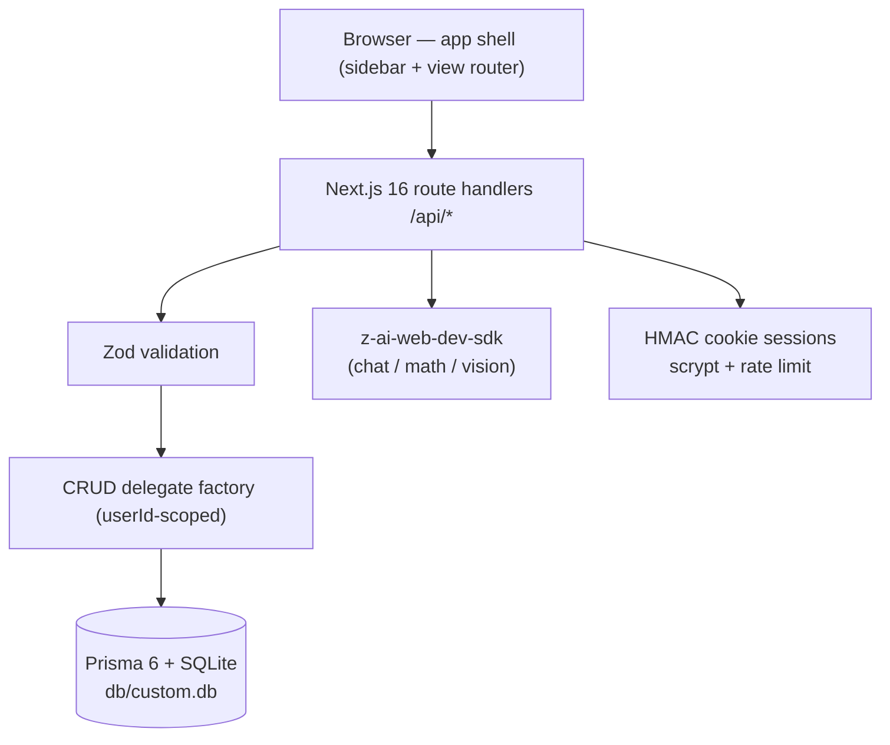

# StudyFlow (Omni-Study)

      

**StudyFlow — your study companion.** A production-ready, self-hosted clone (functional superset) of the [`omni-study1.base44.app`](https://omni-study1.base44.app/) study-planning app, rebuilt as a single Next.js application you fully own: your database, your AI keys, your deployment.

## Overview

The reference app is a study companion that keeps a student's whole life in one place — but it lives behind a hosted platform login with no source access. StudyFlow rebuilds every surface (and fills in the ones the reference left empty) as an open codebase: twenty views from the daily dashboard to a focus timer, all wired to real CRUD persistence through Prisma/SQLite. Visual parity was measured from the live reference (computed styles, not eyeballing), and the places where the framework changed underneath — Tailwind v4's engine differences chief among them — are documented and pinned by tests. Where the reference shows empty states, StudyFlow ships working features: an AI study assistant, a math solver that reads photographed problems, flashcard decks with a study mode, and a grade tracker with trend charts.

| | | |
|---|---|---|
|  |  |  |
|  |  |  |

All 20 views (plus the login card, three mobile captures, seven dark-mode captures, the session-17 fresh-user evidence set — zero-data Analytics/Grade Tracker, the reference-measured empty-state hints, the Settings Profile/Notifications tabs, the mobile StudyGroups copy — the session-11 audit evidence pair, the session-12 accessibility evidence set — forced-colors renders, print pages, the focused skip link — and the session-13 resilience evidence set — the AI-chat failure rollback, the solver's MIME guard toast, the remediated mobile drawer — and the session-14 hardening evidence set — the offline banner with the bounced-back composer, the AI rate-limit toast, the display-name guard) are in [`docs/screenshots/`](docs/screenshots/) — the standard 31 were refreshed after the session-11 theme-system remediation (`node scripts/capture-studyflow.mjs`); the S12 set via `node scripts/capture-s12-evidence.mjs` and the S13 set via `node scripts/capture-s13-evidence.mjs`, and the S14 set via `node scripts/capture-s14-evidence.mjs`, the S15 auth-flow set via `node scripts/capture-s15-evidence.mjs` (the login inline error, the signup form, the verify OTP screen, check-email, the calculator keyboard superset), and the S16 mobile set via `node scripts/capture-s16-evidence.mjs` (the auth sub-screens + the dashboard at 390×844 — the mobile-only responsive fixes; no default-media desktop visual changed in sessions 12–16; the prior pins are the byte-parity guarantee), the S17 fresh-user set via `node scripts/capture-s17-evidence.mjs`, and the S18 RUM set via `node scripts/capture-s18-evidence.mjs` (the beacon-live dashboard + mobile, the GET /api/rum aggregate, the un-instrumented login), and the S19 diagnostics set via `node scripts/capture-s19-evidence.mjs` (the `/rum` panel — desktop light + dark + mobile 390px), and the S20 v3 set via `node scripts/capture-s20-evidence.mjs` (the `/rum` panel with the per-card trend sparklines + the Export CSV action + the exported CSV head), and the S21 portability set via `node scripts/capture-s21-evidence.mjs` (the `/export` page — desktop light + dark + mobile 390px + the downloaded JSON envelope head), and the S22 boot-guard set via `node scripts/capture-s22-evidence.mjs` (the dev-server dashboard + `/export` + mobile 390px screenshots + the boot-guard evidence JSON — the negative spawn's exit + message, the positive-control health, the dev-boot warn line), and the S23 import set via `node scripts/capture-s23-evidence.mjs` (the `/export` page with the Restore card — desktop light + dark + mobile 390px + the completed-import result state + the API round-trip evidence JSON — the first import's summary, the idempotent re-import, the validation-error family, the rollback guard, the probe cleanup), and the S24 change-password set via `node scripts/capture-s24-evidence.mjs` (the Settings Profile tab with the Change password card — desktop light + dark + mobile 390px + the success-note state + the API round-trip evidence JSON — the guard family, the anon gate, the fresh-user rotation with the old-401/new-200 login pair, the session-survives proof, the demo restore), and the S25 account-deletion set via `node scripts/capture-s25-evidence.mjs` (the Settings Profile tab with the Danger zone card — desktop light + dark + mobile 390px + the revealed confirmation-form state + the API round-trip evidence JSON — the guard family, the anon gate, the fresh-user deletion with the DB-level cascade proof, the cleared-session me-401, the demo-intact proof), and the S26 email-change set via `node scripts/capture-s26-evidence.mjs` (the Settings Profile tab with the Email address card — desktop light + dark + mobile 390px + the success-note state with the live identity-block update + the API round-trip evidence JSON — the guard family incl. the same-email 400 + the duplicate 409, the anon gate, the fresh-user rotation with the DB-level emailVerified-stays-true proof + the old-401/new-200 login pair, the demo restore), and the S27 dark-sweep repair set (the before-state — MODE empty, 97 phantom flashbulbs + 7 phantom unreadable measured in LIGHT mode — and the after-state — MODE dark, all 20 views clean in real dark mode — with the guard's negative-control exit, the restore proof, and the refreshed standing 31) in `docs/screenshots/s27-dark-sweep-evidence.json`, and the S28 connectivity-repair set (the before-state — the phantom "Login offline shows no/silent feedback" finding whose own measured bodyText contained the offline message — and the after-state — "Login offline announces the failure through the S15 inline alert (stays on the card, button recovered)" with findings 0 — with the reproduction probe, the negative-control exit, the gates, and the refreshed standing 31) in `docs/screenshots/s28-connectivity-audit-evidence.json` + the login-offline inline-alert capture `s28-login-offline-inline-alert.png`, and the session-29 doc-alignment refresh (the standing 31 re-captured from the remediated codebase — docs-only changes, zero app bytes moved) per `docs/remediation-plan-session29.md`, and the session-30 dependency-security evidence set (the bun-audit classification envelope with the two documented non-production advisories, the negative controls, the gates) in `docs/screenshots/s30-dep-audit-evidence.json` per `docs/remediation-plan-session30.md`

## Key Features

| | Feature | What it does |
|---|---------|--------------|
| 📊 | Dashboard | Time-aware greeting, conditional overdue alert banner, four stat cards, today's tasks, upcoming exams & assignments |
| ☀️ | My Day | Quick-add tasks, amber "Today's Progress" card, Suggestions for overdue/upcoming tasks |
| ✅ | Tasks | Lists (custom lists + Important), search, filters, full CRUD — priority (colored round checkbox), repeat, My Day toggle, subtasks |
| 📅 | Calendar | Sunday-first month grid (dynamic week count) + day detail (border-l-4 colored rows), timeline agenda mode, icon+tab mode switch, legend |
| 🔔 | Events & Reminders | Dark terminal-style panel: 7-day sections, recurring events, multi-reminders, color-coded |
| 🏫 | Timetable | grid-cols-8 week table with full day heads + 60px hour rows, mobile day accordion, Grid Builder, alternating Week A/B, My Classes with today's date |
| 📚 | Assignments / Exams | Subject-tagged, urgency badges, status tracking — type + priority pills, interactive progress sliders; exam cards with subject color strips, durations, topics |
| 🗒️ | Notes | Notebooks, tags, pinned notes, autosaving editor |
| 🃏 | Flashcards | Two-panel view with colored deck swatches, card grid with difficulty badges, 3D-flip study mode, AI card generation |
| 📝 | Practice Tests | Question builder (manual + AI generation), score recording with completion % |
| 👥 | Study Groups | Members, next meeting, subject linking |
| 📈 | Grade Tracker | Gradient summary card + target/chart icons, weighted averages per subject, GPA, SVG trend chart |
| 🧠 | Analytics | Icon-block stat cards (Tasks Completed, Assignments, Focus Time, Upcoming Exams), axis-labeled area charts (7-day activity, focus gradient), grade trend, subject distribution |
| 📁 | Files | Folders, uploads (≤ 2 MiB), links, grid/list views |
| 🧮 | Calculator Suite | Basic, scientific (shunting-yard engine, no `eval`), GPA, unit converter + history |
| ƒ | Math Solver | AI step-by-step solutions — typed or photographed (vision) |
| ✨ | AI Assistant | Chat with six study-tuned quick modes, persisted history |
| ⏲️ | Focus Timer | Pomodoro/Deep Work presets, subject logging, session stats |
| 🎨 | Theme System | Light/Dark/System + seven accent colors + emoji avatars, persisted per user — dark mode fully re-themes every surface (a superset: the reference's own Dark option is a no-op), applies pre-paint (no light flash on load), themes the login route for dark-OS visitors, and System mode tracks OS theme changes live |
| ♿ | Accessibility | Forced-colors (Windows High Contrast) state restoration (system-color outlines on the selected day/today/active tab/active nav, the slider progress gradient), a skip-to-content link (WCAG 2.4.1), print that forces light + keeps essential backgrounds (`print-color-adjust: exact`) + a timetable week table that fits the page, and `prefers-reduced-motion` support — all supersets (the reference has none) |
| 🛡️ | Resilience | Failure-state hardening — every AI call carries a 120 s deadline (`AbortSignal.timeout`) so a hung backend never locks the composer; a failed AI send rolls the message back into the composer instead of orphaning it; the solver guards non-image files client-side; uploads reject nameless files; downloads speak RFC 5987 (`filename*=UTF-8''…`) so unicode filenames save correctly; verified at 300+ rows with zero main-thread blocking |
| 📡 | Connectivity | A global offline banner (amber pill, screen-reader announced) the moment the network drops — renders nothing while online (byte-identical DOM); transport failures toast a human message ("You appear to be offline…") instead of raw browser text; every per-request path recovers (bounced-back composer, dialogs that keep their forms, SPA navigation on cached data) — a superset (the reference has no offline handling) |
| 🔒 | Security hardening | Per-user AI rate limits (20 req/15 min on all four LLM routes — 429 with `Retry-After`), download responses carry `X-Content-Type-Options: nosniff` + `Cache-Control: private, no-store`, whitespace-only display names rejected — alongside the scrypt/HMAC/rate-limited auth baseline and the **AUTH_SECRET boot guard** (session-22): a production boot without a real `AUTH_SECRET` — missing, empty, or the public dev fallback pasted in — REFUSES to start, exiting with the `openssl rand -hex 32` remedy (dev/test keep the documented zero-config fallback with a one-line boot warning); weak-but-present secrets (< 32 chars) draw a boot warning |
| ♿ | AI accessibility | The assistant transcript and the math solver's solution are polite live regions (`aria-live` + `aria-busy`) — replies and solutions land announced for screen readers (WCAG 4.1.3); errors were already announced via the aria-live toast stack |
| 🔐 | Auth | Email & password (scrypt + HMAC cookie sessions), rate-limited — with the reference's full account journey: a real Create-your-account form, email verification (6-digit OTP, 15-minute one-shot codes), an unverified-login gate, a 3-state forgot-password flow (Reset your password → Check your email → the reset link), and inline form errors (the reference's red/green alert pattern). No SMTP in the self-hosted context: the verification code and reset link surface to the actor directly (ADR-013). Session-24 adds the account-security rotation: **a signed-in user changes their own password from Settings → Profile** (current-password proof + the register policy + the must-differ rule, rate-limited — a pure superset; the reference has no password surface) (ADR-022). Session-25 completes the ownership arc with the exit: **a signed-in user permanently deletes their own account from Settings → Profile → Danger zone** (password proof + the typed word DELETE + the ONE cascade write wiping every collection; the session cookie dies with the account — a pure superset; the reference has no deletion surface) (ADR-023). Session-26 adds the account-identity rotation: **a signed-in user changes their own login email from Settings → Profile → Email address** (password proof + the typed-twice confirm guarding the typo lockout + must-differ/uniqueness guards, rate-limited; the session survives — a pure superset; the reference has no email-change surface) (ADR-024) |
| ⌨️ | Calculator keyboard | The calculator accepts physical-keyboard input (digits, operators, Enter to evaluate, Backspace, Escape to clear) — a functional superset; the reference's calculator is click-only. Keystrokes never leak into form fields (GPA rows, converter inputs are guarded) |
| ⚡ | Load stability (CWV) | The authenticated shell pre-warms the active view's data IN PARALLEL with the auth call — the first paint renders with final geometry (dashboard CLS 0.00, was 0.117–0.125; Lighthouse-class mobile preset: login LCP ~640 ms, dashboard LCP ~2.4 s — both CWV-good, vs the reference's own 7.6–8.0 s login / 4.4 s + CLS 0.372 dashboard). Auth sub-screens render the reference's responsive mobile geometry (20px headings, 44px Sign in, the 76px verify rhythm) — measured at 390×844 on both apps |
| 🆕 | Fresh-user journey | A registered user's first run now mirrors the reference's measured zero state: Analytics and Grade Tracker render their stat cards at zero data (no empty-state blocks the reference never renders), every view's empty-state hint carries the reference's exact copy, Settings opens its five tabs with the reference's per-tab headers — and the Profile tab persists School Name, Grade Level (6th Grade → Graduate), a 1–12 hour Daily Study Goal and the Account-created line; the Notifications tab carries the persisted Enable Notifications master toggle (session-17) |
| 📡 | RUM observability | Real-user web-vitals monitoring (a pure superset — the reference has no field telemetry): the authed shell mounts an invisible beacon that reports TTFB/FCP/LCP/CLS/INP to the in-app `POST /api/rum` endpoint (batched, keepalive, failures swallowed); `GET /api/rum` answers p75 per metric + the recent samples for the owner. The beacon renders zero DOM — visual parity is untouched (session-18) |
| 📊 | RUM diagnostics panel | The owner-facing surface for the beacon's field data: the auth-gated `/rum` route renders the five Core Web Vitals at p75 with rating badges derived from the public CWV bounds, a samples line, the ten most recent events, and a Refresh action — themed (dark mode + the seven accents) through the production theme path, responsive to 390px, linked from NOWHERE (the shell's 20-link parity stays byte-intact; the owner navigates directly — see DEPLOYMENT.md §8) (session-19). Session-20 v3: each sampled card carries a SPARKLINE trend line (the metric's 20 most recent samples, oldest → newest — accent-themed SVG, edge cases unit-pinned) and an **Export CSV** action downloads the most recent 2000 events as a spreadsheet-ready RFC-4180 CSV (raw values, the S13/S14 download-header contract) |
| 💾 | Data portability | The "own your data" exit: `GET /api/export/data` downloads the user's COMPLETE content — all 20 collections (tasks, notes, decks, grades, files with payloads, …) in chronological order with ids/foreign keys intact — as a versioned JSON envelope (`format: studyflow-data-export`, `version: 1`; the hashless profile rides `user`; tokens, RUM telemetry, and the password hash are excluded by decision). The auth-gated `/export` page previews it: a per-collection count grid, the **Download JSON** action, and the format documentation — themed through the production path, responsive to 390px, linked from NOWHERE (the owner navigates directly — DEPLOYMENT.md §8.2) (session-21). Session-23 completes the round-trip: **`POST /api/import/data` restores an export into the importing account** — upsert-by-id (existing rows update to the file's values, new ids create with the importer's userId — the envelope is portable across accounts), all-or-nothing in ONE transaction (any failure rolls back completely), never deletes, content only (never identity); dangling optional FKs null (the schema's own SetNull semantics), a dangling required `cards.deckId` is a rejected corrupt envelope, folders sort parents-first with cycle rejection — all pre-validated by the pure seam so Prisma's P2003 never surfaces opaquely. The `/export` page's **Restore from a backup** card drives it (file picker + the created/updated result report; a 10 MiB cap + a 10/15-min rate limit) |
| 🐳 | Docker deployment | A production `Dockerfile` (multi-stage: prod-deps → standalone build → bun runtime) + `docker-compose.yml` with a SQLite volume, an auth-secret guard, an init profile (schema push + seed) and a healthcheck — one command from clone to container (`docker compose --profile init up`); the runtime layout is validated end-to-end outside Docker (session-18) |

## Architecture

| Layer | Technology | Version | Purpose |
|-------|-----------|---------|---------|
| Framework | Next.js (App Router) | 16.4.0 | One page + 20 path rewrites (SPA parity with the reference) |
| UI runtime | React | 19 | Client view switching inside a single app shell |
| Language | TypeScript | 5 (strict) | End-to-end types, no `any` |
| Styling | Tailwind CSS | 4 (CSS-first `@theme`) | v3-pinned palette/shadow tokens for reference parity |
| Components | Radix UI (shadcn-style) | current | Accessible primitives themed via CSS vars |
| Database | SQLite via Prisma ORM | 6.19.3 | Zero-config, single file at repo-root `db/` |
| State | Zustand | 5 | App/theme/data stores; URL is the routing truth |
| Validation | Zod | 4.6.5 | Every API boundary |
| AI | z-ai-web-dev-sdk | 0.0.18 | Server-only: chat, math solve, vision |
| Unit tests | Vitest | 5 | Pure seams (router, date, calculator, auth, schemas, view collections) |
| E2E tests | Playwright | 1.63 | Production standalone build + isolated `db/e2e.db` |
| Runtime | Bun | ≥ 1.3 | `bun run dev`, scripts, seed |



## File Hierarchy

```
📂 src/
├── 📂 app/
│   ├── 📄 page.tsx              ← the whole app: auth gate + shell + view switcher
│   ├── 📄 login/page.tsx        ← reference-parity login card
│   ├── 📄 globals.css           ← Tailwind v4 @theme tokens + trap pins
│   └── 📂 api/                  ← auth, health, 16 entity CRUDs, AI, files, settings
├── 📂 components/
│   ├── 📂 ui/                   ← button, card, dialog, select, tabs, toast, …
│   ├── 📂 layout/               ← sidebar (fixed glass) + mobile drawer chrome
│   └── 📂 views/                ← the 20 view components + shared primitives
├── 📂 lib/
│   ├── 📄 db-path.ts            ← the DATABASE_URL contract (unit-tested)
│   ├── 📄 db.ts                 ← Prisma singleton with env resolution
│   ├── 📄 auth.ts               ← scrypt, HMAC sessions, rate limiter
│   ├── 📄 router.ts             ← 20-view ↔ PascalCase-path map
│   ├── 📄 data.ts               ← client cache + typed mutations
│   ├── 📄 calculator.ts         ← shunting-yard engine, GPA, converter
│   ├── 📄 theme.ts              ← 7 accents, RGB-triplet tokens
│   └── 📂 server/               ← http helpers + entity CRUD delegates
├── 📂 prisma/
│   ├── 📄 schema.prisma         ← 24 models; DATABASE PATH CONTRACT header
│   └── 📄 seed.ts               ← idempotent demo data
├── 📂 tests/
│   ├── 📄 *.test.ts             ← Vitest unit layer (347 tests)
│   └── 📂 e2e/                  ← Playwright specs (291 specs)
└── 📂 docs/
    ├── 📄 Tailwind-V4-Validation-Report.md  ← the five documented v3→v4 traps
    ├── 📄 remediation-plan.md   ← session-2 parity audit: evidence, fixes, non-gaps
    ├── 📄 remediation-plan-session3.md ← session-3 mobile-chrome & token audit
    ├── 📄 remediation-plan-session4.md ← session-4 text-metrics & login audit
    ├── 📄 remediation-plan-session5.md ← session-5 interactive-chrome & view-body audit
    ├── 📄 remediation-plan-session6.md ← session-6 populated-state & row-design audit
    ├── 📄 remediation-plan-session7.md ← session-7 lightly-probed-views & flashcards audit
    ├── 📄 remediation-plan-session8.md ← session-8 deep-chrome/layout audit (16 gap families)
    ├── 📄 remediation-plan-session9.md ← session-9 data-state/chart-axes/icon audit (19 gap families)
    ├── 📄 remediation-plan-session10.md ← session-10 dark-mode consistency audit (the @theme inline token trap + 6 tint families)
    ├── 📄 remediation-plan-session11.md ← session-11 theme-system audit (pre-paint boot script + System tracking + accent-dark re-themes)
    ├── 📄 remediation-plan-session12.md ← session-12 accessibility audit (forced-colors state restoration + print + skip link + reduced-motion)
    ├── 📄 remediation-plan-session13.md ← session-13 resilience audit (AI failure states + upload edge cases; data-volume stress verified green)
    ├── 📄 remediation-plan-session14.md ← session-14 hardening audit (connectivity UX + settings guards + security headers/limits + AI live regions)
    ├── 📄 remediation-plan-session15.md ← session-15 auth-flow audit (inline errors + signup/verify/forgot/reset + calculator keyboard superset)
    ├── 📄 remediation-plan-session16.md ← session-16 CWV/mobile-geometry audit (load-stability pre-warm + responsive auth sub-screens + fresh copy sweep)
    ├── 📂 screenshots/          ← dev-server captures of every view (light + dark)
    └── 📄 DEPLOYMENT.md         ← production notes
```

## Quick Start

Requires **Bun ≥ 1.3** (or npm with Node ≥ 22 — swap `bun` for `npx`/`npm run`).

```bash
git clone https://github.com/nordeim/omni-study.git
cd omni-study
bun install

# Database — .env ships with DATABASE_URL="file:../db/custom.db";
# db/ lives at the repo root (git-ignored, recreated by these two commands):
bun run db:push
bun run db:seed

bun run dev
```

**Verify setup:**

1. `curl http://localhost:3000/api/health` → `{"status":"ok","db":"up","app":"studyflow"}`
2. Open <http://localhost:3000> → redirects to `/login`
3. Sign in with the demo account — **`demo@studyflow.app` / `Demo1234!`** — you land on the dashboard with seeded subjects, tasks, exams, notes, decks and grades.

## Environment Variables

Copy `.env.example` to `.env` (the defaults above already work locally):

| Variable | Required | Purpose |
|----------|----------|---------|
| `DATABASE_URL` | yes | `"file:../db/custom.db"` — resolved by `src/lib/db-path.ts` to `<repo>/db/custom.db` at runtime; the `db:*` scripts set it inline for the Prisma CLI (schema-anchored). Keep the value in sync with `prisma/schema.prisma`'s header note. |
| `AUTH_SECRET` | prod | HMAC key for session cookies. Generate with `openssl rand -hex 32`; a dev-only fallback is used when unset — and **enforced at boot in production** (the server exits with the remedy message instead of silently signing forgeable sessions). |
| `NEXT_PUBLIC_SITE_URL` | no | Canonical origin for metadata/sitemap. Defaults to `http://localhost:3000`. |

## Testing

```bash
bun run test        # Vitest — 347 unit tests (router, theme, date, calculator incl. mapPhysicalKey, auth incl. the AI rate-limit budget + the verification/reset seams, validation incl. verify/forgot/reset schemas + the S24 change-password rotation seam + the S25 deletion seam + the S26 email-rotation seam, db-path, site-url, theme-cache + boot-script contract + content-disposition + api-timeout + the offline transport-error mapping, rum-diagnostics — the CWV thresholds/panel display seam + the S20 sparkline geometry + the CSV builder, data-export — the S21 envelope/manifest/secret-guard seam, env-check — the S22 AUTH_SECRET boot-guard seam, data-import — the S23 envelope-validation/FK-pre-emption/folders-topo-sort seam, dep-audit — the S30 bun-audit parser/classifier seam, dev-preflight — the S31 dev-server boot-stability classifier seam, suite-verdict — the S32 standing-suite verdict seam [the anti-phantom shape-error guard + the three documented non-gap signatures] + the S33 mobile-sweep classifier [the light-mode 390×844 drawer-navigation sweep])
bun run build       # REQUIRED before e2e — the suite boots the standalone server
bun run test:e2e    # Playwright — 291 specs against the production build on :3100
```

E2E notes: the suite pushes and seeds an isolated `db/e2e.db` (never touches `custom.db`), signs the demo user in **once** via a setup project (the login endpoints are rate-limited — 10 attempts/IP/15 min), and asserts the reference-measured design pins (sidebar geometry, v3 `shadow-sm`, canvas gradient, view-title model, stat-card text metrics, empty-state design, brand-gradient stops, login chrome, the session-5 interactive-chrome pins, the session-6 populated-row pins, the session-7 flashcards/timetable/analytics/dialog pins, the session-8 deep-chrome/layout pins, the session-9 data-state/chart-axes pins, the session-10 dark-mode consistency pins — the shadcn token utilities, banner/amber/clock/today/chart dark re-themes, the dark mobile drawer, and a light-mode byte-parity regression guard — the session-11 theme-system pins — pre-paint dark application, the dark-OS login, runtime System tracking, the theme-color meta, the accent-surface dark re-themes, print emulation, and a light regression guard — the session-12 accessibility pins — forced-colors state outlines + the bold active nav + the slider gradient, the skip link's Tab order/focus/Enter landing, the beforeprint/afterprint light-forcing, `print-color-adjust: exact` on the essential surfaces, the timetable print width reset, reduced-motion collapse, and a light regression guard — the session-13 resilience pins — the AI-chat failure rollback + recovery, the solver's client-side MIME guard with zero outbound requests, the nameless-upload rejection, and the RFC 5987 download header — and the session-14 hardening pins — the offline banner's appear/disappear + online absence (byte-parity guard), the human offline toast, the whitespace display-name 400 + trim-on-save, the AI-route per-user rate limit (20 then 429 with Retry-After), the download nosniff + private no-store headers, and the AI transcript/solver aria-live regions — and the session-15 auth-flow pins — the inline login-error alert with its measured chrome, the signup form's reference shape, the register→verify→signed-in journey via the surfaced code, the unverified-login gate, the forgot→check-email→reset-link→new-password journey, and the calculator's physical-keyboard superset including the form-field guard — and the session-22 boot-guard pins — the standalone production server spawned WITHOUT AUTH_SECRET exits non-zero with the actionable message (the `openssl rand -hex 32` remedy), and the positive control: the suite's own properly-configured boot answering `/api/health` — and the session-24 change-password pins — the anon 401 gate, the wrong-current/same-password/short-new 400 family (pre-write: the demo hash untouched), and the fresh-user rotation round-trip: register → sign in → the panel rotates → the old password login 401 → the new password login 200 → the session survives — and the session-25 account-deletion pins — the anon 401 gate, the wrong-password/wrong-confirmation/short-password 400 family (pre-write: the demo account untouched, still signing in), and the fresh-user terminal journey: register → sign in through the UI → the panel reveals the Danger zone form → the wrong-word early inline error → the deletion → the redirect to /login → the old-credentials login 401 → the cleared session's me 401 — and the session-26 email-change pins — the anon 401 gate, the wrong-password/mismatched-confirm/short-password/same-email 400 family + the duplicate-email 409 (pre-write: the demo account untouched, still signing in), and the fresh-user identity rotation: register → sign in through the UI → the panel's Email address card → the mismatched-confirm early inline error → the change → the success note + the identity block showing the NEW email (the live store update, both surfaces) → the session survives me 200 with the new email → the old-email login 401 → the new-email login 200). Full gate order: `lint → typecheck → test → build → test:e2e`.

## API Reference

All endpoints are same-origin JSON; sessions ride the `sf_session` cookie. 🔒 = requires authentication.

| Endpoint | Methods | Description |
|----------|---------|-------------|
| `/api/health` | GET | Liveness + DB probe (used by the e2e webServer gate + the Docker healthcheck) |
| `/api/rum` | POST/GET 🔒 | The RUM hook (session-18): POST a batched web-vitals report (upsert on sessionId+metric — final value wins, 1000/15-min per-user budget); GET answers p75 per metric + recent samples + the per-metric `trends` series (session-20) — the data behind the `/rum` diagnostics panel (session-19) |
| `/api/rum/export` | GET 🔒 | The CSV export (session-20): the user's most recent 2000 RUM events as a spreadsheet-ready `text/csv` download (RFC-4180 escaping, raw values, the attachment + nosniff + private/no-store header contract) |
| `/api/export/data` | GET 🔒 | The full-data export (session-21): the user's complete content across the 20 collections as a versioned JSON envelope download (chronological, ids/FKs intact, the hashless profile, the attachment + nosniff + private/no-store header contract) — the data behind the `/export` page |
| `/api/import/data` | POST 🔒 | The data import / restore (session-23): POST a `studyflow-data-export` envelope to restore it into the importing account — upsert-by-id in ONE all-or-nothing transaction (never deletes; content only, never identity; the importer's userId re-attached to every row), the seam's envelope validation (dangling optional FKs nulled, required `cards.deckId` rejected, folders sorted parents-first with cycle rejection), a 10 MiB body cap (413), a 10/15-min per-user rate limit (429), and the per-collection created/updated report as the response |
| `/api/auth/login` / `register` / `logout` / `me` | POST/GET | Rate-limited auth; no user enumeration. `register` creates an UNVERIFIED account + a 6-digit code (no auto-login — S15/ADR-013); `login` gates unverified accounts behind the reference's inline copy |
| `/api/auth/verify-email` / `resend-verification` | POST | The OTP flow: match the latest unexpired 15-min code → mark verified + sign in; resend re-issues for unverified accounts (uniform 200 otherwise) |
| `/api/auth/forgot-password` / `reset-password` | POST | The 3-state reset flow: always-200 request (reset URL in the response — the no-SMTP delivery), 30-min one-shot token consumption |
| `/api/auth/change-password` | POST 🔒 | The account-security rotation (session-24/ADR-022): `{ currentPassword, newPassword }` — the current password verified against the stored scrypt hash FIRST (a wrong current → 400, pre-write), the register family's min-8/max-200 policy on both fields, the must-differ rule (the schema's refine), a 10/15-min per-user rate limit (429 + Retry-After); the stateless session SURVIVES the owner's own rotation (documented — revoking other sessions is ADR-022's rejected alternative) |
| `/api/auth/delete-account` | POST 🔒 | The ownership exit (session-25/ADR-023): `{ password, confirmation: "DELETE" }` — the password verified against the stored scrypt hash FIRST (a wrong password → 400, pre-write), the typed-confirmation rule (the schema's refine — case-exact), a 10/15-min per-user rate limit (429 + Retry-After), then the ONE cascade write: `user.delete` wipes every collection (all 22 user relations carry `onDelete: Cascade` — subjects, tasks, notes, decks, grades, files, chat, RUM events, tokens); the session cookie is cleared with the account (maxAge 0 — the logout mechanism) |
| `/api/auth/change-email` | POST 🔒 | The account-identity rotation (session-26/ADR-024): `{ password, newEmail, confirmEmail }` — the password verified against the stored scrypt hash FIRST (a wrong password → 400, pre-write), the confirm-match rule (the schema's refine), then the route-side guards: must-differ (posting the current address → 400) + uniqueness (an address owned by ANY account, verified or not → 409), a 10/15-min per-user rate limit (429 + Retry-After), then the ONE write: `user.update` moves the login identifier (lowercased; `emailVerified` stays true — the password proof IS the verification); the session SURVIVES (stateless HMAC over the user id — the S24 contract) |
| `/api/tasks` (+ `/[id]`) | GET POST PATCH DELETE 🔒 | Tasks — lists, importance, due dates |
| `/api/task-lists`, `/api/subjects`, `/api/assignments`, `/api/exams`, `/api/events`, `/api/timetable`, `/api/notebooks`, `/api/notes`, `/api/flashcards/decks`, `/api/flashcards/cards`, `/api/practice-tests`, `/api/study-groups`, `/api/grades`, `/api/focus-sessions`, `/api/holidays` | GET POST PATCH DELETE 🔒 | Ownership-scoped CRUD via the delegate factory |
| `/api/files` (+ `/[id]`, `/folders`, `/link`) | GET POST DELETE 🔒 | Multipart upload ≤ 2 MiB (nameless files rejected), link-files, download with RFC 5987 filenames |
| `/api/settings/preferences` | PATCH 🔒 | Theme mode, accent, avatar, display name + the S17 study-profile fields (school, grade level, 1–12h study goal, notifications master) |
| `/api/calculator/history` | GET POST DELETE 🔒 | Persisted calculations |
| `/api/ai/chat`, `/api/ai/messages` | POST GET DELETE 🔒 | Study assistant (server-side SDK only; 20 req/user/15 min) |
| `/api/ai/generate-cards` | POST 🔒 | AI flashcard generation for a deck |
| `/api/ai/generate-questions` | POST 🔒 | AI practice-test question generation |
| `/api/math/solve` | POST 🔒 | Text or photographed problems (vision; 20 req/user/15 min) |

## Design System

Measured from the live reference (see `docs/Tailwind-V4-Validation-Report.md` for the full trap log):

| Token | Value | Usage |
|-------|-------|-------|
| Primary | `#8b5cf6` (violet-500) via `--sf-primary` RGB triplet | Active states, accents |
| Primary CTAs | `linear-gradient(to right, violet-500, indigo-600)` + v3 `shadow` — accent-aware via `.sf-gradient` (session-5 pin) | Every primary action button |
| Task rows | standalone `rounded-xl` cards, slate-200 border, 24px round priority-colored checkbox, slate-700 titles, due/repeat pills, hover-revealed actions (session-6 pin) | Tasks + My Day |
| Dashboard rows | bare `p-4 gap-4` rows, 20px round checkbox, title-only (session-6 pin) | Today's Tasks |
| Assignment rows | 24px round checkbox, blue due-in pill, priority/type pills, gradient progress slider + violet % label (session-6 pin) | Assignments |
| Exam cards | 3-col grid, `h-2` subject color strip, amber urgency badge, icon detail rows, type footer (session-6 pin) | Exams |
| Calendar cells | Sunday-first `aspect-square` centered cells (dynamic week count — 35 for five-week months), 4-color dots, SELECTED = solid accent fill + TODAY = 100-level tint (both hover-stripped), simple p-6 month card, legend + border-l-4 day-detail rows (session-6/S8-C/S9-E pins) | Calendar |
| Flashcards | two-panel layout: `w-80 border-r` deck sidebar with colored 40px icon blocks, deck color swatches, `lg:grid-cols-3` card grid with difficulty pills, 3D-flip study mode (session-7 pin) | Flashcards |
| Timetable grid | `grid-cols-8` week table, full day-name heads + `text-lg` dates, 60px hour rows with "7 AM" labels, mobile day accordion (session-7 pin) | Timetable |
| Analytics stats | r12 border-0 cards, 48px tinted icon blocks (violet/blue/green/orange-100), fraction values (session-7 pin) | Analytics |
| View titles | `h1 text-2xl font-bold text-slate-800` + 24px accent icon (MyDay/FocusTimer are 30px) | Every view header (session-4 pin) |
| Form controls | gray-200 borders, gray-950 text, gray-400 placeholders, `h-9` transparent inputs, v3 `shadow-sm` (session-5 pin) | Dialogs, selects, tabs, outline buttons |
| Dialogs | `max-w-md` (448px), `rounded-lg` (8px), 36px inputs (session-5 pin) | Every modal |
| Empty states | 80px rounded-2xl gradient block (`violet-100 → indigo-100`), 40px accent icon, 20px/600 h3, 16px hint | Every empty view (session-4 pin) |
| Events panel | `slate-900` rounded-2xl shadow-2xl terminal panel, cyan New Event link, `CW <n>` calendar-week label | Events view (session-5 pin) |
| Strong | `#7c3aed` (violet-600) | Links ("View All"), active nav text |
| Card | white, `1px solid #f1f5f9`, radius 16px | Every surface |
| Shadow | `0 1px 2px 0 rgb(0 0 0 / 0.05)` | v3 `shadow-sm`, **pinned** in `@theme` |
| Canvas | `linear-gradient(to right bottom, #f8fafc, #fff, #f5f3ff4d)` | App background |
| Sidebar | 260px fixed, `rgba(255,255,255,0.8)` + blur(20px) + white/50 hairline (`.glass`) | Hidden below `lg` |
| Mobile app bar | 64px fixed `.glass`, brand + live clock ("03:43 AM") | Content starts at 80px (both apps) |
| Mobile drawer | 288px white panel, `shadow-2xl`, 20% blurred backdrop, icon nav items | No footer (reference-exact) |
| Clock chip | `violet-50 → indigo-50` gradient (`rgb(245,243,255) → rgb(238,242,255)`), violet-700 time | Accent-aware via `--sf-primary-softest(-adjacent)` |
| Brand gradients | chips + CTA end **indigo-600** (`rgb(79,70,229)`); avatar runs violet-400 → indigo-500 (the lighter pair) | Accent-aware via `--sf-primary-gradient-to` / `-avatar-*` tokens |
| Accents | violet · blue · **emerald** · **amber** · pink · red · teal (session-5 migration — the reference's swatch faces) | Settings → Appearance |
| Font | system sans stack | Matches reference body styles |

Six accent themes × Light/Dark/System × 24 emoji avatars, all persisted to the user record.

## Deployment

The app builds to a **standalone server** (`output: "standalone"` in `next.config.ts`):

```bash
bun run build
bun run start        # NODE_ENV=production, serves .next/standalone
```

For production use an **absolute** `DATABASE_URL` (see `docs/DEPLOYMENT.md` §4) and set `AUTH_SECRET`. Deploy keys never live in the repo — pushes use the `docs/ssh_git_wrapper_v3.py` wrapper (see `docs/how-to-git-push-using-ssh-wrapper_SKILL.md`).

## Troubleshooting

| Symptom | Cause | Fix |
|---------|-------|-----|
| `{"status":"degraded","db":"down"}` on `/api/health` | No database file yet | `bun run db:push && bun run db:seed` |
| Prisma CLI created the db **one directory too high** | `.env`-loaded relative URLs anchor at the CWD | Use the `bun run db:*` scripts (they set `DATABASE_URL` inline, schema-anchored) — never raw `prisma db push` with the repo-root `.env` |
| E2E webServer timeout | `bun run build` not run since the last change | Rebuild, then `bun run test:e2e` |
| Dev server dies silently in low-memory containers | OOM-killed (`next-server` ~1.6 GB RSS) | Close extra headless browsers; rerun `bun run dev` |
| Login fails after many attempts | Rate limiter (10/IP/15 min) | Wait or restart dev; specs share ONE login by design |
| `space-y-*` gaps look wrong next to `mt-*` children | Tailwind v4 selector rewrite (trap 4) | Use `flex gap-*`; the codebase convention bans margin utilities inside `space-*` |
| The standalone production server exits at boot with `AUTH_SECRET is required in production` | The session-22 boot guard — the server refuses to sign session cookies with the public dev fallback | That is the guard working: generate a secret (`openssl rand -hex 32`), set `AUTH_SECRET` in the environment, restart (DEPLOYMENT.md §4) |

## Contributing

The verification gate before any push: `bun run lint && bun run typecheck && bun run test && bun run build && bun run test:e2e`. Conventions that differ from defaults: **Tailwind v4 CSS-first** (no `tailwind.config.js` — theme lives in `src/app/globals.css` `@theme`); **`gap-*` layout only** (never `space-y/x` with margin-carrying children); Zustand stores over Context; every API payload through its Zod schema in `src/lib/validation.ts`; `z-ai-web-dev-sdk` imported only inside route handlers.

## Project Status

| Phase | Status | Deliverables |
|-------|--------|--------------|
| Reference recon (all 20 views, computed-style tokens) | ✅ Complete | Traps + measured tokens in `docs/Tailwind-V4-Validation-Report.md` |
| Codebase build (20 views, 24 models, 40+ endpoints) | ✅ Complete | `src/**`, `prisma/**` |
| Test suites (93 unit + 91 e2e) | ✅ Complete | `tests/**` |
| Visual parity verification | ✅ Complete | `docs/screenshots/**`, `docs/remediation-plan*.md` |
| Session-2 parity remediation (radius trap, icons, avatar, clock) | ✅ Complete | `docs/remediation-plan.md` |
| Session-3 mobile-chrome & token remediation (fixed glass app bar + live clock, drawer mirror, greeting map, accent token completeness) | ✅ Complete | `docs/remediation-plan-session3.md` |
| Session-4 text-metrics & second-order remediation (v4 blur trap, stat-card metrics, reference empty states, view-title h1+icon model, login card, measured gradient stops, heading hierarchy) | ✅ Complete | `docs/remediation-plan-session4.md` |
| Session-5 interactive-chrome & view-body remediation (gradient CTAs, Events dark panel + repeat/reminders, FocusTimer/Settings/Calculator/Timetable/Notes/GradeTracker/Files/MyDay/AI reworks, gray form-control palette, dialog chrome, emerald/amber accents) | ✅ Complete | `docs/remediation-plan-session5.md` |
| Session-6 populated-state remediation (task card rows + priority/repeat/myDay/subtasks, MyDay amber progress card + Suggestions, dashboard bare rows, assignment sliders, exam card grid, calendar grid/legend/day-detail — measured against live reference data) | ✅ Complete | `docs/remediation-plan-session6.md` |
| Session-7 lightly-probed-views remediation (Flashcards two-panel view + deck colors + card grid + 3D study mode + AI card generation, Study Groups/Practice Tests measured dialogs + AI question generation, Timetable grid-cols-8 week grid + mobile accordion + week-alignment bug fix, Analytics icon-block stat cards + 7-day charts, Grade Tracker icons, Notes title input) | ✅ Complete | `docs/remediation-plan-session7.md` |
| Session-8 deep-chrome/layout remediation (nav icon set + active-gradient stop + tagline + 36px collapse button, dashboard flush divide-y rows, Calendar selected/today semantics + simple month card, MyDay header block + bare suggestions, Timetable today-header tint, Tasks two-pane, Notes/Study Groups two-pane reworks, Analytics per-card icons + donut + workload, Calculator/MathSolver/AI/FocusTimer/Settings icon-and-chrome fixes, Assignments/Exams search icons + slim exam cards, dead-utility sweep) | ✅ Complete | `docs/remediation-plan-session8.md` |
| Session-9 data-state/chart-axes remediation (dashboard overdue banner + slim section empty states, MyDay amber greeting empty state + bare quick-add row, Tasks outline filter button + empty My Lists, Calendar Sunday-first grid + icon/tab mode switch, Files house breadcrumb + grid3x3 toggle, text-only Grid Builder, Assignments Active-default slim rows, Exams orange Tomorrow badge, Analytics area charts with axes/gridlines, FocusTimer/Settings/Notes icon fixes, Flashcards deck-row ellipsis menu, AI wand-sparkles composer) | ✅ Complete | `docs/remediation-plan-session9.md` |
| Session-10 dark-mode consistency remediation (the `@theme inline` literal-token trap — shadcn base tokens now route through `hsl(var(--x))` runtime indirection so every `bg-card`/`bg-popover`/`bg-muted`/`border-input` utility re-themes in dark; dark washes for the overdue banner, MyDay amber card, timetable/calendar today tints, sidebar clock chip, settings selected cards; dark SVG chart axes/fills; the reference's Dark option measured as a platform no-op → the clone's full dark mode is the documented superset) | ✅ Complete | `docs/remediation-plan-session10.md` |
| Session-11 theme-system remediation (the theme-application lifecycle root cause — a pre-paint boot script + localStorage cache kills the dark-mode FOUC and themes the login route; System mode tracks OS changes at runtime; theme-color meta sync; the accent-dark re-themes for the active nav, ViewAll links, timetable mobile today chip, avatar swatch; minimal print styles) | ✅ Complete | `docs/remediation-plan-session11.md` |
| Session-12 accessibility remediation (forced-colors state restoration with system-color outlines, print that forces light + keeps essential backgrounds, the skip-to-content link, reduced-motion support) | ✅ Complete | `docs/remediation-plan-session12.md` |
| Session-13 resilience remediation (AI failure states — the optimistic-message rollback + the 120 s deadlines; upload edge cases — nameless-file rejection + RFC 5987 download filenames; data-volume stress verified green at 300+ rows) | ✅ Complete | `docs/remediation-plan-session13.md` |
| Session-14 hardening remediation (connectivity — the global offline banner + the human transport-failure message; security — per-user AI rate limits + download nosniff/no-store headers; settings — the whitespace display-name guard; AI a11y — transcript + solver live regions; 14 stale pre-clone scripts removed) | ✅ Complete | `docs/remediation-plan-session14.md` |
| Session-15 auth-flow remediation (inline login errors — the reference's red/green alert pattern; the full account journey — Create-your-account form, 6-digit email verification with an unverified-login gate, 3-state forgot-password + reset deep-links; the calculator's physical-keyboard superset with a guarded listener; Files search + pre-1.0 sweep verified as non-gaps) | ✅ Complete | `docs/remediation-plan-session15.md` |
| Session-17 fresh-user remediation (the reference's zero-data stat cards on Analytics/GradeTracker, the Settings depth — Profile school/grade/study-goal/notifications fields + per-tab headers + zero-empty states, the seven-view empty-state hint copy family, the mobile StudyGroups copy, zero-subject registrations) | ✅ Complete | `docs/remediation-plan-session17.md` |
| Session-18 RUM + Docker (the web-vitals beacon → POST/GET /api/rum with p75 aggregates, the Dockerfile + compose one-command deployment with the validated runtime layout) | ✅ Complete | `docs/remediation-plan-session18.md` |
| Session-19 RUM diagnostics panel (the auth-gated `/rum` surface — the five CWV at p75 with public-bound rating badges, the recent-samples table, the pure display seam, zero nav linkage) | ✅ Complete | `docs/remediation-plan-session19.md` |
| Session-20 RUM panel v3 (the per-card sparkline trends + the CSV export route — the additive `trends` aggregate field, the RFC-4180 seam, the S13/S14 download-header contract) | ✅ Complete | `docs/remediation-plan-session20.md` |
| Session-21 data portability (the full-data export — the versioned JSON envelope via `GET /api/export/data`, the 20-collection manifest + the row normalizer + the secret guard, the server-gated `/export` count-grid page, zero nav linkage) | ✅ Complete | `docs/remediation-plan-session21.md` |
| Session-22 AUTH_SECRET boot guard (the production fail-fast — the pure `env-check` seam, the `instrumentation.ts` boot hook with the validated process.exit mechanism, the single-source `DEV_FALLBACK_SECRET` refactor, the 64-hex e2e secret) | ✅ Complete | `docs/remediation-plan-session22.md` |
| Session-23 data import (the restore — the pure `data-import` seam with the FK pre-emption + the folders topological sort, the `POST /api/import/data` upsert-by-id all-or-nothing transaction, the `/export` page's Restore card, the 10 MiB cap + rate limit) | ✅ Complete | `docs/remediation-plan-session23.md` |
| Session-24 change-password flow (the account-security rotation — the `changePasswordSchema` seam with the must-differ refine, the `POST /api/auth/change-password` current-password-proof route, the Settings Profile tab's Change password card, the stateless session-survives contract) | ✅ Complete | `docs/remediation-plan-session24.md` |
| Session-25 account-deletion flow (the ownership exit — the `deleteAccountSchema` seam with the typed-DELETE refine, the `POST /api/auth/delete-account` password-proof cascade route, the Settings Profile tab's Danger zone card with the two-step reveal, the session-dies-with-the-account contract) | ✅ Complete | `docs/remediation-plan-session25.md` |
| Session-26 email-change flow (the account-identity rotation — the `changeEmailSchema` seam with the confirm-match refine, the `POST /api/auth/change-email` password-proof route with the must-differ/uniqueness guards, the Settings Profile tab's Email address card with the live identity-block update through the theme store, the session-survives contract) | ✅ Complete | `docs/remediation-plan-session26.md` |
| Session-27 dark-sweep audit-tool repair (the tooling-integrity fix — the standing dark-mode audit had silently rotted after the S11 theme lifecycle: the forced-class + stale `sf-theme-mode` key measured LIGHT mode and reported 97 phantom flashbulbs; now sets dark through the settings API, self-verifies the precondition with a loud non-zero exit, rides the applied mode in the JSON envelope, and restores light — the self-verifying-precondition doctrine for every probe) | ✅ Complete | `docs/remediation-plan-session27.md` |
| Session-28 connectivity-audit repair (the tooling-integrity fix — the A4 login-offline probe had silently rotted after the S15 auth-flow change: it still asserted the S14-era toast design while S15 replaced the login card's errors with the reference's measured INLINE role=alert, so the audit emitted a phantom "no/silent feedback" finding whose own measured evidence disproved it; now asserts the designed channel — the S15 inline alert scoped to the auth card, the user stays on the card, the button recovers — with the loud genuine-failure criterion kept; validated with the reproduction probe + the negative control; the standing 31 refreshed) | ✅ Complete | `docs/remediation-plan-session28.md` |
| Session-29 documentation-drift repair (the doc-alignment fix — every standing audit re-ran GREEN with zero code findings and the reference re-swept UNCHANGED, so the sweep's genuine defect family was the prose layer: the doc claims had drifted under additive change — the schema's 24 models were documented as "22" (written at S18, forgetting the S15 token pair) in CLAUDE/PAD/README and "21" (the pre-S15 list) in SKILL; PAD's "registration seeds three starter subjects" contradicted ADR-015's zero-subjects, its "ships no Dockerfile" contradicted ADR-016's shipped Dockerfile + compose, its "no reduced-motion yet" contradicted ADR-010's resolved block, and its tree listed a `src/hooks/` that never existed; SKILL §11 carried thirteen-session-stale test counts (106/194 vs 549) and §5 named the pre-S4 `backdrop-blur-sm` where the code ships `backdrop-blur-xs`; all layers re-aligned against the executable truth, with the "all 22 user relations" claims verified correct and left untouched; AP-74 records the lesson) | ✅ Complete | `docs/remediation-plan-session29.md` |
| Session-30 dependency-security audit (the never-audited surface — `pre15-preflight` measures outdated-count only; its "no action" verdict stood while `bun audit` carried 2 HIGH advisories: `braces` <=3.0.3 [dev-only via eslint-config-next; 3.0.3 IS the latest npm version — no upstream patch exists] and `deepmerge-ts` <8.0.0 [CLI-only via `@prisma/config`'s exact 7.1.5 pin; never in the standalone trace] — both verified NON-PRODUCTION against the 13-root `.next/standalone/node_modules` trace. The repair: the standing `bun scripts/dep-audit.mjs` probe — parses bun's text report, classifies every advisory by RUNTIME REACHABILITY against the standalone trace, FAILS loudly (exit 1) on anything runtime-reachable, documents the dev/CLI family with evidence, and self-verifies its preconditions [trace exists + newer than `bun.lock`, else exit 1 with no findings]; the pure seam `src/lib/dep-audit.ts` + 15 unit pins; validated with the negative controls [a fabricated runtime advisory exits 1; the stale-trace precondition exits 1 with zero findings]) | ✅ Complete | `docs/remediation-plan-session30.md` |
| Session-31 dev-server boot-stability preflight (the environment precondition no probe verified — a stale Turbopack `.next/dev` cache put `/login` into a sustained full-page reload loop [17+ main-frame navigations per 15 s; React never hydrated] that SURVIVED a clean daemon restart while `/api/health` stayed 200 — the audits then failed OPAQUELY, a 30 s click timeout naming the disabled login button instead of the cache; the S9 lesson's "restart the daemon" remedy proved INSUFFICIENT — only `rm -rf .next/dev` clears it. The repair: the standing `bun scripts/dev-server-preflight.mjs` preflight — loads `/login`, counts same-path navigations over an 8 s post-load window, fills the demo credentials and waits for the submit button to enable [NEVER submits — zero login requests], classifies through the pure `src/lib/dev-preflight.ts` seam [green / reload-loop / no-hydration / unreachable, each with its honest class-specific remedy], exits 1 loudly on every failure class; 11 unit pins + the negative controls [dead port → `unreachable`; a scratch self-reloading login-shaped page → `reload-loop` with the cache-clear remedy; healthy server → GREEN]) | ✅ Complete | `docs/remediation-plan-session31.md` |
| Session-32 standing-suite orchestrator (the operating procedure that existed only in prose — `bun scripts/standing-suite.mjs`: the S31 preflight enforced first, each standing audit spawned EXACTLY ONCE with its stdout classified through the unit-pinned `suite-verdict` seam; the anti-phantom guard [a missing key on a known audit is a LOUD shape-error, never a silent 0] — five of sixteen envelopes had been mis-parsed by careful operators, and the S29/S31 double-run phantom recurred a third time; the genuine defect the strict reading surfaced: the ai-a11y-audit's D2 probe leaked a probe pair into the demo chat DB on EVERY run [unroute-before-release order — fixed to reload-first per the S14 lesson + a closing Prisma cleanup; 4 stale pairs purged, dark/accent sweeps re-green], plus the :3200 standalone auto-start with ephemeral AUTH_SECRET and the demo-theme closing guard) | ✅ Complete | `docs/remediation-plan-session32.md` |
| Session-33 mobile light-mode sweep (the manual 390×844 walkthrough every session ran as prose, encoded as a standing probe — `node scripts/mobile-sweep.mjs`, the suite's 16th audit stage: all 20 views navigated THROUGH THE DRAWER with per-view identity-heading [h1-or-h2, the S8-H mobile-stack pattern], no-horizontal-overflow [scrollWidth ≤ 390 — the S16 mobile-only-gap class], drawer-closes-on-navigation, fixed glass app bar, zero console errors; self-verifying preconditions [viewport asserted, light mode through the settings API]; the genuine defect the first run surfaced: the clone's Notes mobile stack had LOST the identity heading the reference renders [its own two-pane overflows to 416px at 390 — the clone's no-overflow stack is the superset, but the heading was missing; fixed with the StudyGroups S8-H h2 pattern, desktop bytes untouched]; the reference's own mobile overflow documented on 5 views [Notes 416, Timetable 395, Flashcards 391, Calculator 429, MathSolver 417] where the clone stays 390) | ✅ Complete | `docs/remediation-plan-session33.md` |
| Docs (README / AGENTS / CLAUDE / PAD / SKILL) | ✅ Complete | repo root |

No license file is present in this repository; treat the code as proprietary to the repo owner.
